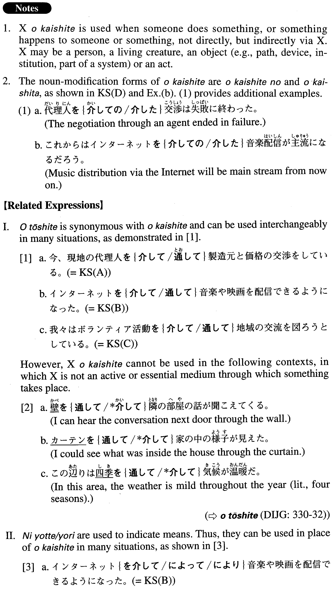

# を介して/介した

[1. Summary](#summary) 
[2. Formation](#formation) 
[3. Example Sentences](#example-sentences) 
[4. Grammar Book Page](#grammar-book-page) 

## Summary

<table><tr>   <td>Summary</td>   <td>A compound particle that introduces a medium through which someone does something or something happens to someone or something.</td></tr><tr>   <td>Equivalent</td>   <td>Through; via; by means of; by ~ing</td></tr><tr>   <td>Part of speech</td>   <td>Compound Particle (usually used in formal writing and formal speech)</td></tr><tr>   <td>Related expression</td>   <td>をとうして; によって/より</td></tr></table>

## Formation

<table class="table"><tbody><tr class="tr head"><td class="td">(i) Noun</td><td class="td">を介して</td><td class="td"></td></tr><tr class="tr"><td class="td"></td><td class="td">知り合いを介して</td><td class="td">Through an acquaintance</td></tr><tr class="tr head"><td class="td">(ii) Noun1</td><td class="td">を{介しての/介した}Noun2</td><td class="td"></td></tr><tr class="tr"><td class="td"></td><td class="td">通信網を{介しての/介した}データ送信</td><td class="td">Data transmission via a network</td></tr></tbody></table>

## Example Sentences

<table><tr>   <td>今、現地の代理人を介して製造元と価格の交渉をしている。</td>   <td>We are negotiating the price with the manufacturer through a local agent now.</td></tr><tr>   <td>インターネットを介して音楽や映画を配信できるようになった。</td>   <td>Music and movies can be distributed via the Internet now.</td></tr><tr>   <td>我々はボランティア活動を介して地域の交流を図ろうとしている。</td>   <td>We are trying to promote interaction among the local (units) through volunteer activities.</td></tr><tr>   <td>通訳を｛介しての/介した｝商談は効率が悪い。</td>   <td>Business talks via an interpreter are inefficient.</td></tr><tr>   <td>日本にいる友達を介してこの情報を手に入れた。</td>   <td>I got this information with the help of (literally: through) a friend of mine in Japan.</td></tr><tr>   <td>このウイルスはそれに感染した鳥から蚊を介して人に感染する。人から人や人から蚊を介しての感染はない。</td>   <td>This virus is transmitted to people from infected birds via mosquitoes. It is not transmitted between people either directly or via mosquitoes.</td></tr><tr>   <td>自殺系サイトを介して知り合った男女が、初対面でいきなり一緒に自殺するという事件が続き、社会問題となった。</td>   <td>There have been several incidents in which a man and a woman who had met through a suicide website committed suicide together right after meeting in person for the first time, and such incidents have become a social problem.</td></tr><tr>   <td>このテロ組織は海外の金融機関を介して資金の調達と仕送りをしているらしい。</td>   <td>This terrorist organization seems to be collecting and distributing money via overseas financial institutions.</td></tr><tr>   <td>記憶は再生時に脳の「海馬」という部分を介して再構成される。</td>   <td>When we recall memories, they are reconstructed through the part of the brain called the hippocampus.</td></tr><tr>   <td>新しいビジネスを生むためのアイデアは、勤務外のインフォーマルなコミュニケーションを介して、より多く得られると言われる。</td>   <td>It is said that more ideas for creating new business can be obtained via informal communication outside of work.</td></tr><tr>   <td>このグループは、同じような障害で悩んでいる人々が、お互いの交流を介して問題をよりよく理解し、助け合っていけるよう、様々な支援を行っている。</td>   <td>This group provides various kinds of support so that people with the same sort of disorder or disability can better understand others' problems and help each other by interacting.</td></tr></table>

## Grammar Book Page

