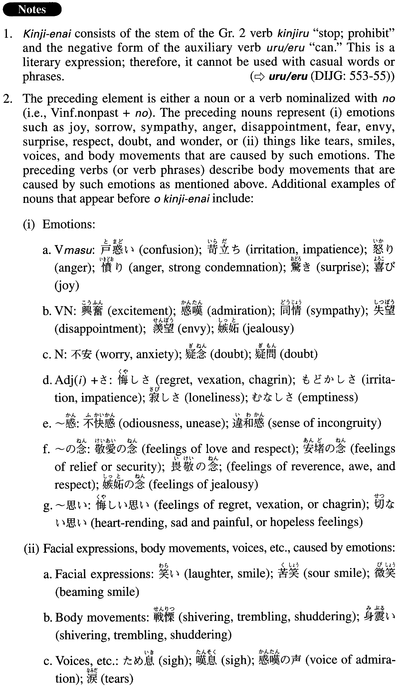

# を禁じ得ない

[1. Summary](#summary) 
[2. Formation](#formation) 
[3. Example Sentences](#example-sentences) 
[4. Grammar Book Page](#grammar-book-page) 

## Summary

<table><tr>   <td>Summary</td>   <td>A phrase that is used when one cannot control emotions or reactions caused by emotions.</td></tr><tr>   <td>English</td>   <td>Cannot hold; cannot hold back; cannot keep back; cannot help ~ing; cannot keep ~ from ~ing</td></tr><tr>   <td>Part of speech</td>   <td>Phrase (usually used in formal writing and formal speech)</td></tr></table>

## Formation

<table class="table"><tbody><tr class="tr head"><td class="td">(i) Noun</td><td class="td">を禁じ得ない</td><td class="td"></td></tr><tr class="tr"><td class="td"></td><td class="td">喜びを禁じ得ない</td><td class="td">Cannot keep back one’s joy</td></tr><tr class="tr head"><td class="td">(ii) Vinformal nonpastの</td><td class="td">を禁じ得ない</td><td class="td"></td></tr><tr class="tr"><td class="td"></td><td class="td">足が震えるのを禁じ得ない</td><td class="td">Cannot keep someone’s legs from trembling</td></tr></tbody></table>

## Example Sentences

<table><tr>   <td>このような無責任な行いに対して怒りを禁じ得ない。</td>   <td>I cannot hold back my anger at such an irresponsible deed.</td></tr><tr>   <td>その感動的な光景を見て、涙がこみ上げてくるのを禁じ得なかった。</td>   <td>Seeing the moving scene, I could not keep my tears from welling up.</td></tr><tr>   <td>24年の苦悩と空白の後、ついに実現した家族との再会に、周囲の者も涙を禁じ得なかった。</td>   <td>(Seeing) the family reunited, an occasion that finally became reality after twenty-four years of agony and separation, people around them couldn't help but cry, too.</td></tr><tr>   <td>その美しい早春の風景画に作者の温かい郷土愛を感じ、深い感動を禁じ得なかった。</td>   <td>Looking at the beautiful early spring landscape painting, I felt the painter's love for his homeland, and couldn't help but be moved profoundly.</td></tr><tr>   <td>出版社による無神経な個人写真の扱い方に、驚きと憤りを禁じ得ない。</td>   <td>I can't hold back my surprise and anger at the publisher's thoughtless way of treating those personal photos.</td></tr><tr>   <td>大統領の声明は、せっかく第一歩を踏み出した両国の平和統一の働きに水を差すのではないかという疑問を禁じ得ない。</td>   <td>I cannot keep myself from wondering if the president's announcement will pour cold water on the two nations' hard-won first step toward peaceful unification.</td></tr><tr>   <td>長い間憧れていた人に会う瞬間が近づいて、次第に動悸が速まるのを禁じ得なかった。</td>   <td>As the moment approached when I was to meet with the person I'd admired for a long time, I could not stop my heart from beating faster and faster.</td></tr><tr>   <td>この業界の救いようのない保守性に、深いため息が出るのを禁じ得なかった。</td>   <td>(Looking at) this industry's hopeless conservatism, I couldn't help but let out a deep sigh.</td></tr></table>

## Grammar Book Page

