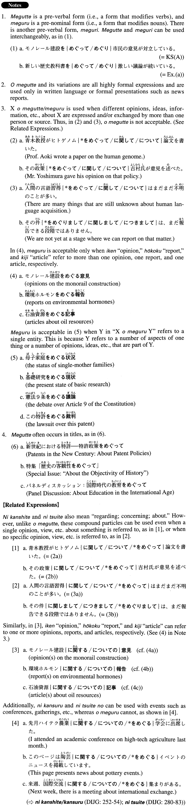

# をめぐって・めぐる

[1. Summary](#summary) 
[2. Formation](#formation) 
[3. Example Sentences](#example-sentences) 
[4. Grammar Book Page](#grammar-book-page) 

## Summary

<table><tr>   <td>Summary</td>   <td>A compound particle meaning “concerning; over”, which is used with an issue over which different opinions, ideas, etc., are expressed or exchanged.</td></tr><tr>   <td>English</td>   <td>Centering around; in connection with; over; concerning; regarding; with regard to</td></tr><tr>   <td>Part of speech</td>   <td>Compound Particle (usually used in formal writing and formal speech)</td></tr><tr>   <td>Related expression</td>   <td>に関して; について</td></tr></table>

## Formation

<table class="table"><tbody><tr class="tr head"><td class="td">(i) Noun</td><td class="td">をめぐって</td><td class="td"></td></tr><tr class="tr"><td class="td"></td><td class="td">この報道をめぐって</td><td class="td">Concerning this news report</td></tr><tr class="tr head"><td class="td">(ii) Noun1</td><td class="td">をめぐるNoun2</td><td class="td"></td></tr><tr class="tr"><td class="td"></td><td class="td">基礎研究をめぐって現状</td><td class="td">Current status of (literally: around) basic research</td></tr><tr class="tr head"><td class="td">(iii) Embedded Question</td><td class="td">をめぐって</td><td class="td"></td></tr><tr class="tr"><td class="td"></td><td class="td">日本がこの問題にどう対応するべきかをめぐって</td><td class="td">Regarding how Japan should handle this problem</td></tr><tr class="tr head"><td class="td">(iv) Noun1かNoun2か</td><td class="td">をめぐって</td><td class="td"></td></tr><tr class="tr"><td class="td"></td><td class="td">実行か中止かをめぐって</td><td class="td">Concerning whether we should execute something, or hold off on it</td></tr><tr class="tr head"><td class="td">(v) Embedded Question1+Embedded Question2</td><td class="td">をめぐって</td><td class="td"></td></tr><tr class="tr"><td class="td"></td><td class="td">単独で行うかパートナーを探すかをめぐって</td><td class="td">Regarding whether we want to do it by ourselves or look for a partner</td></tr></tbody></table>

## Example Sentences

<table><tr>   <td>モノレール建設をめぐって市民の意見が対立している。</td>   <td>Citizens' opinions are divided over the monorail construction.</td></tr><tr>   <td>無駄な公共事業をめぐる批判の声が強まっている。</td>   <td>(Voices of) Criticism concerning wasteful public projects is growing stronger.</td></tr><tr>   <td>大学運営は今後どうあるべきかをめぐって活発に意見が交わされた。</td>   <td>Opinions were exchanged actively regarding how universities should be run from now on.</td></tr><tr>   <td>進攻か撤退かをめぐって激しい議論が戦わされた。</td>   <td>There was a heated discussion over whether we should advance or retreat.</td></tr><tr>   <td>新制度に即時切り替えるべきか来年度まで待つべきかをめぐって委員の間で意見が分かれた。</td>   <td>Opinions were divided among the committee members regarding whether we should shift to the new system immediately or wait until next year.</td></tr><tr>   <td>新しい歴史教科書をめぐって激しい議論が続いている。</td>   <td>The fierce debate over the new history textbook continues.</td></tr><tr>   <td>審判の判定をめぐって選手が乱闘し試合が約１時間中断した。</td>   <td>The players had a fight over the umpire's decision, and the game was interrupted for about an hour.</td></tr><tr>   <td>自衛隊派遣の是非をめぐって激しい議論が交わされた。</td>   <td>There were fierce arguments over the pros and cons of dispatching the Self-Defence Forces.</td></tr><tr>   <td>老化のメカニズムをめぐる研究が注目を浴びている。</td>   <td>Research into the mechanism of aging is drawing a lot of attention.</td></tr><tr>   <td>我が県でもITをめぐる働きが加速しそうです。</td>   <td>It looks like the movement toward IT (information technology) will accelerate in our prefecture, too.</td></tr><tr>   <td>本章では、原子力発電をめぐる最近の動向を紹介すると共に、将来の有力なエネルギー源について概観する。</td>   <td>This chapter introduces recent trends in nuclear power generation and gives an overview of promising energy sources for the future.</td></tr><tr>   <td>他の国でもいつ軍隊を引き上げるべきかをめぐって議論が戦わされている。</td>   <td>Just when the army should be withdrawn is hotly debated in other countries, too.</td></tr><tr>   <td>深刻化する少年犯罪が連日のように報道されている中、厳罰主義か更生重視かをめぐって社会の対応が揺れている。</td>   <td>While there are reports almost every day on juvenile crime, which is becoming more serious, society wavers between applying strict punishment and emphasizing rehabilitation.</td></tr><tr>   <td>調停案を受け入れるかこのまま交渉を続けるかをめぐって我々の間で意見が分かれている。</td>   <td>Our opinions are divided over whether we should accept the arbitration plan or continue negotiating.</td></tr></table>

## Grammar Book Page

