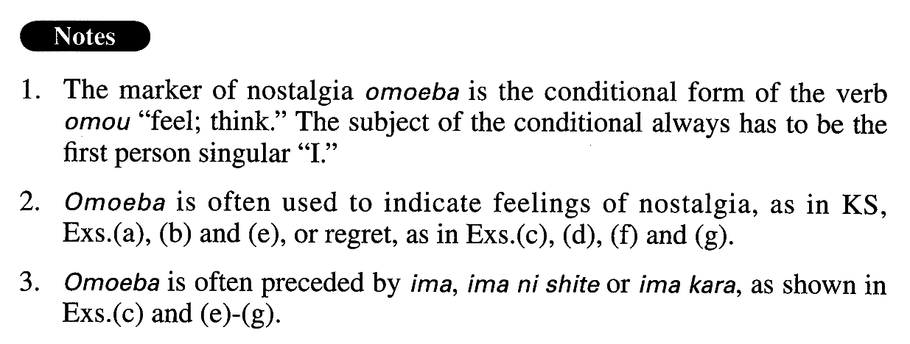

# 思えば

[1. Summary](#summary) 
[2. Example Sentences](#example-sentences) 
[3. Grammar Book Page](#grammar-book-page) 

## Summary

<table><tr>   <td>Summary</td>   <td>An adverb that indicates feelings of nostalgia or regret when recollecting one’s past experiences.</td></tr><tr>   <td>English</td>   <td>Come ot think of it; when I think back; on reflection</td></tr><tr>   <td>Part of speech</td>   <td>Adverb (usually used in formal writing and formal speech)</td></tr></table>

## Example Sentences

<table><tr>   <td>思えば、大学時代はとても楽しかった。</td>   <td>When I come to think of it, I had a great time when I was in college.</td></tr><tr>   <td>思えば、あの頃私は彼と政治問題について毎日のように議論したものだ。</td>   <td>When I think back, I discussed political issues with him almost every day.</td></tr><tr>   <td>思えば、終戦後数年は、ほとんどの日本人が野菜を庭で育てていた。</td>   <td>Come to think of it, for a few years after the war, almost all Japanese people grew vegetables in their backyards.</td></tr><tr>   <td>今思えばどうしてこんなCDを買ったのだろう。</td>   <td>Now that I think about it, why did I buy such a (terrible) CD?</td></tr><tr>   <td>思えば心筋梗塞の前兆はあった。</td>   <td>Come to think of it, there were warning signs of a cardiac seizure.</td></tr><tr>   <td>小学校3年生の時、祖母と銀座で映画を見た。今にして思えば、あれが祖母と見た最初で最後の映画だった。</td>   <td>I saw a movie in Ginza with my grandmother when I was a third grader. When I think back on it now, that was the first and the last movie I ever saw with her.</td></tr><tr>   <td>今から思えば、私が同僚の男性と結婚すると言った時、父は猛然と反対した。あの時父の忠告を聞いておけばと悔やまれる。</td>   <td>As I think of it now, my father was vehemently opposed when I told him that I was going to marry my colleague. I regret that I didn't listen to his advice.</td></tr><tr>   <td>自転車で出かけようとした途端、チェーンが外れてしまった。今から思えば、あれがケチのつき始めだった。</td>   <td>The moment I went out on my bicycle, the chain came off. When I come to think of it now, that was the beginning of (a period of) bad luck.</td></tr></table>

## Grammar Book Page

