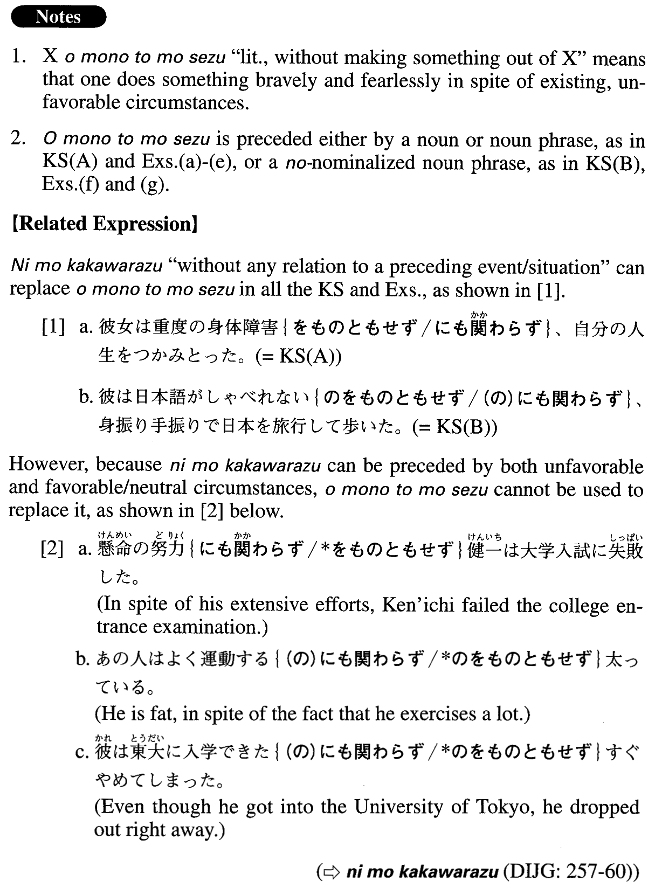

# をものともせず

[1. Summary](#summary) 
[2. Formation](#formation) 
[3. Example Sentences](#example-sentences) 
 

## Summary

<table><tr>   <td>Summary</td>   <td>A phrase indicating that someone does something bravely/fearlessly in spite of unfavourable circumstances.</td></tr><tr>   <td>English</td>   <td>In spite of ~; undaunted by ~; in definance of ~; in the face of ~</td></tr><tr>   <td>Part of speech</td>   <td>Phrase (usually used in formal writing and formal speech)</td></tr><tr>   <td>Related expression</td>   <td>にもかかわらず</td></tr></table>

## Formation

<table class="table"><tbody><tr class="tr head"><td class="td">(i) Noun</td><td class="td">をものともせず</td><td class="td"></td></tr><tr class="tr"><td class="td"></td><td class="td">失敗をものともせず</td><td class="td">In spite of the failure</td></tr><tr class="tr head"><td class="td">(ii) Sinformalの</td><td class="td">をものともせず</td><td class="td">だ after Adjectiveなstem and Noun changes to な</td></tr><tr class="tr"><td class="td"></td><td class="td">非難されたのをものともせず</td><td class="td">In spite of the fact that someone was criticised</td></tr><tr class="tr"><td class="td"></td><td class="td">頭が痛いのをものともせず</td><td class="td">In spite of the fact that someone has a headache</td></tr><tr class="tr"><td class="td"></td><td class="td">場所が不便{な/である}のをものともせず</td><td class="td">In spite of the fact that the location is inconvenient</td></tr><tr class="tr"><td class="td"></td><td class="td">夫が病気{な/である}のをものともせず</td><td class="td">In spite of the fact that someone’s husband is ill</td></tr></tbody></table>

## Example Sentences

<table><tr>   <td>彼女は重度の身体障害をものともせず、自分の人生をつかみとった。</td>   <td>Despite severe physical handicaps, she took charge of her own life.</td></tr><tr>   <td>彼は日本語がしゃべれないのをものともせず、身振り手振りで日本を旅行して歩いた。</td>   <td>Undaunted by his inability to speak Japanese, he travelled around Japan communicating with gestures and signs.</td></tr><tr>   <td>友人は高波をものともせず4キロを泳ぎ切った。</td>   <td>Overcoming high waves, my friend swam (all of) four kilometres.</td></tr><tr>   <td>子供は時差をものともせず、早速水着に着替えてワイキキビーチへ出かけた。</td>   <td>In spite of the time difference, my child changed to her swimming suit right away and went to Waikiki Beach.</td></tr><tr>   <td>高層ビル火災の際、消防士たちは危険をものともせずその建物の階段を駆け登っていった。</td>   <td>At the time of the high-rise fire, firemen ran up the stairs of the building in spite of the danger.</td></tr><tr>   <td>民衆は軍事政権の弾圧をものともせず、デモ行進を続けた。</td>   <td>The people continued their demonstrations in defiance of the military government's oppression.</td></tr><tr>   <td>彼女は周囲の人の批判をものともせず、自分の信じる道を進んだ。</td>   <td>Ignoring criticism from the people around her, she proceeded on the path she believed in.</td></tr><tr>   <td>高校生たちは雨が激しく降っているのをものともせず、熱心に野球の練習をしていた。</td>   <td>The high school students were practicing baseball in spite of the heavy rain (literally: in spite of the fact that it was raining hard).</td></tr><tr>   <td>美佐子は片道所要時間が2時間を越えるのをものともせず、東京の証券会社に通勤した。</td>   <td>Despite the fact that it took Misako two hours each way, she commuted (every day) to a securities company in Tokyo.</td></tr></table>

## Grammar Book Page

