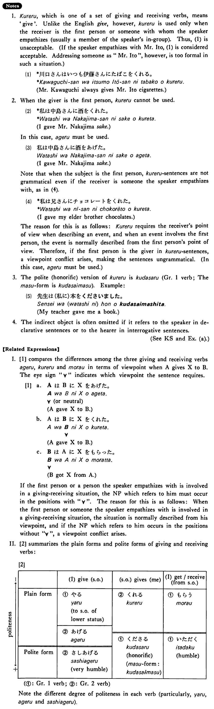

# 呉れる・くれる (1)

 
 
 
 

## Summary

<table><tr>   <td>Summary</td>   <td>Someone whose status is not higher than the speaker’s gives something to the first person or to someone with whom the speaker empathises.</td></tr><tr>   <td>English</td>   <td>Give</td></tr><tr>   <td>Part of speech</td>   <td>Verb (Group 2)</td></tr><tr>   <td>Related expression</td>   <td>あげる1; もらう</td></tr></table>

## Example Sentences

<table><tr>   <td>大川さんは（私に）本を呉れた・呉れました。</td>   <td>Mr. Okawa gave me a book.</td></tr><tr>   <td>ビルは（君に）何を呉れましたか。</td>   <td>What did Bill give to you?</td></tr><tr>   <td>川村さんは私の娘にレコードを呉れた。</td>   <td>Mr. Kawamura gave my daughter a record.</td></tr></table>

## Explanation

1. くれる, which is one of a set of giving and receiving verbs, means 'give'. Unlike the English 'give', however, くれる is used only when the receiver is the first person or someone with whom the speaker empathizes (usually a member of the speakers in-group). Thus, (1) is unacceptable. (If the speaker empathizes with Mr. Ito, (1) is considered acceptable. Addressing someone as "Mr. Ito", however, is too formal in such a situation.)
  <ul>(1) <li>*川口さんはいつも伊藤さんにたばこをくれる。</li> <li>Mr. Kawaguchi always gives Mr. Ito cigarettes.</li> </ul>  
2. When the giver is the first person, くれる cannot be used.
  <ul>(2) <li>*私は中島さんに酒をくれた。</li> <li>I gave Mr. Nakajima sake.</li> </ul>  
In this case, あげる must be used.
  <ul>(3) <li>私は中島さんに酒をあげた。</li> <li>I gave Mr. Nakajima sake.</li> </ul>  
Note that when the subject is the first person, くれる sentences are not grammatical even if the receiver is someone the speaker empathizes with, as in (4).
  <ul>(4) <li>*私は兄さんにチョコレートをくれた。</li> <li>I gave my elder brother chocolates.</li> </ul>  
The reason for this is as follows: くれる requires the receiver's point of view when describing an event, and when an event involves the first person, the event is normally described from the first person's point of view. Therefore, if the first person is the giver in くれる sentences, a viewpoint conflict arises, making the sentences ungrammatical. (In this case, あげる must be used.)
  
3. The polite (honorific) version of くれる is 下さる (Group 1 verb; The ます form is 下さいます). Example:
  <ul>(5) <li>先生は(私に)本をくださいました。</li> <li>My teacher gave me a book.</li> </ul>  
4. The indirect object is often omitted if it refers to the speaker in declarative sentences or to the hearer in interrogative sentences.
  
(See Key Sentence and Example (a).)
  
【Related Expressions】
  
I. [1] compares the differences among the three giving and receiving verbs あげる, くれる and もらう in terms of viewpoint when A gives X to B. The eye sign ∀ indicates which viewpoint the sentence requires.
  
[1]
  <ul> <li>a. AはBにXをあげた。</li> <li>__∀ (or neutral)</li> <li>[A gave X to B.]</li> </ul>  <ul> <li>b. AはBにXをくれた。</li> <li>_____∀</li> <li>[A gave X to B.]</li> </ul>  <ul> <li>c. BはAにXをもらった。</li> <li>__∀</li> <li>[B got X from A.]</li> </ul>  
If the first person or a person the speaker empathizes with is involved in a giving-receiving situation, the Noun Phrase which refers to him must occur in the positions with ∀. The reason for this is as follows: When the first person or someone the speaker empathizes with is involved in a giving-receiving situation, the situation is normally described from his viewpoint, and if the Noun Phrase which refers to him occurs in the positions without a viewpoint conflict arises.
  
II. [2] summarizes the plain forms and polite forms of giving and receiving verbs:
  
[2]
  <table class="table"> <tbody>  <tr class="tr"> <td class="td"></td> <td class="td"></td> <td class="td">(I) give (someone)</td> <td class="td">(someone) gives (me)</td> <td class="td">(I) get/receive (from someone)</td> </tr>  <tr class="tr"> <td class="td">－ p o l i t e n e s s ＋</td> <td class="td">Plain form
</td> <td class="td">①やる to someone of lower status
②あげる
</td> <td class="td">②くれる
</td> <td class="td">①もらう
</td> </tr>  <tr class="tr"> <td class="td"></td> <td class="td">Polite form</td> <td class="td">②差し上げる very humble</td> <td class="td">①くださる honorific ますform: くださいます</td> <td class="td">①いただく</td> </tr>  </tbody> </table>   
Note the different degree of politeness in each verb (particularly, やる, あげる and 差し上げる).

## Grammar Book Page

