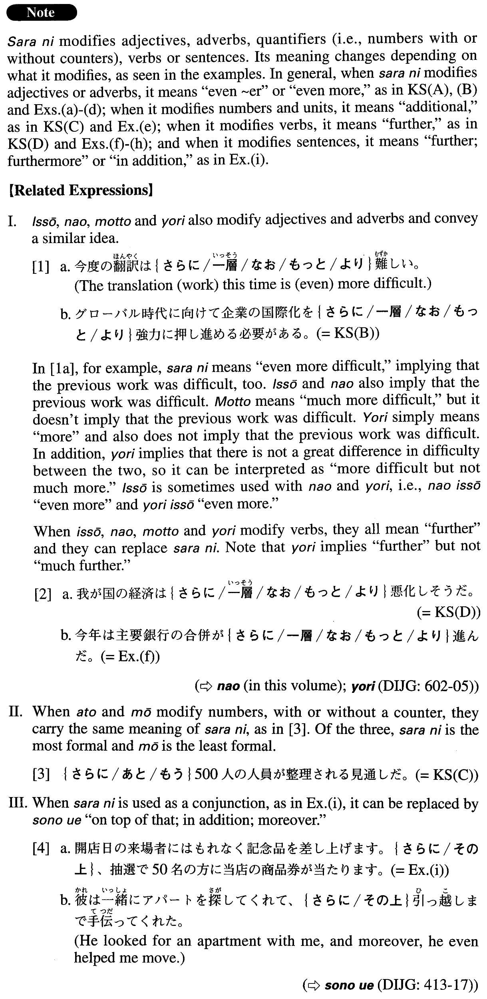

# 更に

 
 
 
 

## Summary

<table><tr>   <td>Summary</td>   <td>An adverb/conjunction that represents the idea of “additionally” or “further”.</td></tr><tr>   <td>English</td>   <td>Even ~er; even more; additional; more; further; furthermore; in addition</td></tr><tr>   <td>Part of speech</td>   <td>Adverb/Conjunction</td></tr><tr>   <td>Related expression</td>   <td>一緒; なお; もっと; より; あと; もう; その上; ひいては; 且つ; なお</td></tr></table>

## Formation

<table class="table"><tbody><tr class="tr head"><td class="td">(i) 更に</td><td class="td">Adjective(い/な) </td><td class="td"></td></tr><tr class="tr"><td class="td"></td><td class="td">更に小さい</td><td class="td">Even smaller</td></tr><tr class="tr"><td class="td"></td><td class="td">更に複雑な</td><td class="td">Even more complex</td></tr><tr class="tr head"><td class="td">(ii) 更に</td><td class="td">Adverb</td><td class="td"></td></tr><tr class="tr"><td class="td"></td><td class="td">更に慎重に</td><td class="td">Even more prudently</td></tr><tr class="tr head"><td class="td">(iii) 更に</td><td class="td">Number(+Counter) </td><td class="td"></td></tr><tr class="tr"><td class="td"></td><td class="td">更に３０時間</td><td class="td">An additional 30 hours</td></tr><tr class="tr head"><td class="td">(iv) 更に</td><td class="td">V/VP</td><td class="td"></td></tr><tr class="tr"><td class="td"></td><td class="td">更に調査する</td><td class="td">Someone investigates something further</td></tr><tr class="tr"><td class="td"></td><td class="td">更に改良を加える</td><td class="td">Someone makes further improvements</td></tr></tbody></table>

## Example Sentences

<table><tr>   <td>更に大きいハリケーンがテキサス南部を襲った。</td>   <td>An even larger hurricane struck South Texas.</td></tr><tr>   <td>前の翻訳も難しかったが今度のは更に難しい。</td>   <td>The last translation (job) was difficult, but this one is even harder.</td></tr><tr>   <td>グローバル時代に向けて企業の国際化を更に強力に押し進める必要がある。</td>   <td>In our global age, we must promote the internationalization of businesses even more forcefully.</td></tr><tr>   <td>更に５００人の人員が整理される見通しだ。</td>   <td>It is expected that an additional 500 employees will be laid off.</td></tr><tr>   <td>我が国の経済は更に悪化しそうだ。</td>   <td>It looks like our nation's economy will worsen still further.</td></tr><tr>   <td>更に大型のジャンボジェットが開発されることになった。</td>   <td>It has been decided that an even larger jumbo jet will be developed.</td></tr><tr>   <td>D社のノート型コンピュータが更に薄くなった。</td>   <td>Company D's laptop computers have become even thinner.</td></tr><tr>   <td>電化製品をディスカウントショップより更にお安く提供しております。</td>   <td>We provide electrical appliances even more cheaply than discount shops do.</td></tr><tr>   <td>メモリが更に10パーセント値下げされた。</td>   <td>The price of the memory was lowered by an additional 10 percent.</td></tr><tr>   <td>今年は主要銀行の合併が更に進んだ。</td>   <td>More mergers took place among major banks this year.</td></tr><tr>   <td>鳥インフルエンザの被害が更に広がる恐れがある。</td>   <td>There is fear that the damage caused by bird flu will spread even further.</td></tr><tr>   <td>センサーでデータを集め、これを更に同一チップ上の増幅器で増幅する。</td>   <td>Data is collected with a sensor and, furthermore, on the same chip the data is augmented with an amplifier.</td></tr><tr>   <td>開店日の来場者にはもれなく記念品を差し上げます。更に、抽選で50名の方に当店の商品券が当たります。</td>   <td>We'll give a commemorative souvenir to all customers on opening day. In addition, we'll give a gift certificate for our store to 50 people selected in a drawing.</td></tr></table>

## Grammar Book Page

