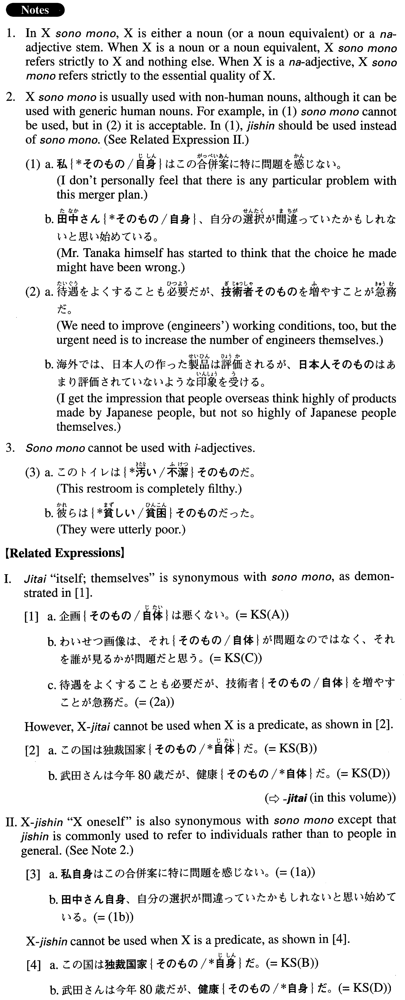

# そのもの

[1. Summary](#summary) 
[2. Formation](#formation) 
[3. Example Sentences](#example-sentences) 
[4. Grammar Book Page](#grammar-book-page) 

## Summary

<table><tr>   <td>Summary</td>   <td>A phrase used to refer strictly to the preceding noun (phrase) or adjective.</td></tr><tr>   <td>Equivalent</td>   <td>Itself; themselves; very; perfect; the definition of; the picture of; absolutely; totally; utterly; perfectly</td></tr><tr>   <td>Part of speech</td>   <td>Phrase</td></tr><tr>   <td>Related expression</td>   <td>自体; 自身</td></tr></table>

## Formation

<table class="table"><tbody><tr class="tr head"><td class="td">(i) Noun</td><td class="td">そのもの</td><td class="td"></td></tr><tr class="tr"><td class="td"></td><td class="td">技術そのもの</td><td class="td">Technology itself</td></tr><tr class="tr"><td class="td"></td><td class="td">それそのもの</td><td class="td">That itself</td></tr><tr class="tr head"><td class="td">(ii) Adjectiveなstem</td><td class="td">そのもの</td><td class="td"></td></tr><tr class="tr"><td class="td"></td><td class="td">温厚そのものだ</td><td class="td">Someone is very gentle</td></tr><tr class="tr"><td class="td"></td><td class="td">温厚そのものの人柄</td><td class="td">A very gentle personality</td></tr></tbody></table>

## Example Sentences

<table><tr>   <td>マイナス思考ばかりしていると、人生そのものが駄目になる。</td>   <td>If you remain a negative thinker, your life itself will be ruined.</td></tr><tr>   <td>企画そのものは悪くない。</td>   <td>The plan itself is not bad.</td></tr><tr>   <td>この国は独裁国家そのものだ。</td>   <td>This country is the perfect definition of an autocracy.</td></tr><tr>   <td>わいせつ画像は、それそのものが問題なのではなく、それを誰が見るかが問題だと思う。</td>   <td>I think that obscene images themselves are not the problem; who sees them is the problem.</td></tr><tr>   <td>武田さんは今年８０歳だが、健康そのものだ。</td>   <td>Mr. Takeda is 80 this year and the picture of health.</td></tr><tr>   <td>私はこの団体の存在そのものを疑っている。</td>   <td>I doubt this group's very existence.</td></tr><tr>   <td>我々は外務省改革にとどまらず、現在の外交そのものの転換を望む。</td>   <td>Not only do we want to reform the Ministry of Foreign Affairs, but we hope the current diplomacy itself will change.</td></tr><tr>   <td>人間はその人の考えそのものである。</td>   <td>The epitome of a person is his or her thinking. (literally: A human being is his or her thought itself.)</td></tr><tr>   <td>私にとってバレーボールは人生そのものでした。</td>   <td>For me, volleyball was life itself.</td></tr><tr>   <td>土地は、それそのものは富を生み出さないが、その上で生産、販売などの経済活動を行うことで富を生み出す。</td>   <td>The land itself does not produce wealth, but wealth is produced when people conduct economic activities, such as production and sales, on it (literally: by (people's) conducting economic activities such as production and sales on it).</td></tr><tr>   <td>お年寄りを狙い、強引な方法で家屋の修理契約を結ぶ手口は卑劣そのものだ。</td>   <td>(literally: Their way of) Aiming at the elderly and forcing them to sign a house repair contract is utterly contemptible.</td></tr><tr>   <td>そのマニュアルは説明も図も明快そのもので、画像処理の知識がない者にもよく分かる。</td>   <td>The manual's explanations and figures are perfectly clear, so even people with no knowledge of image processing will be able to understand them well.</td></tr><tr>   <td>米倉さんは誠実そのものの人柄で知られている。</td>   <td>Ms. Yonekura is known for his totally sincere personality.</td></tr></table>

## Grammar Book Page

