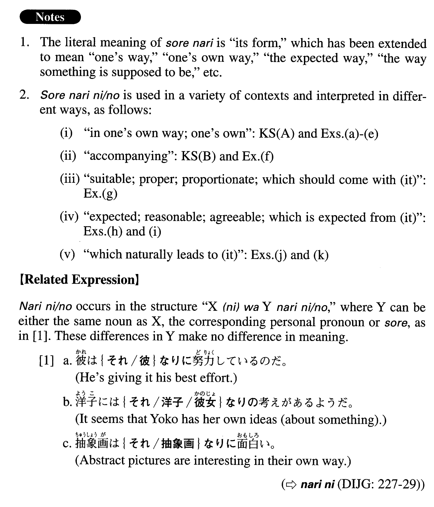

# それなりに・の

[1. Summary](#summary) 
[2. Formation](#formation) 
[3. Example Sentences](#example-sentences) 
[4. Grammar Book Page](#grammar-book-page) 

## Summary

<table><tr>   <td>Summary</td>   <td>A phrase representing the idea that someone/something does something or is in a state in his/her/its own way, or in a way suitable to the situation or generally expected from the situation.</td></tr><tr>   <td>Equivalent</td>   <td>In one’s own way; accompanying; proportionate; suitable; expected; agreeable; reasonable; one’s own; proper to</td></tr><tr>   <td>Part of speech</td>   <td>Phrase</td></tr><tr>   <td>Related expression</td>   <td>なりに/の</td></tr></table>

## Formation

<table class="table"><tbody><tr class="tr head"><td class="td">(i) それなりに</td><td class="td">{V/Adjective(い/な)/Noun+Copula}</td><td class="td"></td></tr><tr class="tr"><td class="td"></td><td class="td">それなりに楽しめる</td><td class="td">Something can be enjoyed in its own way</td></tr><tr class="tr"><td class="td"></td><td class="td">それなりに美味しい</td><td class="td">Something is tasty in its own way</td></tr><tr class="tr"><td class="td"></td><td class="td">それなりに便利だ</td><td class="td">Something is convenient in its own way</td></tr><tr class="tr"><td class="td"></td><td class="td">それなりに傑作だ</td><td class="td">Something is an excellent work in its own way</td></tr><tr class="tr head"><td class="td">(ii) それなりの</td><td class="td">Noun</td><td class="td"></td></tr><tr class="tr"><td class="td"></td><td class="td">それなりの利点</td><td class="td">Merits proper to something</td></tr></tbody></table>

## Example Sentences

<table><tr>   <td>天才と言われる人にはそれなりの苦しみがあると思う。</td>   <td>I think people who are called geniuses suffer in their own way.</td></tr><tr>   <td>クラシックもジャズもロックも、聞いてみればみなそれなりに面白い。</td>   <td>If you (really) listen to classical music, jazz and rock, each of them is interesting in its own way.</td></tr><tr>   <td>外国で仕事をするのは面白いが、それなりの苦労は覚悟しなければならない。</td>   <td>Working abroad is interesting, but you must expect a certain amount of hardship, too.</td></tr><tr>   <td>買った参考書はどれもみなそれなりに役に立っている。</td>   <td>All the reference books I have bought have been helpful in their own way.</td></tr><tr>   <td>選手たちはみんなそれなりに精一杯やっている。ただ結果が出ないだけだ。</td>   <td>All the players are giving it their best in their own way. We just haven't had the (expected) result.</td></tr><tr>   <td>お金がなくてもそれなりに余暇を楽しむ方法はある。</td>   <td>Even if you don't have money, there are ways to enjoy your leisure in your own way.</td></tr><tr>   <td>ほとんどの人は、悩みや問題があってもそれなりに暮らしているのだと思います。</td>   <td>I think that even though most people have worries and problems, they are living the best they can (literally: in their own ways).</td></tr><tr>   <td>上の地位にいればそれなりの責任がかかってくる。</td>   <td>If you are in a high-ranking position, you have to assume the responsibilities that come with it.</td></tr><tr>   <td>きつい仕事にはそれなりの報酬を払うべきだ。</td>   <td>For a tough assignment we should pay appropriate compensation.</td></tr><tr>   <td>今年それなりの成績を上げることができれば、来年支店長に昇進できそうだ。</td>   <td>If I can achieve the expected performance this year, it looks like I'll be promoted to branch manager next year.</td></tr><tr>   <td>それなりの収入があるのなら、結婚相手はすぐ見つかるはずです。</td>   <td>If you have a reasonable income, you should be able to find someone to marry soon.</td></tr><tr>   <td>彼が準決勝まで残ったということは、それなりの実力があるということだ。</td>   <td>The fact that he made it to the semifinals means that he had the right skills to take him that far.</td></tr><tr>   <td>彼女がみんなに好かれていないのはそれなりの理由がある。</td>   <td>There's a reason no one likes her (literally: she is not liked by everyone).</td></tr></table>

## Grammar Book Page

