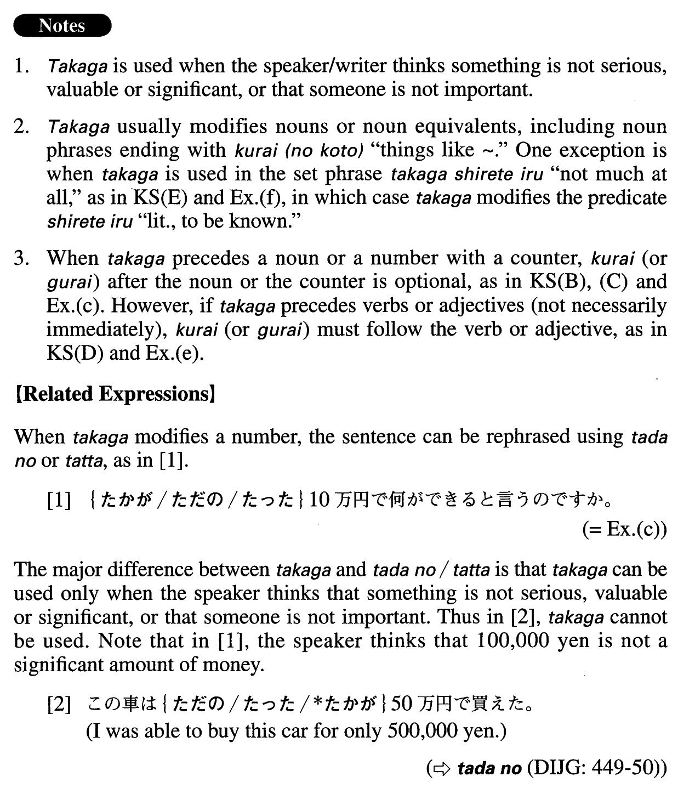

# たかが

[1. Summary](#summary) 
[2. Formation](#formation) 
[3. Example Sentences](#example-sentences) 
 

## Summary

<table><tr>   <td>Summary</td>   <td>A noun modifier used when the speaker thinks little of the referent of the modified noun or noun phrase.</td></tr><tr>   <td>English</td>   <td>Only; just; mere</td></tr><tr>   <td>Part of speech</td>   <td>Noun Modifier</td></tr><tr>   <td>Related expression</td>   <td>ただの; たった</td></tr></table>

## Formation

<table class="table"><tbody><tr class="tr head"><td class="td">(i) たかが</td><td class="td">Nounだ</td><td class="td"></td></tr><tr class="tr"><td class="td"></td><td class="td">たかが子供だ</td><td class="td">Someone is only a child</td></tr><tr class="tr head"><td class="td">(ii) たかが</td><td class="td">{Noun/Number(+Counter)}　(くらい){と/で}</td><td class="td"></td></tr><tr class="tr"><td class="td"></td><td class="td">たかがレポート(くらい)と</td><td class="td">Thinking/saying that it’s only a report</td></tr><tr class="tr"><td class="td"></td><td class="td">たかがレポート(くらい)で</td><td class="td">Over just a report</td></tr><tr class="tr"><td class="td"></td><td class="td">たかが二人(くらい)と</td><td class="td">Thinking/saying that (there are only) two people</td></tr><tr class="tr"><td class="td"></td><td class="td">たかが二人(くらい)で</td><td class="td">With just two people</td></tr><tr class="tr head"><td class="td">(iii) たかが～</td><td class="td">{V/Adjectiveい}informal くらい (のこと)で</td><td class="td"></td></tr><tr class="tr"><td class="td"></td><td class="td">たかが英語が{できる/できた}くらい (のこと)で</td><td class="td">Just because someone can/could speak English; just for (things like) being able to speak English</td></tr><tr class="tr"><td class="td"></td><td class="td">たかが成績{悪い/悪かった}くらい (のこと)で</td><td class="td">Just because someone’s performance is/was poor; just for (things like) someone’s poor performance</td></tr><tr class="tr head"><td class="td">(iv) たかが～</td><td class="td">Adjectiveなstem{な/だった} くらい (のこと)で</td><td class="td"></td></tr><tr class="tr"><td class="td"></td><td class="td">たかが料理が下手{な/だった} くらい (のこと)で</td><td class="td">Just because someone is/was bad a cooking; just for (something like) being a poor cook</td></tr></tbody></table>

## Example Sentences

<table><tr>   <td>たかが子供の言ったことだ。そんなに深刻に考えることはない。</td>   <td>It's just something a child told you. You don't have to take it so seriously.</td></tr><tr>   <td>たかが漫画(くらい)と馬鹿にしてはいけない。</td>   <td>You shouldn't make light of it saying it's just a cartoon.</td></tr><tr>   <td>たかが車の故障(くらい)でそんなに大騒ぎする必要はない。</td>   <td>You don't need to make such a big fuss over a little car trouble.</td></tr><tr>   <td>たかが無断で自転車を借りたくらい(のこと)でそんなに怒らなくてもいいでしょう。</td>   <td>You don't have to get so mad at me just for borrowing your bicycle without asking.</td></tr><tr>   <td>人間一人の知恵などたかが知れている。</td>   <td>One person's wisdom doesn't amount to much.</td></tr><tr>   <td>たかが喫煙じゃないか。どうしてそんなに犯罪者のように言われなきゃならないんだ。</td>   <td>It's only smoking. Why do they have to talk about us as if we were criminals?</td></tr><tr>   <td>たかがノートくらいと言われるかもしれませんが、僕にとってはとても大事なものなんです。</td>   <td>You may say it's just a notebook, but to me it's very important.</td></tr><tr>   <td>たかが１０万円で何ができると言うのですか。</td>   <td>What do you expect us to do with only 100,000 yen?</td></tr><tr>   <td>たかがアパート探しくらいで君に面倒をかけたくない。</td>   <td>I don't want to bother you with just apartment hunting.</td></tr><tr>   <td>たかが転んだくらいで救急車を呼ぶなんて大げさだ。</td>   <td>It is overreacting to call an ambulance just for falling down.</td></tr><tr>   <td>公共事業によって景気が回復する領域などたかが知れている。</td>   <td>There's hardly any area in which the economy can be improved through public projects.</td></tr><tr>   <td>たかが椅子。しかし、これによって仕事の能率が大きく左右されるし健康にも影響する。</td>   <td>It's just (a matter of) a chair. But it can affect your productivity at work and influence your health.</td></tr><tr>   <td>たかが風邪、されど風邪。</td>   <td>It's just a cold, but it is a cold.</td></tr></table>

## Grammar Book Page

