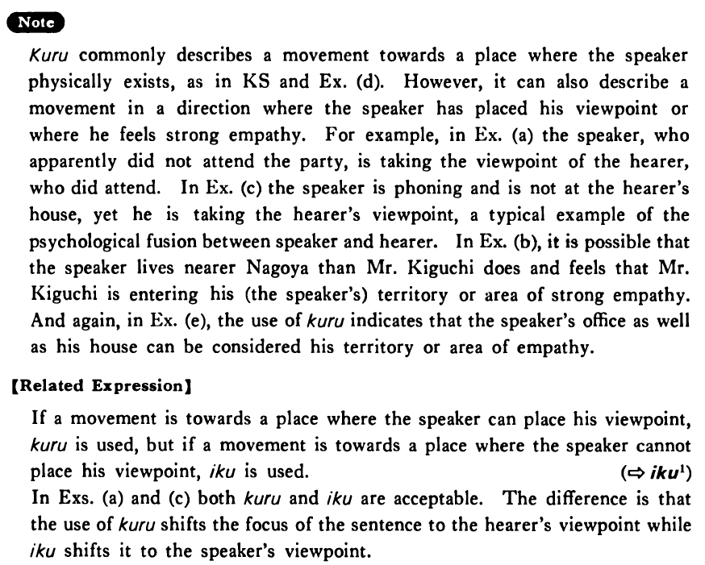

# 来る・くる (1)

[1. Summary](#summary) 
[2. Example Sentences](#example-sentences) 
[3. Explanation](#explanation) 
[4. Grammar Book Page](#grammar-book-page) 

## Summary

<table><tr>   <td>Summary</td>   <td>Someone or something moves in a direction towards the speaker or the speaker’s viewpoint or area of empathy.</td></tr><tr>   <td>Equivalent</td>   <td>Come; visit; show up</td></tr><tr>   <td>Part of speech</td>   <td>Verb (Irregular)</td></tr><tr>   <td>Related expression</td>   <td>行く1</td></tr></table>

## Example Sentences

<table><tr>   <td>田中さんが明日うちへ・に来る・来ます。</td>   <td>Mr. Tanaka will come to my house tomorrow.</td></tr><tr>   <td>ナンシーは昨日パーティーに来ましたか。</td>   <td>Did Nancy come to the party yesterday?</td></tr><tr>   <td>来週木口さんが名古屋に来るそうだ。</td>   <td>I was told that Mr. Kiguchi is coming to Nagoya next week.</td></tr><tr>   <td>もし、もし、家内が来たら直ぐ帰るように言って下さい。</td>   <td>Hello, please tell my wife to come home right away if she (literally: comes to see you) drops by.</td></tr><tr>   <td>今日はまだ新聞が来ない。</td>   <td>Today's newspaper hasn't come yet.</td></tr><tr>   <td>僕の研究室に明日来て下さい。</td>   <td>Please come to my office tomorrow.</td></tr></table>

## Explanation

から commonly describes a movement towards a place where the speaker physically exists, as in Key Sentence and Example (d). However, it can also describe a movement in a direction where the speaker has placed his viewpoint or where he feels strong empathy. For example, in Example (a) the speaker, who apparently did not attend the party, is taking the viewpoint of the hearer, who did attend. In Example (c) the speaker is phoning and is not at the hearer's house, yet he is taking the hearer's viewpoint, a typical example of the psychological fusion between speaker and hearer. In Example (b), it is possible that the speaker lives nearer Nagoya than Mr. Kiguchi does and feels that Mr. Kiguchi is entering his (the speaker's) territory or area of strong empathy. And again, in Example (e), the use of 来る indicates that the speaker's office as well as his house can be considered his territory or area of empathy.
  
【Related Expression】
  
If a movement is towards a place where the speaker can place his viewpoint, 来る is used, but if a movement is towards a place where the speaker cannot place his viewpoint, 行く is used.
  
(⇨ <a href="#㊦ 行く・いく (1)">行く</a>1)
  
In Examples (a) and (c) both 来る and 行く are acceptable. The difference is that the use of 来る shifts the focus of the sentence to the hearer's viewpoint while 行く shifts it to the speaker's viewpoint.

## Grammar Book Page

