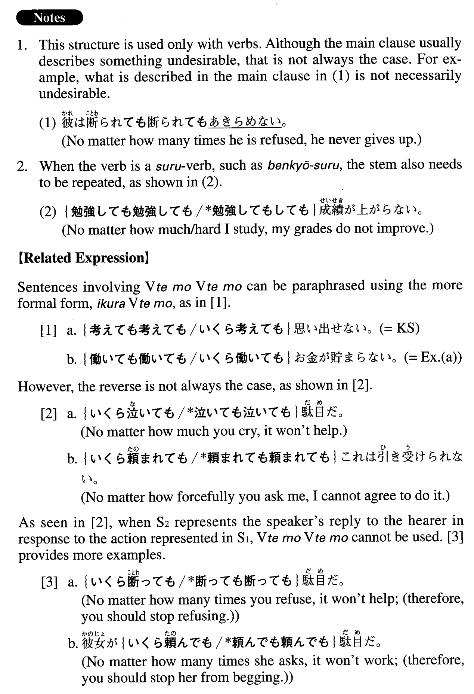

# ～ても～ても

[1. Summary](#summary) 
[2. Formation](#formation) 
[3. Example Sentences](#example-sentences) 
 

## Summary

<table><tr>   <td>Summary</td>   <td>A structure meaning “even if someone does something repeatedly”.</td></tr><tr>   <td>English</td>   <td>No matter how much/often/hard/etc.; no matter how many times</td></tr><tr>   <td>Part of speech</td>   <td>Structure</td></tr><tr>   <td>Related expression</td>   <td>いくら~ても</td></tr></table>

## Formation

<table class="table"><tbody><tr class="tr head"><td class="td">V1</td><td class="td">てもV2ても</td><td class="td">Where V1=V2</td></tr><tr class="tr"><td class="td"></td><td class="td">飲んでも飲んでも</td><td class="td">No matter how much I drink</td></tr></tbody></table>

## Example Sentences

<table><tr>   <td>考えても考えても思い出せない。</td>   <td>No matter how much/hard I try (literally: think), I cannot remember it.</td></tr><tr>   <td>働いても働いてもお金が貯まらない。</td>   <td>No matter how much/hard I work, I cannot save money.</td></tr><tr>   <td>掘っても掘っても水は出てこなかった。</td>   <td>No matter how much/deep I dug, I didn't hit water.</td></tr><tr>   <td>歩いても歩いても町が見えてこない。</td>   <td>No matter how far I walk, I can't see (the next) town.</td></tr><tr>   <td>練習しても練習してもゴルフがうまくならない。</td>   <td>No matter how hard I practice, my golf does not improve.</td></tr><tr>   <td>暑い上に湿度が高いので、拭っても拭っても汗が吹き出してくる。</td>   <td>Because it's hot and humid (literally: it is humid on top of being hot), I sweat no matter how many times/much I wipe (my face).</td></tr><tr>   <td>このクラスの学生は教えても教えても覚えないので、教えがいがない。</td>   <td>Because the students in this class never learn no matter how many times I teach them (the same things), I feel like it's not worth teaching them.</td></tr></table>

## Grammar Book Page

