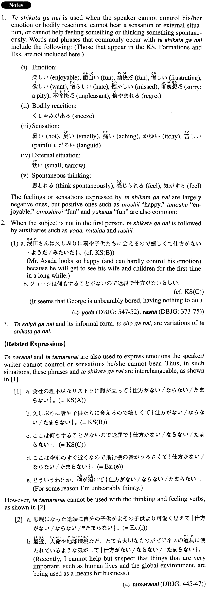

# て仕方がない

[1. Summary](#summary) 
[2. Formation](#formation) 
[3. Example Sentences](#example-sentences) 
 

## Summary

<table><tr>   <td>Summary</td>   <td>A phrase that represents emotions the speaker/writer cannot control or sensations/situations he/she cannot bear.</td></tr><tr>   <td>English</td>   <td>Cannot help ~ing; cannot stop feeling; (so ~ and) cannot control ~; so ~ and ~ cannot bare it; so; unbearably</td></tr><tr>   <td>Part of speech</td>   <td>Phrase</td></tr><tr>   <td>Related expression</td>   <td>てならない; て堪らない; (とい)ったらない</td></tr></table>

## Formation

<table class="table"><tbody><tr class="tr head"><td class="td">(i) Verb</td><td class="td">て仕方がない</td><td class="td"></td></tr><tr class="tr"><td class="td"></td><td class="td">喉が乾いて仕方がない</td><td class="td">(I) am so thirsty (and cannot bear it) </td></tr><tr class="tr head"><td class="td">(ii) Adjectiveいstemく</td><td class="td">て仕方がない</td><td class="td"></td></tr><tr class="tr"><td class="td"></td><td class="td">悲しくて仕方がない</td><td class="td">(I) am so sad (and can hardly control (my) emotion) </td></tr><tr class="tr head"><td class="td">(iii) Adjectiveな</td><td class="td">で仕方がない</td><td class="td"></td></tr><tr class="tr"><td class="td"></td><td class="td">いやで仕方がない</td><td class="td">(I) dislike it so much (and (I)) can hardly control (my) emotion</td></tr></tbody></table>

## Example Sentences

<table><tr>   <td>会社の理不尽なリストラに腹が立って仕方がない。</td>   <td>I'm so mad at the company's unreasonable restructuring (i.e., laying off workers) (and cannot control my anger).</td></tr><tr>   <td>久しぶりに妻や子供たちに会えるので嬉しくて仕方がない。</td>   <td>Because I get to see my wife and children for the first time in a long while, I am so happy (and can hardly control my emotion).</td></tr><tr>   <td>ここは何もすることがないので退屈で仕方がない。</td>   <td>Because I have nothing to do here, I'm unbearably bored.</td></tr><tr>   <td>アンディーがアメリカに帰ってまだ二日しか経っていないのに、寂しくて仕方がない。</td>   <td>Although it's been only two days since Andy went back to America, I miss him so much (literally: I'm so lonely and can hardly control my emotion).</td></tr><tr>   <td>こんなすばらしい建物が取り壊されるのかと思うと残念で仕方がない</td>   <td>I feel so bad when I think that such a wonderful building is going to be demolished.</td></tr><tr>   <td>ボーイフレンドが一年の日本留学を終えて来週帰ってくる。早く会いたくて仕方がない。</td>   <td>My boyfriend is coming back next week after finishing his year of study in Japan. I'm dying to see him (literally: I want to see him soon so much)!</td></tr><tr>   <td>悪い風邪を引いたらしい。咳が出て仕方がない。</td>   <td>I seem to have a bad cold. I cannot control my coughing.</td></tr><tr>   <td>ここは空港のすぐ近くなので飛行機の音がうるさくて仕方がない。</td>   <td>Because this place is close to an airport, the noise from the airplanes is unbearable.</td></tr><tr>   <td>この参考書は索引が不完全なので使いにくくて仕方がない。</td>   <td>Because this reference book has an incomplete index, it is so hard to use.</td></tr><tr>   <td>私のうちは近くにスーパーもコンビニもないので不便で仕方がない。</td>   <td>Because there is neither a supermarket nor a convenience store near my house, it is unbearably inconvenient.</td></tr><tr>   <td>先週、学会で会った女性が気になって仕方がない。</td>   <td>I cannot stop thinking about the woman I met at the academic conference last week.</td></tr><tr>   <td>母親になった途端に自分の子供がよその子供より可愛く思えて仕方がない。</td>   <td>As soon as I became a mother, I couldn't help thinking that my child was cuter than other children.</td></tr></table>

## Grammar Book Page

