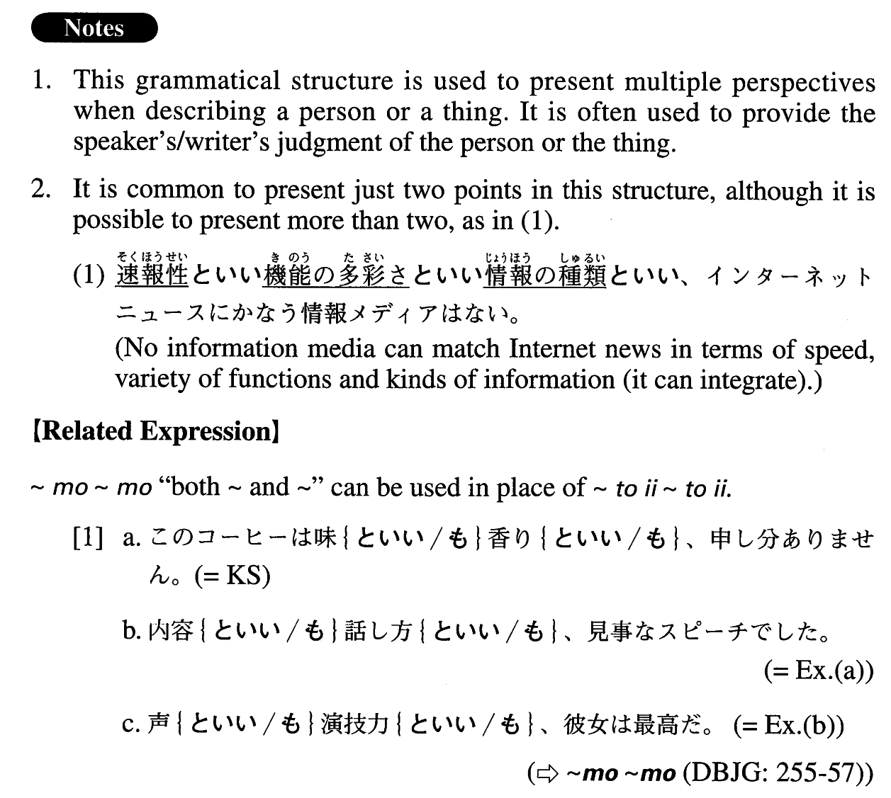

# ～といい～といい

[1. Summary](#summary) 
[2. Formation](#formation) 
[3. Example Sentences](#example-sentences) 
 

## Summary

<table><tr>   <td>Summary</td>   <td>A structure that introduces multiple perspectives when describing a person or a thing.</td></tr><tr>   <td>English</td>   <td>In terms of both ~ and ~; in terms of ~ as well as ~; from the perspective of both ~ and ~</td></tr><tr>   <td>Part of speech</td>   <td>Structure</td></tr><tr>   <td>Related expression</td>   <td>も~も</td></tr></table>

## Formation

<table class="table"><tbody><tr class="tr head"><td class="td">Noun1</td><td class="td">といいNoun2といい</td><td class="td"></td></tr><tr class="tr"><td class="td"></td><td class="td">色といい形といい</td><td class="td">In terms of both colour and shape</td></tr></tbody></table>

## Example Sentences

<table><tr>   <td>このコーヒーは味といい香りといい、申し分ありません。</td>   <td>This coffee is perfect in terms of both flavour and aroma.</td></tr><tr>   <td>内容といい話し方といい、見事なスピーチでした。</td>   <td>It was a splendid speech in terms of content as well as delivery.</td></tr><tr>   <td>声といい演技力といい、彼女は最高だ。</td>   <td>She is the best from the perspective of both voice and acting ability.</td></tr><tr>   <td>人柄といい才能といい、米倉さんに勝る人はいない。</td>   <td>No one surpasses Ms. Yonekura in terms of both personality and ability.</td></tr><tr>   <td>音楽の情感といい音の豊かさといい、こんな感動的な演奏を聴いたことがない。</td>   <td>I've never heard such a moving performance, both in terms of the artist's emotion and the richness of the sound.</td></tr><tr>   <td>家柄といい学歴といい、彼は非の打ちどころがない。</td>   <td>He is just perfect, both in terms of his family and educational backgrounds.</td></tr><tr>   <td>スピードといいパワーといい、今の彼に勝てる選手はいない。</td>   <td>No player can beat him now in terms of either speed or power.</td></tr></table>

## Grammar Book Page

