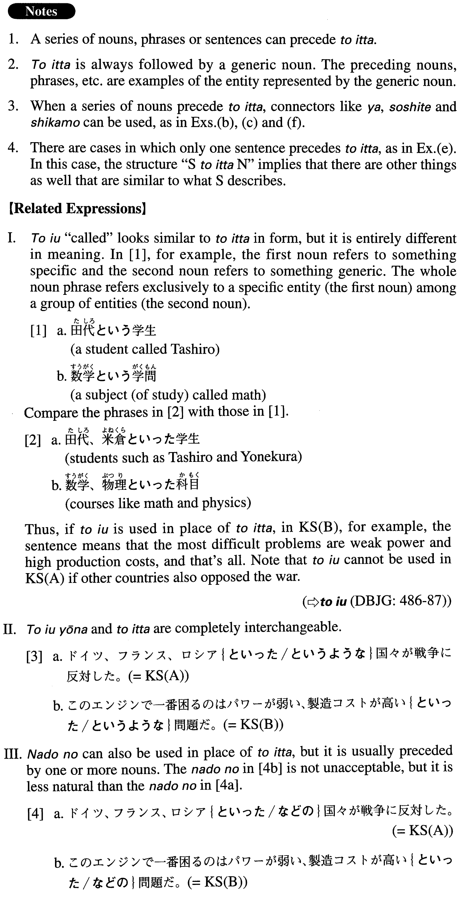

# といった

[1. Summary](#summary) 
[2. Formation](#formation) 
[3. Example Sentences](#example-sentences) 
 

## Summary

<table><tr>   <td>Summary</td>   <td>A compound particle that introduces examples.</td></tr><tr>   <td>English</td>   <td>Like; such as; among others</td></tr><tr>   <td>Part of speech</td>   <td>Compound Particle</td></tr><tr>   <td>Related expression</td>   <td>と言う; と言うような; などの</td></tr></table>

## Formation

<table class="table"><tbody><tr class="tr head"><td class="td">(i) Noun1、Noun2(、…) </td><td class="td">といったNoun</td><td class="td"></td></tr><tr class="tr"><td class="td"></td><td class="td">犬、猫といったペット</td><td class="td">Pets like dogs and cats</td></tr><tr class="tr head"><td class="td">(ii) Sentence1 (、Sentence2、Sentence3、…) </td><td class="td">といったNoun</td><td class="td"></td></tr><tr class="tr"><td class="td"></td><td class="td">持ち運びしやすい、容量が大きいといった特徴</td><td class="td">Such characteristics as portability and large capacity</td></tr></tbody></table>

## Example Sentences

<table><tr>   <td>ドイツ、フランス、ロシアといった国々が戦争に反対した。</td>   <td>Countries such as Germany, France and Russia opposed the war.</td></tr><tr>   <td>このエンジンで一番困るのはパワーが弱い、製造コストが高いといった問題だ。</td>   <td>The problems that are giving me the most trouble with this engine are things like weak power and high production costs.</td></tr><tr>   <td>終身雇用、年功序列といった日本の伝統的雇用形態が崩れつつある。</td>   <td>Japan's traditional employment practices, such as permanent employment and seniority systems, are (in the process of) falling apart.</td></tr><tr>   <td>ここではBMWやベンツといったドイツの高級車が人気があるようだ。</td>   <td>It looks like expensive German cars such as BMWs and Mercedes Benzes are popular here.</td></tr><tr>   <td>学校選択制、そして基礎学力の向上といったテーマが今、全国で議論されている。</td>   <td>Themes like school-choice systems and the improvement of basic academic skills are being discussed all over the country now.</td></tr><tr>   <td>こんな機能があるといい、こんな情報が欲しいといったご意見・ご要望がありましたら、下記のアドレスに電子メールでお知らせ下さい。</td>   <td>If you have opinions/requests such as \"This kind of function would be helpful\" or \"I want this kind of information,\" please let us know via e-mail at the address below.</td></tr><tr>   <td>一流大学から一流企業に就職すれば一生安泰の人生が送れるといった考え方はもう通用しない。</td>   <td>It's no longer realistic to think that if you graduate from a first-class university and get a job at a first-class company you are set for life.</td></tr><tr>   <td>ゴミを燃やせばダイオキシン二酸化炭素といった有害物質が排出される。またゴミの埋立地もあとわずかで満杯になる、しかも新たな埋立地がない、といった問題がある。</td>   <td>If you burn trash, toxic materials such as dioxin and carbon dioxide are emitted. There is also the problem that landfills will soon be full and, to make the matter worse, no new land for landfills is available.</td></tr></table>

## Grammar Book Page

