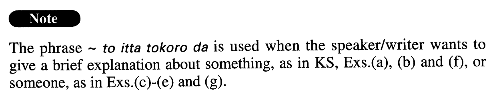

# といったところだ

[1. Summary](#summary) 
[2. Formation](#formation) 
[3. Example Sentences](#example-sentences) 
 

## Summary

<table><tr>   <td>Summary</td>   <td>A phrase the speaker/writer uses to explain something in a brief/rough manner.</td></tr><tr>   <td>English</td>   <td>I would say ~; ~ is how I’d put it</td></tr><tr>   <td>Part of speech</td>   <td>Phrase</td></tr></table>

## Formation

<table class="table"><tbody><tr class="tr head"><td class="td">(i) {V/Adjectiveい}informal</td><td class="td">といったところだ。</td><td class="td"></td></tr><tr class="tr"><td class="td"></td><td class="td">やっと終わったといったところだ。</td><td class="td">I’d say that it’s finally over</td></tr><tr class="tr"><td class="td"></td><td class="td">良くもなく悪くもないといったところだ。</td><td class="td">I’d say that it is neither good nor bad</td></tr><tr class="tr head"><td class="td">(ii) {Noun/Adjectiveなstem}</td><td class="td">といったところだ。</td><td class="td"></td></tr><tr class="tr"><td class="td"></td><td class="td">典型的な日本人といったところだ。</td><td class="td">I’d say that he/she is a typical Japanese</td></tr><tr class="tr"><td class="td"></td><td class="td">不健康といったところだ。</td><td class="td">I’d say that someone is unhealthy</td></tr><tr class="tr head"><td class="td">(iii) {Adverb/Interjection}</td><td class="td">といったところだ。</td><td class="td"></td></tr><tr class="tr"><td class="td"></td><td class="td">もうちょっとといったところだ。</td><td class="td">I’d say that it will be done very soon</td></tr><tr class="tr"><td class="td"></td><td class="td">まあまあといったところだ。</td><td class="td">I’d say that something is so-so</td></tr></tbody></table>

## Example Sentences

<table><tr>   <td>9月になって猛暑も一段落といったところです。</td>   <td>I'd say the searing heat levelled off in September.</td></tr><tr>   <td>ここは山というよりは、小高い丘といったところだ。</td>   <td>I'd say that this is more of a (small) hill than a mountain.</td></tr><tr>   <td>ホテルの部屋の広さはまあまあといったところでした。</td>   <td>I'd say that the space in the hotel room was so-so.</td></tr><tr>   <td>この大学の学部生と院生は合わせて6、000人といったところだ。</td>   <td>Together, the number of undergraduates and graduates at this college is about 6,000.</td></tr><tr>   <td>ヤンキースとレッドソックスはほぼ互角といったところだ。</td>   <td>I'd say that the Yankees and the Red Sox are even.</td></tr><tr>   <td>たった1年間の経験だけでは、図書館「達人」と呼ばれるには、まだまだといったところです。</td>   <td>With only one year of experience, I'd say I have a long way to go before people call me a library expert.</td></tr><tr>   <td>英語の\"Sorry\"は日本語の「すみません」よりも「謝罪」の意味合いが強い。いわゆる「ごめんなさい」「申し訳ありません」といったところだ。</td>   <td>“Sorry” in English is more of an apology than the Japanese “sumimasen.” I would say that it corresponds to “gomennasai” or “moushiwake arimasen.”</td></tr><tr>   <td>この小説の主人公の男の性格を一言で表すとすれば、「自分には厳しいけれど、人にはとても優しい」といったところです。</td>   <td>If I were to describe the personality of this novel's main character in short (literally: in a word), I would say he is very hard on himself but very kind to others.</td></tr></table>

## Grammar Book Page

