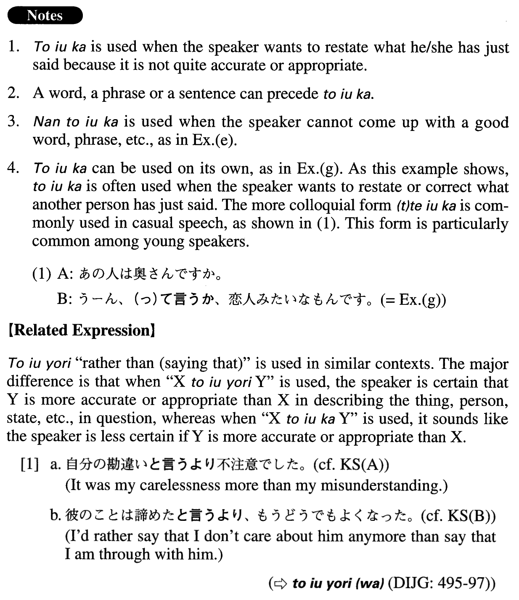

# と言うか

 
 
 

## Summary

<table><tr>   <td>Summary</td>   <td>A phrase used to restate what was just said in order to be more accurate or appropriate.</td></tr><tr>   <td>English</td>   <td>Or; or rather; or I’d (rather) call it; or I may call it; or I’d (rather) say; or I may say</td></tr><tr>   <td>Part of speech</td>   <td>Phrase</td></tr><tr>   <td>Related expression</td>   <td>と言うより</td></tr></table>

## Example Sentences

<table><tr>   <td>自分の勘違いと言うか、不注意でした。</td>   <td>It was my misunderstanding . . . or carelessness, rather.</td></tr><tr>   <td>彼のことは諦めたと言うか、もうどうでもよくなった。</td>   <td>I'm through with him. Or rather, I don't care anymore.</td></tr><tr>   <td>我が社の話は何もできません。と言うか、何も話すことはありません。</td>   <td>I cannot talk about our company. Or, I should say, I have nothing to say about it.</td></tr><tr>   <td>彼は議論好きと言うか、いつも人の意見に反対したがります。</td>   <td>He is argumentative, or should I say, he always wants to disagree with others.</td></tr><tr>   <td>この事件については、私たちも驚いていると言うか、困惑しています。</td>   <td>We are also surprised by this incident, or perplexed, rather.</td></tr><tr>   <td>今日来た人は、商魂たくましいと言うか、本当に厚かましい人でした。</td>   <td>The person who visited us today was an aggressive salesman, or maybe I should just say he was a really shameless person.</td></tr><tr>   <td>何度裏切られても涙を見ると許してしまう自分に腹が立つと言うか、愛想が尽きる。</td>   <td>No matter how many times I get betrayed, I end up forgiving him when I see his tears. I'm angry at myself, or I should say, I'm sick of myself. (literally: I'm angry at myself, who ends up...)</td></tr><tr>   <td>これは何と言うか、まあ、一種の妥協でしょうね。</td>   <td>What should I call it? Hmm, it's a kind of compromise, I guess.</td></tr><tr>   <td>これは日記と言うか覚え書きと言うか…。</td>   <td>Should I call this a diary, or a memo?</td></tr><tr>   <td>A:あの人は奥さんですか。B:うーん、と言うか、恋人みたいなもんです。</td>   <td>A: Is she your wife?    B: Well, actually, (I'd say) she's something like a lover.</td></tr></table>

## Grammar Book Page

