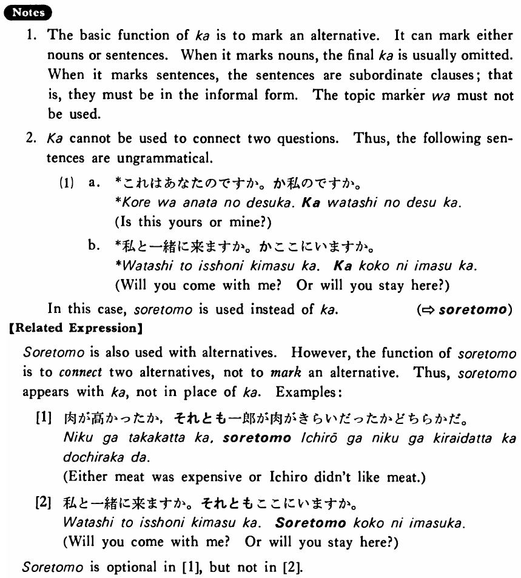

# か (1)

[1. Summary](#summary) 
[2. Formation](#formation) 
[3. Example Sentences](#example-sentences) 
[4. Explanation](#explanation) 
[5. Grammar Book Page](#grammar-book-page) 

## Summary

<table><tr>   <td>Summary</td>   <td>A particle which marks an alternative.</td></tr><tr>   <td>English</td>   <td>(either) ~ or ~</td></tr><tr>   <td>Part of speech</td>   <td>Particle</td></tr><tr>   <td>Related expression</td>   <td>それとも</td></tr></table>

## Formation

<table class="table"><tbody><tr class="tr head"><td class="td">(i)  {V/Adjective い}    informal</td><td class="td">か </td><td class="td">&nbsp;</td></tr><tr class="tr"><td class="td">&nbsp;</td><td class="td">{話す /話した} か</td><td class="td">Either    someone talks/talked or</td></tr><tr class="tr"><td class="td">&nbsp;</td><td class="td">{高い /高かった} か</td><td class="td">Either    something is/was expensive or</td></tr><tr class="tr head"><td class="td">(ii)  {Adjective な stem/   N}</td><td class="td">{Ø/だった} か</td><td class="td">&nbsp;</td></tr><tr class="tr"><td class="td">&nbsp;</td><td class="td">{静か /静かだった} か</td><td class="td">Either    something is/was quiet or</td></tr><tr class="tr"><td class="td">&nbsp;</td><td class="td">{先生 /先生だった} か</td><td class="td">Either    someone is/was a teacher or</td></tr><tr class="tr head"><td class="td">(iii) N1 か N2</td><td class="td">先生か学生 </td><td class="td">Either    a teacher or a student</td></tr></tbody></table>

## Example Sentences

<table><tr>   <td>私は電車かバス（か）で行く・行きます。</td>   <td>I will go either by train or by bus.</td></tr><tr>   <td>トムが行くかメアリーが行くかどちらかだ・です。</td>   <td>Either Tom will go or Mary will go.</td></tr><tr>   <td>私は毎朝ジュースかミルクを飲む。</td>   <td>I drink either juice or milk every morning.</td></tr><tr>   <td>それはボブかマークかします。</td>   <td>As for that, either Bob or Mark will do it.</td></tr><tr>   <td>肉が高かったか一郎が嫌いだったかどちらかだ。</td>   <td>Either meat was expensive or Ichiro didn't like meat.</td></tr><tr>   <td>手紙を書くか電話をかけるかどちらかして下さい。</td>   <td>Either write a letter or make a call, please.</td></tr><tr>   <td>食べるか話すかどちらかにしなさい。</td>   <td>Decide on either eating or talking.</td></tr></table>

## Explanation

1. The basic function of か is to mark an alternative. It can mark either nouns or sentences. When it marks nouns, the final か is usually omitted. When it marks sentences, the sentences are subordinate clauses; that is, they must be in the informal form. The topic marker は must not be used.
  
2. か cannot be used to connect two questions. Thus, the following sentences are ungrammatical.
  <ul>(1) <li>a. *これはあなたのですか。か私のですか。</li> <li>Is this yours or mine?</li> 

 <li>b. *私と一緒に来ますか。かここにいますか。</li> <li>Will you come with me? Or will you stay here?</li> </ul>  
In this case, それとも is used instead of か.
   (⇨ <a href="#㊦ それとも">それとも</a>)
  
【Related Expression】
  
それとも is also used with alternatives. However, the function of それとも is to connect two alternatives, not to mark an alternative. Thus, それとも< appears with か, not in place of か. Examples:
  
[1]
  <ul> <li>肉が高かったか，それとも一郎が肉がきらいだったかどちらかだ。</li> <li>Either meat was expensive or Ichiro didn't like meat.</li> </ul>  
[2]
  <ul> <li>私と一緒に来ますか。それともここにいますか。</li> <li>Will you come with me? Or will you stay here?</li> </ul>  
それとも is optional in [1], but not in [2].

## Grammar Book Page

