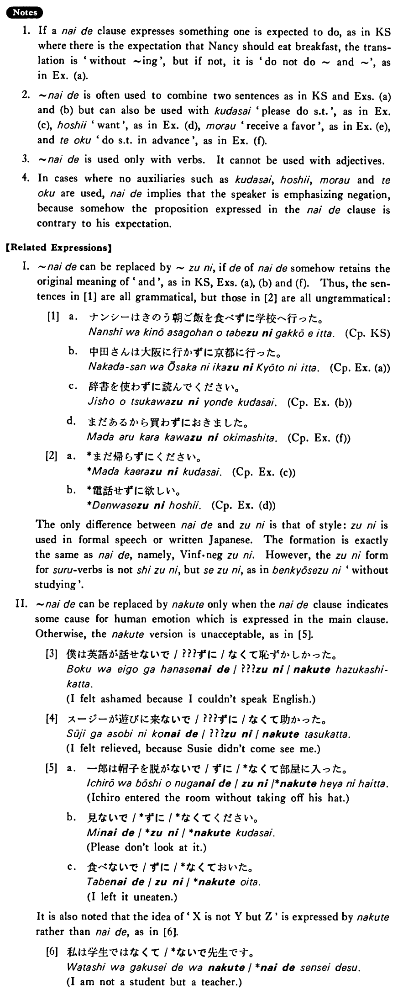

# ないで

[1. Summary](#summary) 
[2. Formation](#formation) 
[3. Example Sentences](#example-sentences) 
[4. Explanation](#explanation) 
 

## Summary

<table><tr>   <td>Summary</td>   <td>A negative て form of a verb.</td></tr><tr>   <td>English</td>   <td>Do not do something and; without doing ~</td></tr><tr>   <td>Part of speech</td>   <td>Phrase</td></tr><tr>   <td>Related expression</td>   <td>なくて; ずに</td></tr></table>

## Formation

<table class="table"> <tbody><tr class="tr head"> <td class="td">Vnegative</td> <td class="td">ないで </td> <td class="td">&nbsp;</td> </tr> <tr class="tr"> <td class="td">&nbsp;</td> <td class="td">話さないで </td> <td class="td">Without    talking</td> </tr> <tr class="tr"> <td class="td">&nbsp;</td> <td class="td">食べないで </td> <td class="td">Without    eating</td> </tr></tbody></table>

## Example Sentences

<table><tr>   <td>ナンシーは昨日朝ご飯を食べないで学校へ行った・行きました。</td>   <td>Nancy went to school yesterday without eating her breakfast.</td></tr><tr>   <td>中田さんは大阪に行かないで京都に行った。</td>   <td>Mr. Nakada didn't go to Osaka; he went to Kyoto.</td></tr><tr>   <td>辞書を使わないで読んで下さい。</td>   <td>Please read it without using a dictionary.</td></tr><tr>   <td>まだ帰らないで下さい。</td>   <td>Please don't go home yet.</td></tr><tr>   <td>電話しないで欲しい。</td>   <td>I want you not to call me.</td></tr><tr>   <td>やかましくしないで貰いたい。</td>   <td>I want you to not make noises.</td></tr><tr>   <td>まだあるから買わないでおきました。</td>   <td>Because I still have it, I didn’t buy it (in advance).</td></tr></table>

## Explanation

1. If a ないで clause expresses something one is expected to do, as in Key Sentence where there is the expectation that Nancy should eat breakfast, the translation is 'without ~ing', but if not, it is 'do not do ~ and ~', as in Example (a).
  
2. ないで is often used to combine two sentences as in Key Sentence and Examples (a) and (b) but can also be used with 下さい 'please do something', as in Example (c), 欲しい 'want', as in Example (d), もらう 'receive a favor', as in Example (e), and ておく 'do something in advance', as in Example (f).
  
3. ないで is used only with verbs. It cannot be used with adjectives.
  
4. In cases where no auxiliaries such as 下さい, 欲しい, もらう and ておく are used, ないで implies that the speaker is emphasizing negation, because somehow the proposition expressed in the ないで clause is contrary to his expectation.
  
【Related Expressions】
  
I. ないで can be replaced by ずに, if で of ないで somehow retains the original meaning of 'and' as in Key Sentence, Examples (a), (b) and (f). Thus, the sentences in [1] are all grammatical, but those in [2] are all ungrammatical:
  
[1]
  <ul> <li>a. ナンシーはきのう朝ご飯を食べずに学校へ行った。&nbsp;&nbsp;[Complementiser phrase: Key Sentence]</li> 

 <li>b. 中田さんは大阪に行かずに京都に行った。&nbsp;&nbsp;[Complementiser phrase: Example (a)]</li> 

 <li>c. 辞書を使わずに読んでください。&nbsp;&nbsp;[Complementiser phrase: Example (b)]</li> 

 <li>d. まだあるから買わずにおきました。&nbsp;&nbsp;[Complementiser phrase: Example (f)]</li> </ul>   
[2]
  <ul> <li>a. *まだ帰らずにください。&nbsp;&nbsp;[Complementiser phrase: Example (c)]</li> <li>

 <li>b. *電話せずに欲しい。&nbsp;&nbsp;[Complementiser phrase: Example (d)]</li> </ul>   
The only difference between ないで and ずに is that of style: ずに is used in formal speech or written Japanese. The formation is exactly the same as ないで, namely, Verb informal negativeずに. However, the ずに form for する verbs is not しずに, but せずに, as in 勉強せずに, 'without studying'.
  
II. ないで can be replaced by なくて only when the ないで clause indicates some cause for human emotion which is expressed in the main clause. Otherwise, the なくて version is unacceptable, as in [5].
  
[3]
  <ul> <li>僕は英語が話せないで/???ずに/なくて恥ずかしかった。</li> <li>I felt ashamed because I couldn't speak English.</li> </ul>  
[4]
  <ul> <li>スージーが遊びに来ないで/???ずに/なくて助かった。</li> <li>I felt relieved, because Susie didn't come see me.</li> </ul>  
[5]
  <ul> <li>a. —郎は帽子を脱がないで/ずに/*なくて部屋に入った。</li> <li>Ichiro entered the room without taking off his hat.</li> 

 <li>b. 見ないで/*ずに/*なくてください。</li> <li>Please don't look at it.</li> 

 <li>c. 食べないで/ずに/*なくておいた。</li> <li>I left it uneaten.</li> </ul>  
It is also noted that the idea of 'X is not Y but Z' is expressed by なくて rather than ないで, as in [6].
  
[6]
  <ul> <li>私は学生ではなくて/*ないで先生です。</li> <li>I am not a student but a teacher.</li> </ul>

## Grammar Book Page

