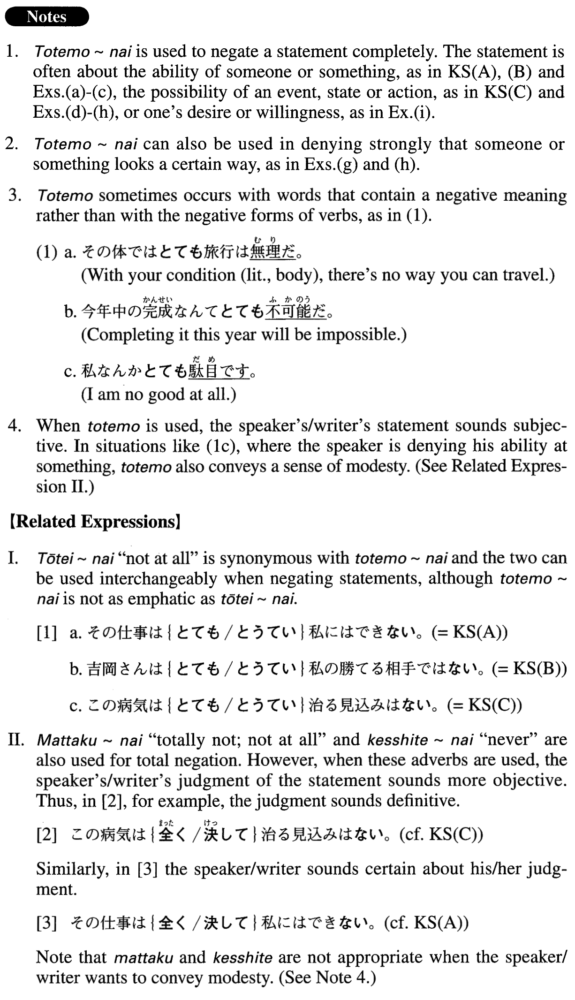

# とても～ない

[1. Summary](#summary) 
[2. Formation](#formation) 
[3. Example Sentences](#example-sentences) 
 

## Summary

<table><tr>   <td>Summary</td>   <td>A structure that is used to deny emphatically the ability of someone/something or possibility of an event, state or action</td></tr><tr>   <td>English</td>   <td>Cannot possibly; totally impossible; there is no possibility; there is no way; not ~ at all; not ~ by any means; by no means</td></tr><tr>   <td>Part of speech</td>   <td>Structure</td></tr><tr>   <td>Related expression</td>   <td>とうてい~ない; 全く~ない; 決して~ない</td></tr></table>

## Formation

<table class="table"><tbody><tr class="tr head"><td class="td">(i) とても</td><td class="td">Vnegativeない</td><td class="td"></td></tr><tr class="tr"><td class="td"></td><td class="td">とても歩けない</td><td class="td">Cannot possibly walk</td></tr><tr class="tr"><td class="td"></td><td class="td">とても届かない</td><td class="td">Do not reach at all</td></tr><tr class="tr head"><td class="td">(ii) とても</td><td class="td">Nounはない</td><td class="td"></td></tr><tr class="tr"><td class="td"></td><td class="td">とても望みはない</td><td class="td">There is no (hope) at all</td></tr><tr class="tr head"><td class="td">(ii) とても</td><td class="td">NPではない</td><td class="td"></td></tr><tr class="tr"><td class="td"></td><td class="td">とても人に見せられるものではない</td><td class="td">Something is something I cannot possibly show others (literally: something is not something I can possibly show others) </td></tr></tbody></table>

## Example Sentences

<table><tr>   <td>この仕事はとても私にはできない。</td>   <td>I cannot possibly do this job.</td></tr><tr>   <td>吉岡さんはとても私の勝てる相手ではない。</td>   <td>Mr. Yoshioka is someone I couldn't possibly beat. (literally: Mr. Yoshioka is not someone I could possibly beat.)</td></tr><tr>   <td>この病気はとても治る見込みはない。</td>   <td>There is no possibility that he will recover from this illness.</td></tr><tr>   <td>私は数学ではとても彼にかなわない。</td>   <td>I cannot possibly beat him in mathematics.</td></tr><tr>   <td>こんな予算ではとてもこの学校を維持していけない。</td>   <td>It is totally impossible to maintain this school with a budget like this.</td></tr><tr>   <td>今の大統領はとてもこの国を統治する能力はない。</td>   <td>The current president has no ability at all to govern this country.</td></tr><tr>   <td>この病人はとても助からない。</td>   <td>There is no way this patient can possibly be saved.</td></tr><tr>   <td>この地方に雪が降ることはとてもあり得ない。</td>   <td>There's no way it could snow in this region.</td></tr><tr>   <td>とても我々に勝ち目はない。</td>   <td>We have no chance of winning.</td></tr><tr>   <td>経済はとてもすぐには回復しそうにない。</td>   <td>It does not look like there is any chance the economy will recover soon.</td></tr><tr>   <td>山岸さんはとても８０歳には見えない。</td>   <td>Mrs. Yamagishi does not look 80 years old at all.</td></tr><tr>   <td>そんな危ないところにはとても子供を行かせられない。</td>   <td>I cannot possibly send my child to such a dangerous place.</td></tr></table>

## Grammar Book Page

