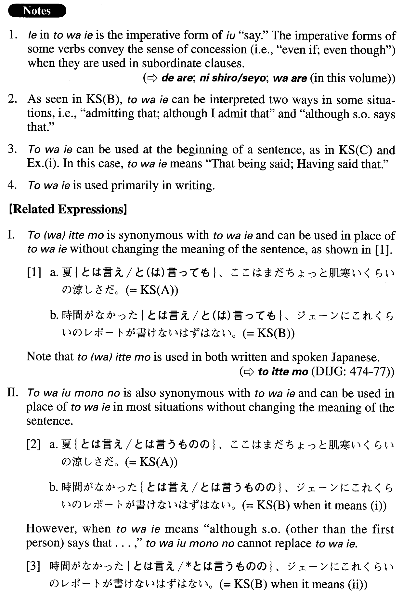

# とは言え

[1. Summary](#summary) 
[2. Formation](#formation) 
[3. Example Sentences](#example-sentences) 
[4. Grammar Book Page](#grammar-book-page) 

## Summary

<table><tr>   <td>Summary</td>   <td>A conjunctive phrase meaning “although it is said that”</td></tr><tr>   <td>Equivalent</td>   <td>Although (it is said that/someone says that); even though (it is said that/someone says that); admitting that; that being said; however; nevertheless</td></tr><tr>   <td>Part of speech</td>   <td>Phrase (usually used in formal writing and formal speech)</td></tr><tr>   <td>Related expression</td>   <td>と(は)いっても; とは言うものの</td></tr></table>

## Formation

<table class="table"><tbody><tr class="tr head"><td class="td">(i) Sinformal</td><td class="td">とは言え</td><td class="td">だ after Adjectiveなstem and Noun is omitted</td></tr><tr class="tr"><td class="td"></td><td class="td">{知らない/知らなかった}とは言え</td><td class="td">Although someone doesn’t/didn’t know</td></tr><tr class="tr"><td class="td"></td><td class="td">{寒い/寒かった}とは言え</td><td class="td">Although it is/was cold</td></tr><tr class="tr"><td class="td"></td><td class="td">不便{∅/だった}とは言え</td><td class="td">Although something is/was inconvenient</td></tr><tr class="tr"><td class="td"></td><td class="td">子供{∅/だった}とは言え</td><td class="td">Although someone is/was a child</td></tr><tr class="tr head"><td class="td">(ii) Sentence1。</td><td class="td">とは言えSentence2。</td><td class="td"></td></tr></tbody></table>

## Example Sentences

<table><tr>   <td>夏とは言え、ここはまだちょっと肌寒いくらいの涼しさだ。</td>   <td>Although it is summer, it is still cool here—almost to the extent that it can be called a little chilly.</td></tr><tr>   <td>時間がなかったとは言え、ジェーンにこれくらいのレポートが書けないはずはない。</td>   <td>(i) Even admitting that Jane didn't have much time, I don't believe that she couldn't write a (simple) report like this. (ii) Although Jane says that she didn't have much time (or you say that Jane didn't have much time), I don't believe that she couldn't write a (simple) report like this.</td></tr><tr>   <td>今度の学会が楽しみだ。とは言え、まだ発表準備は全然できていない。</td>   <td>I'm looking forward to the next academic conference. That being said, I haven't prepared for my presentation at all yet.</td></tr><tr>   <td>子供がやったこととは言え、これは立派な犯罪だ。</td>   <td>Although this was done by a child, it practically amounts to a crime.</td></tr><tr>   <td>予想していた返答だったとは言え、やはりそれを聞いた時はショックだった。</td>   <td>Although it was the response I'd expected, it really did shock me to hear it.</td></tr><tr>   <td>ノートブック型とは言え、ディスプレイは１７インチ、プロセッサーは2.4GHz、内臓ドライブは２５０GBもあり、DVD/CD-RWコンボドライブ付きという優れものだ。</td>   <td>Although it is a laptop, it is an excellent machine, with a 17-inch display, a 2.4GHz processor, a voluminous 250GB internal drive and a DVD/CD-RW combo drive.</td></tr><tr>   <td>安いとは言え、都会の高級マンションだ。普通の者が簡単に買える代物ではない。</td>   <td>Although I say (it is) reasonable, it is an upscale condominium in the city. It's not something ordinary people can easily afford.</td></tr><tr>   <td>いかに暫定的処置とは言え、これはずさんすぎる。</td>   <td>No matter how temporary these measures are supposed to be, this is just too slipshod.</td></tr><tr>   <td>怪我をして動けないとは言え、ものを考えることはできる。</td>   <td>Even though I cannot move because of my injury, I can still think.</td></tr><tr>   <td>毎日走っているとは言え、1キロほどジョギングするだけだから大した運動にはならない。</td>   <td>Although I say I run every day, it's just one kilometre of jogging, so I don't get much exercise.</td></tr><tr>   <td>退職したとは言え、毎日やることがたくさんあるので忙しい。</td>   <td>Although I've retired, I have lots of things to do every day, which keeps me busy.</td></tr><tr>   <td>燃料電池は将来化石燃料に代わる主要エネルギーになるだろう。とは言え、これにはまだ解決すべき技術的な問題が多く残っている。</td>   <td>Fuel cells will probably become a major source of energy in the future, replacing fossil fuels. Having said that, many technical problems (with this technology) remain to be solved.</td></tr></table>

## Grammar Book Page

