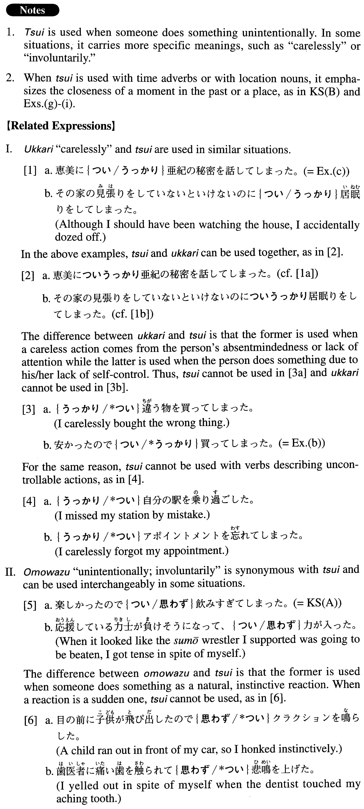

# つい

 
 
 
 

## Summary

<table><tr>   <td>Summary</td>   <td>An adverb used to describe someone doing something without being able to control himself/herself or used to indicate the closeness of a time or a place.</td></tr><tr>   <td>English</td>   <td>Unintentionally; without being able to control onself; without meaning to; carelessly; involuntarily; in spite of oneself; just; only</td></tr><tr>   <td>Part of speech</td>   <td>Adverb</td></tr><tr>   <td>Related expression</td>   <td>うっかり; 思わず</td></tr></table>

## Formation

<table class="table"><tbody><tr class="tr head"><td class="td">(i) つい</td><td class="td">Verb</td><td class="td"></td></tr><tr class="tr"><td class="td"></td><td class="td">つい居眠りをする</td><td class="td">Someone dozes carelessly/unintentionally</td></tr><tr class="tr head"><td class="td">(ii) つい</td><td class="td">Adverb</td><td class="td">(time) </td></tr><tr class="tr"><td class="td"></td><td class="td">つい最近</td><td class="td">Just recently</td></tr></tbody></table>

## Example Sentences

<table><tr>   <td>楽しかったので、つい飲みすぎてしまった。</td>   <td>Because I had such a good time, I ended up drinking too much (without meaning to).</td></tr><tr>   <td>ついさっきまで山口さんが来ていたんです。</td>   <td>Mr. Yamaguchi was here until just a little while ago.</td></tr><tr>   <td>人のお金を使うのは悪いとは知りながら、つい使ってしまった。</td>   <td>I know it's a bad thing to use someone else's money but I just couldn't control myself (and used it).</td></tr><tr>   <td>安かったのでつい買ってしまった。</td>   <td>It was cheap, so I just bought it (even though I didn't mean to).</td></tr><tr>   <td>恵美につい亜紀の秘密を話してしまった。</td>   <td>I carelessly told Aki's secret to Emi.</td></tr><tr>   <td>彼の仕事を見ているとじれったいのでつい手を貸してしまう。</td>   <td>I feel impatient when I see him doing his work, so, without intending to, I end up extending a hand.</td></tr><tr>   <td>あの人は面白いのでついからかいたくなる。</td>   <td>He's so funny it's hard to resist teasing him (literally: I come to want to tease him without meaning to).</td></tr><tr>   <td>この店は感じがいいのでつい入ってみたくなる。</td>   <td>This shop has such a good atmosphere that I can't help wanting to go in.</td></tr><tr>   <td>ついこの間、新年を祝ったと思ったら今日はもうバレンタインデーだ。</td>   <td>It feels like we just celebrated New Year's the other day, and here it is Valentine's Day already.</td></tr><tr>   <td>彼女からは、つい２、3日前にメールをもらった。</td>   <td>I received an email from her only two or three days ago.</td></tr><tr>   <td>ついそこに喫茶店がありますからそこで話しましょう。</td>   <td>There's a tea house just over there, so let's talk there.</td></tr></table>

## Grammar Book Page

