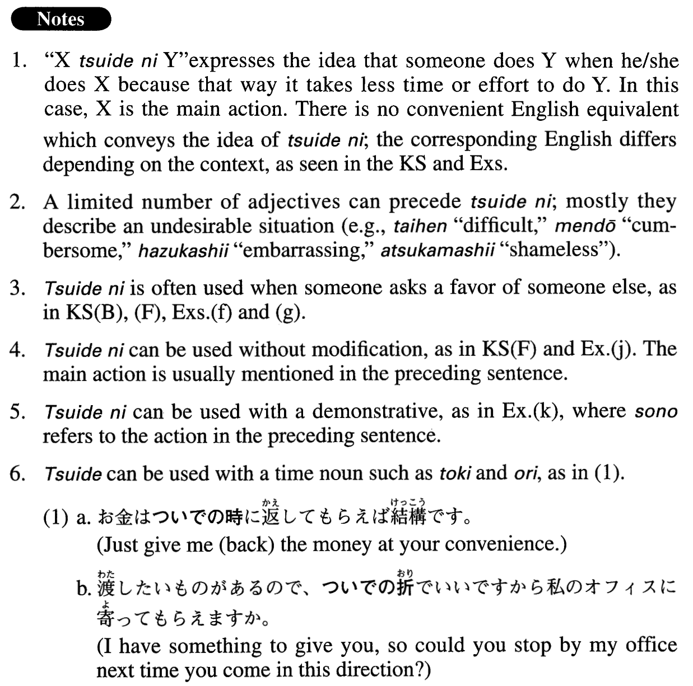

# ついでに

[1. Summary](#summary) 
[2. Formation](#formation) 
[3. Example Sentences](#example-sentences) 
 

## Summary

<table><tr>   <td>Summary</td>   <td>A phrase used to express the idea that someone does a second thing at the same time as the first because it takes less time or effort.</td></tr><tr>   <td>English</td>   <td>When; while (~ at it); as; on one’s way to; since ~ (anyway); as well; at one’s convenience</td></tr><tr>   <td>Part of speech</td>   <td>Phrase</td></tr></table>

## Formation

<table class="table"><tbody><tr class="tr head"><td class="td">(i) Vinformal</td><td class="td">ついでに</td><td class="td"></td></tr><tr class="tr"><td class="td"></td><td class="td">{行く/行った}ついでに</td><td class="td">When someone goes/went</td></tr><tr class="tr head"><td class="td">(ii) Vます</td><td class="td">ついでに</td><td class="td"></td></tr><tr class="tr"><td class="td"></td><td class="td">送りついでに</td><td class="td">When someone sends something/gives a ride to someone</td></tr><tr class="tr head"><td class="td">(iii) Adjectiveなstem</td><td class="td">ついでに</td><td class="td"></td></tr><tr class="tr"><td class="td"></td><td class="td">面倒ついでに</td><td class="td">Since someone is doing a tedius thing anyway</td></tr><tr class="tr head"><td class="td">(iv) Adjectiveい{stem/informal nonpast}</td><td class="td">ついでに</td><td class="td"></td></tr><tr class="tr"><td class="td"></td><td class="td">恥ずかし(い) ついでに</td><td class="td">Since someone is embarrassed anyway</td></tr><tr class="tr head"><td class="td">(v) VN</td><td class="td">ついでに</td><td class="td"></td></tr><tr class="tr"><td class="td"></td><td class="td">発送ついでに</td><td class="td">While someone ships something</td></tr><tr class="tr head"><td class="td">(vi) Nの</td><td class="td">ついでに</td><td class="td"></td></tr><tr class="tr"><td class="td"></td><td class="td">食事のついでに</td><td class="td">When someone has a meal</td></tr><tr class="tr"><td class="td"></td><td class="td">ニューヨーク出張のついでに</td><td class="td">When someone goes to New York on business</td></tr></tbody></table>

## Example Sentences

<table><tr>   <td>京都へ来たついでに龍安寺の石庭を見に行こうと思っている。</td>   <td>Since I'm in Kyoto, I'm thinking of going to see the rock garden at Ryoanji Temple.</td></tr><tr>   <td>頼みついでにもう一つお願いしてもいいですか。</td>   <td>While I'm at it, may I ask another favour of you?</td></tr><tr>   <td>この仕事は大変だが、大変ついでに来週の分もいま方づけておけば後が楽だ。</td>   <td>This job is a real chore, but while we're at it if we finish the work for next week, too, we'll have an easier time later.</td></tr><tr>   <td>生活費を抑えるために電気や水を節約し始めたが、節約ついでにエアコンも止めることにした。</td>   <td>I began to conserve electricity and water to lower my living expenses and as I'm cutting back, I decided to stop using the air conditioner as well.</td></tr><tr>   <td>話のついでにこのことも言っておきます。</td>   <td>While I'm telling you the story, let me add this, too.</td></tr><tr>   <td>コピーしに行くの？じゃ、これもついでにお願いできる？</td>   <td>Are you going to make copies? Then, could I ask you to do this as well?</td></tr><tr>   <td>バンクーバーへ行くついでにシアトルの友達のところに寄る予定だ。</td>   <td>I plan to stop by my friend's place in Seattle on my way to Vancouver.</td></tr><tr>   <td>車を洗ったついでに中も掃除しておいた。</td>   <td>When I washed my car, I cleaned the inside as well.</td></tr><tr>   <td>叱られついでに、もう一つの失敗のことも話してしまいます。</td>   <td>Since you've already told me off once, let me go ahead and tell you about another mistake I made.</td></tr><tr>   <td>恥かきついでにもう一つお聞きしますが、アメリカも大学入試はあるんですか。</td>   <td>Now that I've been embarrassed (by my ignorance) once, let me ask you another question. Are there college entrance exams in America, too?</td></tr><tr>   <td>今回は高級ホテルに泊まっているので、贅沢ついでにホテルのレストランで食事をすることにした。</td>   <td>I'm staying at a first-class hotel this time, and if that isn't luxurious enough, I've decided to have dinner at the hotel restaurant.</td></tr><tr>   <td>ご苦労ついでにこの翻訳も手伝ってもらえませんか。</td>   <td>Since you're working hard anyway, could I ask you to help me with this translation, too?</td></tr><tr>   <td>厚かましいついでにお願いがもう一つあります。</td>   <td>I've already been shameless (in asking you favours), but I have another favour to ask of you.</td></tr><tr>   <td>新しい電気自動車の取材ついでに自分も少し運転させてもらった。</td>   <td>When I went to report on the new electric car, I got to drive it a little myself.</td></tr><tr>   <td>買い物のついでに銀行に寄って少し現金を下ろしていきます。</td>   <td>I'll stop by the bank and withdraw some cash when I go shopping.</td></tr><tr>   <td>以上が今週の予定ですが、ついでに来週の予定も言っておきます。</td>   <td>That is the schedule for this week, and while I'm at it, let me tell you the schedule for next week as well.</td></tr></table>

## Grammar Book Page

