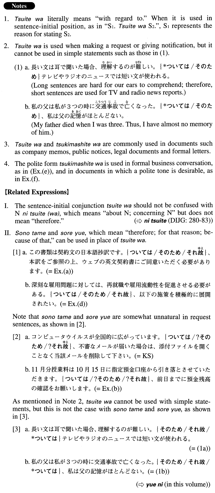

# ついては

[1. Summary](#summary) 
[2. Example Sentences](#example-sentences) 
[3. Grammar Book Page](#grammar-book-page) 

## Summary

<table><tr>   <td>Summary</td>   <td>A sentence-initial conjunction that means “with regard to this,” referring to what is stated in the preceding sentence.</td></tr><tr>   <td>Equivalent</td>   <td>Therefore; thus; so; because of this; for this reason; with regard to this</td></tr><tr>   <td>Part of speech</td>   <td>Conjunction (usually used in formal writing and formal speech)</td></tr><tr>   <td>Related expression</td>   <td>について(は); その為; それ故</td></tr></table>

## Example Sentences

<table><tr>   <td>コンピュータウイルスが全国的に広がっています。ついては、不審なメールが届いた場合は、添付ファイルを開くことなく当該メールを削除して下さい。</td>   <td>Computer viruses are spreading across the country. Because of this, if you receive a suspicious e-mail (literally: in the event a suspicious e-mail arrives), delete the email without opening the attached file.</td></tr><tr>   <td>この書類は契約文の日本語抄訳です。ついては、本訳をご参照の上、ウェブの英文契約書にご同意いただく必要があります。</td>   <td>This document is the abridged Japanese translation of the agreement. Therefore, it is necessary for you to refer to this translation and accept the English agreement posted online.</td></tr><tr>   <td>11月分授業料は10月15日に指定預金口座から引き落とさせていただきます。ついては、前日までに預金残高の確認をお願いします。</td>   <td>We are going to withdraw the November tuition and fees from your designated bank account on October 15. Therefore, please be sure to check the account balance by the previous day.</td></tr><tr>   <td>夏の省エネ対策について本社から通知がありました。ついては、別紙を参照の上、夏季のエネルギー節約にご協力をお願いいたします。</td>   <td>Headquarters has sent a notification with regard to summer energy conservation measures. We therefore request your cooperation with the summer energy saving in accordance with the measures listed in the attachment (literally: after referring to the attachment).</td></tr><tr>   <td>深刻な雇用問題に対しては、再就職や雇用流動性を促進させる必要がある。ついては、以下の施策を積極的に展開されたい。</td>   <td>To counter the serious unemployment (literally: employment) problem, it is necessary to promote reemployment and employment mobility. With regard to this, we'd like the following measures to be actively implemented.</td></tr><tr>   <td>新しくインターネット販売の事業を始める計画です。つきましては、その資金を融資していただきたいのです。</td>   <td>We plan to launch a new Internet sales business. Therefore, we would like to request financing for it.</td></tr><tr>   <td>今月は「リサイクル強化月間」になっています。つきましては、皆様方のご理解とご協力をお願いいたします。</td>   <td>This is a \"recycling reinforcement month.\" We therefore request your understanding and cooperation.</td></tr></table>

## Grammar Book Page

