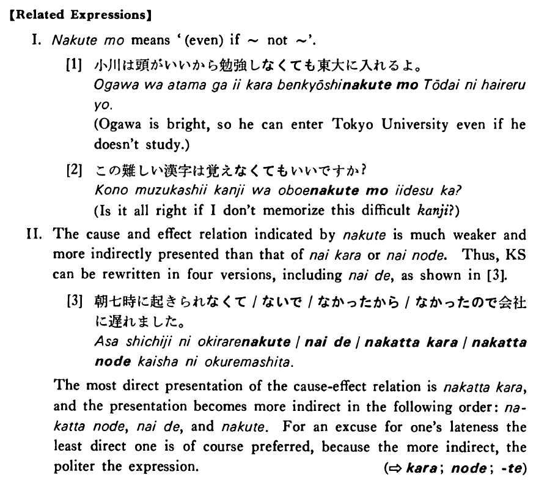

# なくて

 
 
 
 
 

## Summary

<table><tr>   <td>Summary</td>   <td>A て form of the negative ない, which indicates a cause/reason for a state or action.</td></tr><tr>   <td>English</td>   <td>Do not do something and ~; is not ~ and ~; because ~ do not do something</td></tr><tr>   <td>Part of speech</td>   <td>Phrase</td></tr><tr>   <td>Related expression</td>   <td>ないで; ないから; ないので; なくても</td></tr></table>

## Formation

<table class="table"> <tbody><tr class="tr head"> <td class="td">(i)  Vinformal negative</td> <td class="td">なくて </td> <td class="td">Where    V is often a potential verb</td> </tr> <tr class="tr"> <td class="td">&nbsp;</td> <td class="td">{話さ /話せ} なくて</td> <td class="td">Someone    doesn’t/can’t talk and ~</td> </tr> <tr class="tr"> <td class="td">&nbsp;</td> <td class="td">{食べ /食べられ} なくて</td> <td class="td">Someone    doesn’t/can’t eat and ~</td> </tr> <tr class="tr head"> <td class="td">(ii)  Adjective い stem</td> <td class="td">くなくて </td> <td class="td">&nbsp;</td> </tr> <tr class="tr"> <td class="td">&nbsp;</td> <td class="td">高くなくて </td> <td class="td">Something    isn’t expensive and ~</td> </tr> <tr class="tr head"> <td class="td">(iii)  {Adjective な stem/   N}</td> <td class="td">{では/じゃ} なくて</td> <td class="td">&nbsp;</td> </tr> <tr class="tr"> <td class="td">&nbsp;</td> <td class="td">{静かでは/静かじゃ} なくて</td> <td class="td">Something    isn’t quiet and ~</td> </tr> <tr class="tr"> <td class="td">&nbsp;</td> <td class="td">{先生では/先生じゃ} なくて</td> <td class="td">Someone    isn’t a teacher and ~</td> </tr></tbody></table>

## Example Sentences

<table><tr>   <td>朝七時に起きられなくて会社に遅れた・遅れました。</td>   <td>I couldn't get up at seven and was late for work (at my company).</td></tr><tr>   <td>先生の説明が分からなくて困りました。</td>   <td>I didn't understand the teacher's explanation and had a difficult time.</td></tr><tr>   <td>日本では日本語が話せなくて残念でした。</td>   <td>It's regrettable that I couldn't speak Japanese in Japan.</td></tr><tr>   <td>試験は難しくなくてよかったですね。</td>   <td>The exam wasn't difficult and it was good, wasn't it?</td></tr><tr>   <td>字が上手じゃなくて恥ずかしいんです。</td>   <td>My handwriting is so poor that I feel ashamed.</td></tr><tr>   <td>厳しい先生じゃなくてよかった。</td>   <td>He wasn't a strict teacher and it was good.</td></tr></table>

## Explanation

【Related Expressions】
  
I. なくても means '(even) if ~not ~'.
  
[1]
  <ul> <li>小川は頭がいいから勉強しなくても東大に入れるよ。</li> <li>Ogawa is bright, so he can enter Tokyo University even if he doesn't study.</li> </ul>  
[2]
  <ul> <li>この難しい漢字は覚えなくてもいいですか？</li> <li>Is it all right if I don't memorize this difficult kanji?</li> </ul>  
II. The cause and effect relation indicated by なくて is much weaker and more indirectly presented than that of ないから or ないので. Thus, Key Sentence can be rewritten in four versions, including ないで, as shown in [3].
  
[3]
  <ul> <li>朝七時に起きられなくて/ないで/なかったから/なかったので会社に遅れました。</li> </ul>  
The most direct presentation oi tne cause-effect relation is なかったから, and the presentation becomes more indirect in the following order: なかったので, ないで and なくて. For an excuse for one's lateness the least direct one is of course preferred, because the more indirect, the politer the expression.
   
(⇨ <a href="#㊦ から (1)">から</a>; <a href="#㊦ ので">ので</a>; <a href="#㊦ て">て</a>)

## Grammar Book Page

