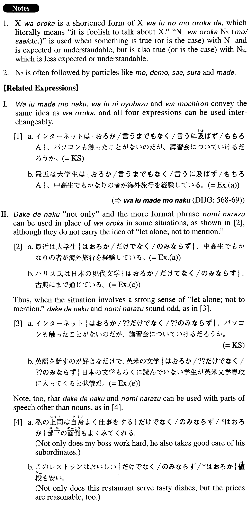

# はおろか

[1. Summary](#summary) 
[2. Formation](#formation) 
[3. Example Sentences](#example-sentences) 
 

## Summary

<table><tr>   <td>Summary</td>   <td>A phrase that is used when something is not only true with one thing or person, but also with another thing or person that is less expected or understandable.</td></tr><tr>   <td>English</td>   <td>Let alone; not only ~ (but also ~); not to mention; to say nothing of; never mind; much less</td></tr><tr>   <td>Part of speech</td>   <td>Phrase (usually used in formal writing and formal speech)</td></tr><tr>   <td>Related expression</td>   <td>は言うまでもなく; は言うに及ばず; はもちろん; だけでなく; のみならず</td></tr></table>

## Formation

<table class="table"><tbody><tr class="tr head"><td class="td">Noun1</td><td class="td">はおろかNoun2{も/でも/さえ/すら/まで}</td><td class="td"></td></tr><tr class="tr"><td class="td"></td><td class="td">ひらがなはおろか漢字{も/でも/さえ/すら/まで}</td><td class="td">Even (in) kanji, let along (in) hiragana</td></tr></tbody></table>

## Example Sentences

<table><tr>   <td>インターネットはおろか、パソコンも触ってことがないのだが、講習会についていけるだろうか。</td>   <td>Never having touched a computer, let alone used the Internet, I wonder if I will be able to keep up in the workshop.</td></tr><tr>   <td>最近は大学生はおろか、中学生でもかなりの者が海外旅行を経験している。</td>   <td>Never mind college students, these days even junior and senior high school students often have experienced traveling abroad.</td></tr><tr>   <td>アメリカでは、隣町まで１００マイル、途中ガソリンスタンドはおろか、民家さえないという場所がたくさんある。</td>   <td>In America there are many places where the next town is 100 miles away and there are no houses, let alone a gas station, in between.</td></tr><tr>   <td>ハリス氏は日本の現代文学はおろか、古典にまで通じている。</td>   <td>Mr. Harris is quite familiar with classics of Japanese literature, to say nothing of (his knowledge of) modern Japanese literature.</td></tr><tr>   <td>「近くて遠い」。この表現は日本との国交がない北朝鮮はおろか、韓国との関係を指すのにもよく使われてきた。</td>   <td>Near yet far. This phrase has often been used to describe Japan's relationship not only with North Korea, with which it has no diplomatic relations, but with South Korea as well.</td></tr><tr>   <td>英語を話すのが好きなだけで、英米の文学はおろか日本の文学もろくに読んでいない学生が英米学専攻に入ってくると悲惨だ。</td>   <td>It'll be a tragedy if a student who has barely even read any Japanese literature, much less British or American literature, signs up to major in English literature just because he or she likes to speak English.</td></tr><tr>   <td>企業は今、セキュリティのための支出を増やさなければ、セキュリティの強化はおろか、維持さえも難しくなっているという。</td>   <td>It is said that it has become more difficult for businesses to maintain security, let alone enhance it, without increasing their security expenses.</td></tr><tr>   <td>このサイトは検索はおろか、本の内容紹介までしてくれるので非常に便利だ。</td>   <td>Not only does this website let you search (for books), it also gives a summary of the (searched) books' contents, so it's very convenient.</td></tr><tr>   <td>戦争はおろか食糧難すら経験したことがない者が、口先だけて戦争を議論しているのは笑止だ。</td>   <td>It is laughable that those people who have never even experienced a food shortage, much less a war, make glib arguments about war.</td></tr></table>

## Grammar Book Page

