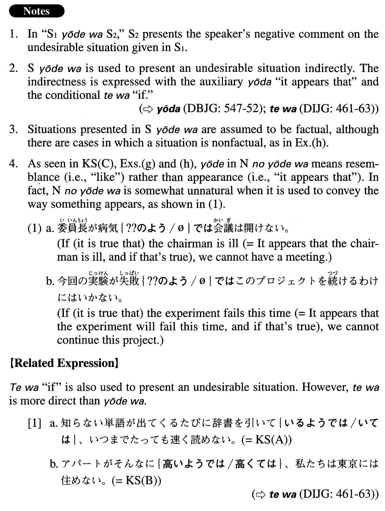

# ようでは

[1. Summary](#summary) 
[2. Formation](#formation) 
[3. Example Sentences](#example-sentences) 
 

## Summary

<table><tr>   <td>Summary</td>   <td>A conjunction that presents an undesirable situation, which is assumed to be factual.</td></tr><tr>   <td>English</td>   <td>If; if it is true that; if it is the case that</td></tr><tr>   <td>Part of speech</td>   <td>Conjunction</td></tr><tr>   <td>Related expression</td>   <td>ては</td></tr></table>

## Formation

<table class="table"><tbody><tr class="tr head"><td class="td">(i) {V/Adjectiveい}informal nonpast</td><td class="td">ようでは</td><td class="td"></td></tr><tr class="tr"><td class="td"></td><td class="td">行くようでは</td><td class="td">If it’s true/the case that someone goes/is going</td></tr><tr class="tr"><td class="td"></td><td class="td">弱いようでは</td><td class="td">If it’s true/the case that something/someone is weak</td></tr><tr class="tr head"><td class="td">(ii) Adjectiveなstemな</td><td class="td">ようでは</td><td class="td"></td></tr><tr class="tr"><td class="td"></td><td class="td">下手なようでは</td><td class="td">If it’s true/the case that someone is bad at something</td></tr><tr class="tr head"><td class="td">(iii) Nounの</td><td class="td">ようでは</td><td class="td"></td></tr><tr class="tr"><td class="td"></td><td class="td">二年のようでは</td><td class="td">If something is like two years ago</td></tr></tbody></table>

## Example Sentences

<table><tr>   <td>知らない単語が出てくるたびに辞書を引いているようではいつまでたっても速く読めない。</td>   <td>If (it is true that) you look up unfamiliar words in the dictionary every time you encounter a new one, you will never learn to read fast.</td></tr><tr>   <td>アパートがそんなに高いようでは私たちは東京には住めない。</td>   <td>If (it is true that) apartments in Tokyo are that expensive, we cannot live there.</td></tr><tr>   <td>成績が今までのようでは困ります。</td>   <td>If you continue to show the level of performance you have to date, we will have a problem. (literally: If your performance is like what you have exhibited up to now, it's a problem.)</td></tr><tr>   <td>今からそんなに文句を言っているようでは、この仕事をやり遂げるのは難しいだろう。</td>   <td>If you complain like that now, it will be difficult to complete this job.</td></tr><tr>   <td>困った時に助けてくれないようでは友達とは言えない。</td>   <td>If (it is true that) he doesn't help you when you are in trouble, you cannot call him a friend.</td></tr><tr>   <td>朝が弱いようではこの仕事は無理でしょう。</td>   <td>If it is true that) you have trouble getting up early in the morning (literally: are weak in the morning), you probably won't be able to do this job.</td></tr><tr>   <td>千円程度の旅費払い戻しに4枚も5枚も書類が必要なようでは問題だ。</td>   <td>It is a problem if (it is true that) it takes four or five forms to request a travel reimbursement for an amount as small as one thousand yen.</td></tr><tr>   <td>今頃そんなことをしているようでは、とても締め切りに間に合わない。</td>   <td>If you're doing things like that now, there's no way you'll meet the deadline.</td></tr><tr>   <td>部下の面倒が見られないようでは上司失格だ。</td>   <td>If (it is true that) you cannot take care of the people under you, you are not qualified to be their boss.</td></tr><tr>   <td>大学の施設が現状のようでは、せっかく研究資金を増やしても有効に活用できない。</td>   <td>Even if we make an effort to increase research funding, with the university facilities the way they are (literally: if the university facilities are in their present condition), we won't be able to utilize the funds effectively.</td></tr><tr>   <td>次の試合も今日の試合のようでは、とても決勝には進めない。</td>   <td>If we play the next game like (we did in) today's game, there's no way we can advance to the finals.</td></tr></table>

## Grammar Book Page

