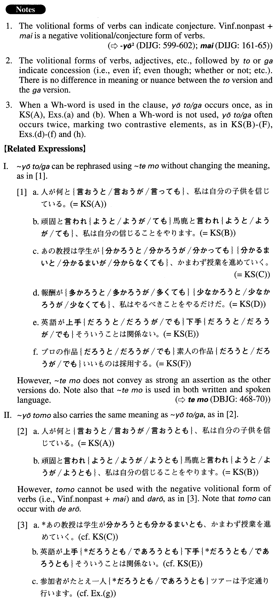

# ようと・が

 
 
 
 

## Summary

<table><tr>   <td>Summary</td>   <td>A conjunctive phrase that expresses the idea of concession.</td></tr><tr>   <td>English</td>   <td>Even if; whatever/whoever/ etc.; no matter what/who/how/etc.; whether X or Y</td></tr><tr>   <td>Part of speech</td>   <td>Phrase (usually used in formal writing and formal speech)</td></tr><tr>   <td>Related expression</td>   <td>ても; ようとも</td></tr></table>

## Formation

<table class="table"><tbody><tr class="tr head"><td class="td">(i) Vvolitional</td><td class="td">{と/が}</td><td class="td"></td></tr><tr class="tr"><td class="td"></td><td class="td">話そう{と/が}</td><td class="td">Even if someone talks</td></tr><tr class="tr"><td class="td"></td><td class="td">見よう{と/が}</td><td class="td">Even if someone looks/sees</td></tr><tr class="tr head"><td class="td">(ii) V1volitional</td><td class="td">{と/が}V2volitional nonpastまい{と/が}</td><td class="td">Where V1=V2</td></tr><tr class="tr"><td class="td"></td><td class="td">行こう{と/が}行くまい{と/が}</td><td class="td">Whether or not someone will go</td></tr><tr class="tr head"><td class="td">(iii) Adjectiveいstemかろう</td><td class="td">{と/が}</td><td class="td"></td></tr><tr class="tr"><td class="td"></td><td class="td">高かろう{と/が}安かろう{と/が}</td><td class="td">Whether something is expensive or cheap</td></tr><tr class="tr head"><td class="td">(vi) {Adjectiveなstem/Noun}</td><td class="td">{だろう/であろう}{と/が}</td><td class="td"></td></tr><tr class="tr"><td class="td"></td><td class="td">便利だろう{と/が}不便だろう{と/が}</td><td class="td">Whether something is convenient or inconvenient</td></tr><tr class="tr"><td class="td"></td><td class="td">便利であろう{と/が}不便であろう{と/が}</td><td class="td">Whether something is convenient or inconvenient</td></tr><tr class="tr"><td class="td"></td><td class="td">英語だろう{と/が}日本語だろう{と/が}</td><td class="td">Whether it is English or Japanese</td></tr><tr class="tr"><td class="td"></td><td class="td">英語であろう{と/が}日本語であろう{と/が}</td><td class="td">Whether it is English or Japanese</td></tr></tbody></table>

## Example Sentences

<table><tr>   <td>人が何と言おう{と/が}、私は自分の子供を信じている。</td>   <td>Whatever (other) people say, I believe my child.</td></tr><tr>   <td>頑固と言われよう{と/が}馬鹿と言われよう{と/が}、私は自分の信じることをやります。</td>   <td>Even if people say I'm stubborn or stupid, I'll do what I believe.</td></tr><tr>   <td>あの教授は学生が分かろう{と/が}分かるまい{と/が}、かまわず授業を進めていく。</td>   <td>That professor keeps lecturing (literally: advances his lecture) regardless of whether his students understand it or not.</td></tr><tr>   <td>報酬が多かろう{と/が}少ないかろう{と/が}、私はやるべきことをやるだけだ。</td>   <td>Whether the compensation is high or low, l'll just do what I have to do.</td></tr><tr>   <td>英語が上手だろう{と/が}下手だろう{と/が}そういうことは関係ない。</td>   <td>It doesn't matter whether his English is good or bad.</td></tr><tr>   <td>プロの作品だろう{と/が}素人の作品だろう{と/が}いいものは採用する。</td>   <td>We'll adopt anything good, whether it's a work by a professional or an amateur.</td></tr><tr>   <td>人が何をしようと大きなお世話だ。</td>   <td>Whatever I do, it's none of your business.</td></tr><tr>   <td>費用がいくらかかろうとかまわない。何としてもこの訴訟勝たなければならない。</td>   <td>We don't care how much it may cost. We have to win this lawsuit by any means.</td></tr><tr>   <td>彼はみんなが聞いていようがおかまいなしで、上司の悪口を言っている。</td>   <td>He is saying bad things about his boss without regard to whether or not others are listening.</td></tr><tr>   <td>自分の子供たちが走り回ろうが飲み物をこぼそうが、親たちは叱りもしないで自分たちの話に夢中になっている。</td>   <td>Even if their children are running around or spilling drinks, the parents are too caught up in their own conversation to scold them.</td></tr><tr>   <td>彼女が結婚しようがするまいが、そんなことは私には関係ないことだ。</td>   <td>Whether she's going to marry or not, it has nothing to do with me.</td></tr><tr>   <td>高かろうが安かろうが、必要なものなら買えばいい。</td>   <td>Whether it's expensive or cheap, we should buy it if we need it.</td></tr><tr>   <td>参加者がたとえ一人であろうとツアーは予定通り行います。</td>   <td>We're going ahead with the tour as scheduled even if we have only one participant.</td></tr><tr>   <td>日本人だろうがアメリカ人だろうが、そういうことは関係ない。好きになったら結婚する。</td>   <td>It doesn't matter whether she is Japanese or American. If I fall in love (with someone), I'll marry that person.</td></tr></table>

## Grammar Book Page

