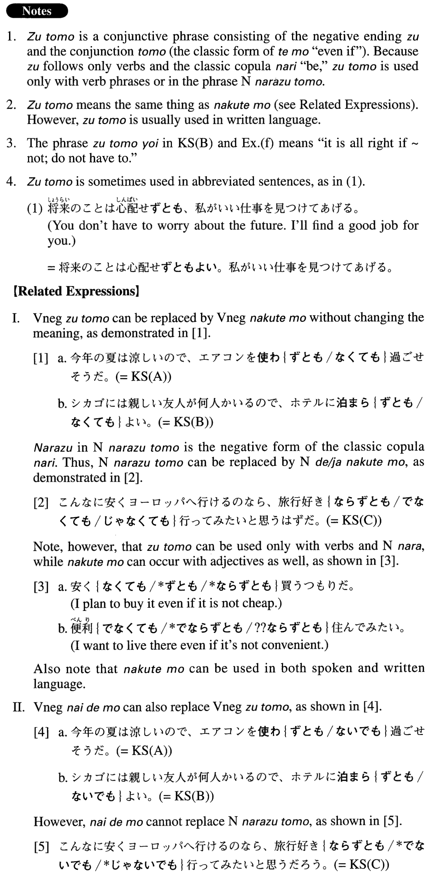

# ずとも

[1. Summary](#summary) 
[2. Formation](#formation) 
[3. Example Sentences](#example-sentences) 
 

## Summary

<table><tr>   <td>Summary</td>   <td>A conjunctive phrase that indicates negative concession: “even if ~ not”.</td></tr><tr>   <td>English</td>   <td>Without ~ing; even if ~ not; if ~ not</td></tr><tr>   <td>Part of speech</td>   <td>Phrase (usually used in formal writing and formal speech)</td></tr><tr>   <td>Related expression</td>   <td>なくても; ないでも</td></tr></table>

## Formation

<table class="table"><tbody><tr class="tr head"><td class="td">(i) Vnegative</td><td class="td">ずとも</td><td class="td">Exception: する→せずとも</td></tr><tr class="tr"><td class="td"></td><td class="td">使わずとも</td><td class="td">Even if one doesn’t use something; without using something</td></tr><tr class="tr head"><td class="td">(ii) Nounなら</td><td class="td">ずとも</td><td class="td"></td></tr><tr class="tr"><td class="td"></td><td class="td">専門家ならずとも</td><td class="td">Even if someone is not a specialist</td></tr></tbody></table>

## Example Sentences

<table><tr>   <td>今年の夏は涼しいので、エアコンを使わずとも過ごせそうだ。</td>   <td>It is cool this summer, so it looks like we can get by without using the air-conditioner.</td></tr><tr>   <td>シカゴには親しい友人が何人かいるので、ホテルに泊まらずともよい。</td>   <td>Because I have several close friends in Chicago, I don't have to stay at a hotel.</td></tr><tr>   <td>こんなに安くヨーロッパへ行けるのなら、旅行好きならずとも行ってみたいと思うだろう。</td>   <td>If you can go to Europe this cheaply, even if you don't especially like to travel, you'll probably want to go.</td></tr><tr>   <td>東京で会えずとも、大阪では必ず会える。</td>   <td>(Even) if we cannot meet up in Tokyo, we will meet in Osaka for sure.</td></tr><tr>   <td>彼がどのくらいできるかはテストをせずとも見当がつく。</td>   <td>I can guess how much he can do without even giving him a test.</td></tr><tr>   <td>この程度の故障ならサービスセンター送らずともこの店で修理できます。</td>   <td>We can repair this sort of trouble here at the store without sending (the product) to the service centre.</td></tr><tr>   <td>この携帯電話は音声による操作が可能で、数字キーを押さずとも声だけで電話をかけられる。</td>   <td>This cell phone can be voice activated, so you can make a call using just your voice, without having to punch any numbers.</td></tr><tr>   <td>これからは特別な訓練を受けずとも使えるようなユーザーインターフェースが必要となるだろう。</td>   <td>From now on it will be necessary to have a user interface that doesn't require special training.</td></tr><tr>   <td>この理論は難解なので、今すぐ分からずともよい。</td>   <td>This theory is hard to understand, so it is all right if you don't understand it right away.</td></tr><tr>   <td>今回の野球ストは、これからのプロスポーツあり方を考えさせる出来事として、野球ファンならずとも注目する人が多かった。</td>   <td>Many people, even if they were not baseball fans, paid attention to the baseball strike this time because it (was an event that) made them think about what professional sports should be like in the future (literally: from now on).</td></tr></table>

## Grammar Book Page

