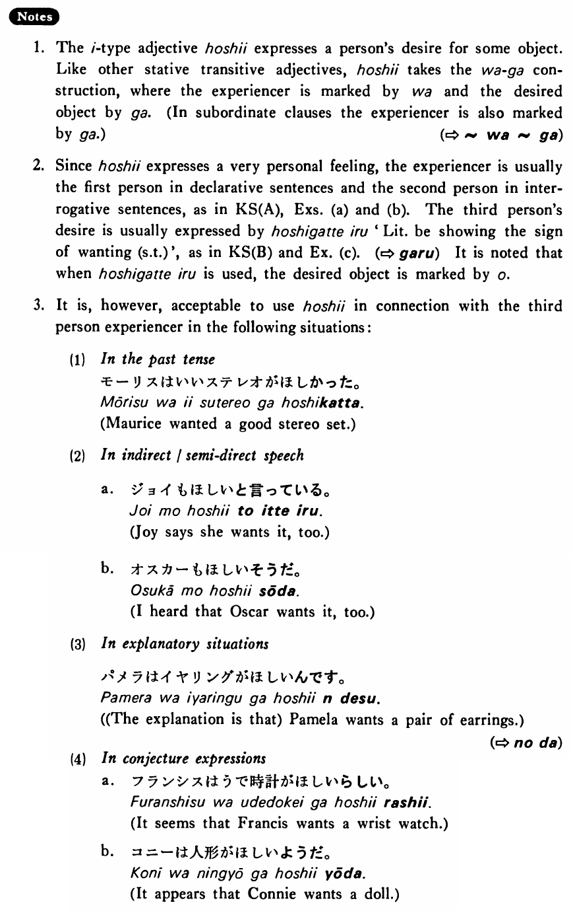

# 欲しい・ほしい (1)

[1. Summary](#summary) 
[2. Example Sentences](#example-sentences) 
[3. Explanation](#explanation) 
[4. Grammar Book Page](#grammar-book-page) 

## Summary

<table><tr>   <td>Summary</td>   <td>Something is desired by the speaker.</td></tr><tr>   <td>English</td>   <td>Want (something)</td></tr><tr>   <td>Related expression</td>   <td>たい</td></tr></table>

## Example Sentences

<table><tr>   <td>私は車が欲しい・欲しいです。</td>   <td>I want a car.</td></tr><tr>   <td>弟は僕の自転車を欲しがっている・います。</td>   <td>My little brother wants a bike.</td></tr><tr>   <td>私は日本人の友達が欲しい。</td>   <td>I want a Japanese friend.</td></tr><tr>   <td>あなたは今何が欲しいですか。</td>   <td>What do you want now?</td></tr><tr>   <td>パムはステレオを欲しがっている。</td>   <td>Pam wants a stereo.</td></tr></table>

## Explanation

1. The い type adjective 欲しい expresses a person's desire for some object. Like other stative transitive adjectives, 欲しい takes the は~が construction, where the experiencer is marked by は and the desired object by が. (In subordinate clauses the experiencer is also marked by が.)
  
(⇨ <a href="#㊦ は～が">は~が</a>)
  
2. Since 欲しい expresses a very personal feelings the experiencer is usually the first person in declarative sentences and the second person in interrogative sentences, as in Key Sentence (A), Examples (a) and (b). The third person's desire is usually expressed by 欲しがっている 'Literally: be showing the sign of wanting (something)', as in Key Sentence (B) and Example (c). (⇨ <a href="#㊦ がる">がる</a>) It is noted that when 欲しがっている is used, the desired object is marked by を.
  
3. It is, however, acceptable to use 欲しい in connection with the third person experiencer in the following situations:
  <ul>(1) In the past tense 

 モーリスはいいステレオがほしかった。 Maurice wanted a good stereo set. </ul>  <ul>(2) In indirect/semi-direct speech 

 a. ジョイもほしいと言っている。 Joy says she wants it, too. 

 b. オスカーもほしいそうだ。 I heard that Oscar wants it, too. </ul>  <ul>(3) In explanatory situations 

 パメラはイヤリングがほしいんです。 (The explanation is that) Pamela wants a pair of earrings. </ul>  
(⇨ <a href="#㊦ のだ">のだ</a>)
  <ul>(4) In conjecture expressions 

 a. フランシスは腕時計がほしいらしい。 It seems that Francis wants a wrist watch. 

 b. コニーは人形がほしいようだ。 It appears that Connie wants a doll. </ul>

## Grammar Book Page

