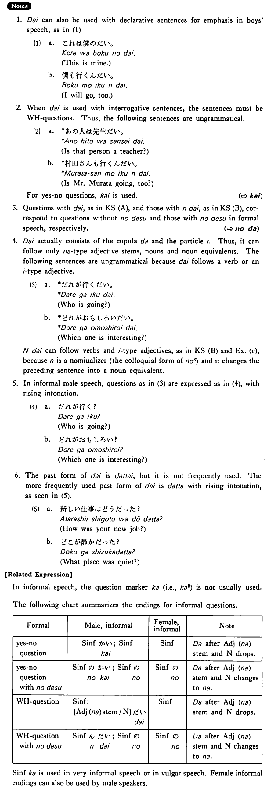

# だい

[1. Summary](#summary) 
[2. Formation](#formation) 
[3. Example Sentences](#example-sentences) 
[4. Explanation](#explanation) 
 

## Summary

<table><tr>   <td>Summary</td>   <td>A sentence final particle which indicates an interrogative word question in informal male speech.</td></tr><tr>   <td>Part of speech</td>   <td>Particle</td></tr><tr>   <td>Related expression</td>   <td>か2; かい</td></tr></table>

## Formation

<table class="table"> <tbody><tr class="tr head"> <td class="td">(1)  {Adjective な stem/   N} </td> <td class="td">だい </td> <td class="td">&nbsp;</td> </tr> <tr class="tr"> <td class="td">&nbsp;</td> <td class="td">静かだい </td> <td class="td">Something    is quiet?</td> </tr> <tr class="tr"> <td class="td">&nbsp;</td> <td class="td">先生だい </td> <td class="td">Someone    is a teacher?</td> </tr> <tr class="tr head"> <td class="td">(2)  {V/Adjective い}    informal </td> <td class="td">んだい </td> <td class="td">&nbsp;</td> </tr> <tr class="tr"> <td class="td">&nbsp;</td> <td class="td">{話す/話した} んだい </td> <td class="td">Someone    talks/talked?</td> </tr> <tr class="tr"> <td class="td">&nbsp;</td> <td class="td">{高い/高かった} んだい </td> <td class="td">Something    is/was expensive?</td> </tr> <tr class="tr head"> <td class="td">(3)  {Adjective な stem/   N} </td> <td class="td">{な/だった} んだい</td> <td class="td">&nbsp;</td> </tr> <tr class="tr"> <td class="td">&nbsp;</td> <td class="td">{静かな/ 静かだった} んだい </td> <td class="td">Something    is/was quiet?</td> </tr> <tr class="tr"> <td class="td">&nbsp;</td> <td class="td">{先生な/先生だった} んだい </td> <td class="td">Someone    is/was a teacher?</td> </tr></tbody></table>

## Example Sentences

<table><tr>   <td>どこが静かだい。</td>   <td>What place is quiet?</td></tr><tr>   <td>誰が行くんだい。</td>   <td>Who is going?</td></tr><tr>   <td>新しい仕事はどうだい。</td>   <td>How's your new job</td></tr><tr>   <td>あの人は誰だい。</td>   <td>Who is that person?</td></tr><tr>   <td>何が可笑しいんだい。</td>   <td>What's funny?</td></tr><tr>   <td>どの人は佐藤先生なんだい。</td>   <td>Which person is Professor Sato?</td></tr></table>

## Explanation

1. だい can also be used with declarative sentences for emphasis in boys' speech, as in (1)
  <ul>(1) <li>a. これは僕のだい。</li> <li>This is mine.</li> 

 <li>b. 僕も行くんだい。</li> <li>I will go, too.</li> </ul>  
2. When だい is used with interrogative sentences, the sentences must be interrogative word questions. Thus, the following sentences are ungrammatical.
  <ul>(2) <li>a. *あの人は先生だい。</li> <li>Is that person a teacher?</li> 

 <li>b. *村田さんも行くんだい。</li> <li>Is Mr. Murata going，too?</li> </ul>  
For yes-no questions, かい is used.
  
(⇨ <a href="#㊦ かい">かい</a>)
  
3. Questions with だい, as in Key Sentence (A), and those with んだい, as in Key Sentence (B), correspond to questions without のです and those with のです in formal speech, respectively.
  
(⇨ <a href="#㊦ のだ">のだ</a>)
  
4. だい actually consists of the copula だ and the particle い. Thus, it can follow only な type adjective stems, nouns and noun equivalents. The following sentences are ungrammatical because だい follows a verb or an い type adjective.
  <ul>(3) <li>a. *だれが行くだい。</li> <li>Who is going?</li> 

 <li>b. *どれがおもしろいだい。</li> <li>Which one is interesting?</li> </ul>  
んだい can follow verbs and い type adjectives, as in Key Sentence (B) and Example (c), because ん is a nominalizer (the colloquial form of の3) and it changes the preceding sentence into a noun equivalent. 
  
5. In informal male speech, questions as in (3) are expressed as in (4)，with rising intonation.
  <ul>(4) <li>a. だれが行く？</li> <li>Who is going?</li> 

 <li>b. どれがおもしろい？</li> <li>Which one is interesting?</li> </ul>  
6. The past form of だい is だったい, but it is not frequently used. The more frequently used past form of だい is だった with rising intonation, as seen in (5).
  <ul>(5) <li>a. 新しい仕事はどうだった？</li> <li>How was your new job?</li> 

 <li>b. どこが静かだった？</li> <li>What place was quiet?</li> </ul>  
【Related Expression】
  
In informal speech, the question marker か (i.e., か2) is not usually used. 
  
The following chart summarizes the endings for informal questions.
  <table class="table"> <tbody> <tr class="tr"> <td class="td">Formal</td> <td class="td">Male, informal</td> <td class="td">Female, informal</td> <td class="td">Note</td> </tr> <tr class="tr"> <td class="td">yes-no question</td> <td class="td">Sentence informalかい</td> <td class="td">Sentence informal</td> <td class="td">だ after Adjectiveな stem and ん drops</td> </tr> <tr class="tr"> <td class="td">yes-no question with のです</td> <td class="td">Sentence informalのかい</td> <td class="td">Sentence informalの</td> <td class="td">だ after Adjectiveな stem and ん changes to な</td> </tr> <tr class="tr"> <td class="td">Interrogative word question</td> <td class="td">Sentence informal; {Adjectiveなstem/Noun}だい</td> <td class="td">Sentence informal</td> <td class="td">だ after Adjectiveな stem and ん drops</td> </tr> <tr class="tr"> <td class="td">Interrogative word question with のです</td> <td class="td">Sentence informalんだい</td> <td class="td">Sentence informalの</td> <td class="td">だ after Adjectiveな stem and ん changes to な</td> </tr> </tbody> </table>  
Sentence informalか is used in very informal speech or in vulgar speech. Female informal endings can also be used by male speakers.

## Grammar Book Page

