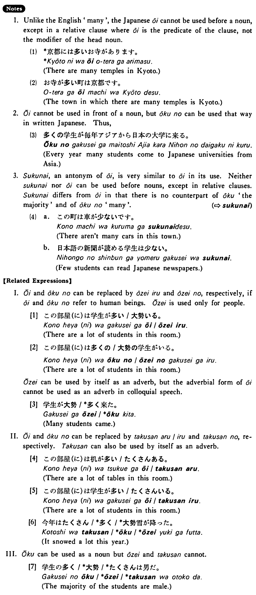

# 多い・おおい

[1. Summary](#summary) 
[2. Example Sentences](#example-sentences) 
[3. Explanation](#explanation) 
[4. Grammar Book Page](#grammar-book-page) 

## Summary

<table><tr>   <td>Summary</td>   <td>(of quantity or number) a lot</td></tr><tr>   <td>English</td>   <td>Many; a lot of; much</td></tr><tr>   <td>Part of speech</td>   <td>Adjective (い)</td></tr><tr>   <td>Related expression</td>   <td>大勢; たくさん</td></tr><tr>   <td>Antonym expression</td>   <td>少ない</td></tr></table>

## Example Sentences

<table><tr>   <td>日本（に）は大学が多い・多いです。</td>   <td>In Japan universities are many.</td></tr><tr>   <td>京都（に）はお寺が多いです。</td>   <td>There are many temples in Kyoto.</td></tr><tr>   <td>ロスさんの作文（に）は間違いが多いです。</td>   <td>There are many mistakes in Mr. Ross's compositions.</td></tr><tr>   <td>一月（に）は雪が多い。</td>   <td>There is a lot of snow in January.</td></tr></table>

## Explanation

1. Unlike the English 'many' the Japanese 多い cannot be used before a noun, except in a relative clause where 多い is the predicate of the clause, not the modifier of the head noun.
  <ul>(1) <li>*京都には多いお寺があります。</li> <li>There are many temples in Kyoto.</li> </ul>  <ul>(2) <li>お寺が多い町は京都です。</li> <li>The town in which there are many temples is Kyoto.</li> </ul>  
2. 多い cannot be used in front of a noun, but 多くの can be used that way in written Japanese. Thus,
  <ul>(3) <li>多くの学生が毎年アジアから日本の大学に来る。</li> <li>Every year many students come to Japanese universities from Asia.</li> </ul>  
3. 少ない, an antoymn of 多い, is very similar to 多い in its use. Neither 少ない nor 多い can be used before nouns, except in relative clauses. 少ない differs from 多い in that there is no counterpart of 多く 'the majority' and of 多くの 'many'.
   
<a href="#㊦ 少ない・すくない">(⇨ 少ない</a>)
  <ul>(4) <li>a. この町は車が少ないです。</li> <li>There aren't many cars in this town.</li> 

 <li>b. 日本語の新聞が読める学生は少ない。</li> <li>Few students can read Japanese newspapers.</li> </ul>  
【Related Expressions】
  
I. 多い and 多くの can be replaced by 大勢いる and 大勢の, respectively, if 多い and 多く no refer to human beings. 大勢 is used only for people.
  
[1]
  <ul> <li>この部屋(に)は学生が多い/大勢いる。</li> <li>There are a lot of students in this room.</li> </ul>  
[2]
  <ul> <li>この部屋(に)は多くの/大勢の学生がいる。</li> <li>There are a lot of students in this room.</li> </ul>  
大勢 can be used by itself as an adverb, but the adverbial form of 多い cannot be used as an adverb in colloquial speech.
  
[3]
  <ul> <li>学生が大勢/*多く来た。</li> <li>Many students came.</li> </ul>  
II. 多い and 多くの can be replaced by たくさんある/いる and たくさんの, respectively. たくさん can also be used by itself as an adverb.
  
[4]
  <ul> <li>この部屋(に)は机が多い/たくさんある。</li> <li>There are a lot of tables in this room.</li> </ul>  
[5]
  <ul> <li>この部屋(に)は学生が多い/たくさんいる。</li> <li>There are a lot of students in this room.</li> </ul>  
[6]
  <ul> <li>今年はたくさん/*多く/*大勢雪が降った。</li> <li>It snowed a lot this year.</li> </ul>  
多く can be used as a noun but 大勢 and たくさん cannot.
  
[7]
  <ul> <li>学生の多く/*大勢/*たくさんは男だ。</li> <li>The majority of the students are male.</li> </ul>

## Grammar Book Page

