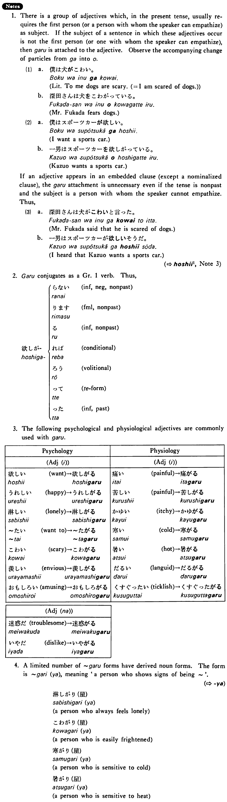

# がる

 
 
 
 
 

## Summary

<table><tr>   <td>Summary</td>   <td>An auxiliary verb attached to a psychological/physiological adjective meaning a person other than the speaker shows signs of ~</td></tr><tr>   <td>English</td>   <td>Show signs of ~</td></tr><tr>   <td>Part of speech</td>   <td>Auxiliary Verb (Group 1)</td></tr></table>

## Formation

<table class="table"> <tbody><tr class="tr head"> <td class="td">Adjective い/な stem </td> <td class="td">がる </td> <td class="td">&nbsp;</td> </tr> <tr class="tr"> <td class="td">&nbsp;</td> <td class="td">うれしがる </td> <td class="td">Someone    shows signs of being glad</td> </tr> <tr class="tr"> <td class="td">&nbsp;</td> <td class="td">めんどうがる </td> <td class="td">Someone    shows signs of being bothered</td> </tr> </tbody></table>

## Example Sentences

<table><tr>   <td>一男はスポーツカーを欲しがった・がりました。</td>   <td>Kazuo showed signs of wanting a sports car.</td></tr><tr>   <td>上田さんはアイスクリームを食べたがった・がりました。</td>   <td>Mr Uedo showed signs of wanting to eat ice cream.</td></tr><tr>   <td>スーザンは一人で淋しがっています。</td>   <td>Susan feels lonely by herself.</td></tr><tr>   <td>子供が眠たがっている。</td>   <td>My child wants to go to sleep.</td></tr></table>

## Explanation

1. There is a group of adjectives which, in the present tense, usually requires the first person (or a person with whom the speaker can empathize) as subject. If the subject of a sentence in which these adjectives occur is not the first person (or one with whom the speaker can empathize), then がる is attached to the adjective. Observe the accompanying change of particles from が into を.
  <ul>(1) <li>a. 僕は犬がこわい。</li> <li>Literally: To me dogs are scary, (= I am scared of dogs.)</li> 

 <li>b.深田さんは犬をこわがっている。</li> <li>Mr, Fukada fears dogs.</li> </ul>  <ul>(2) <li>a. 僕はスポーツカーが欲しい。</li> <li>I want a sports car.</li> 

 <li>b. 一男はスポーツカーを欲しがっている。</li> <li>Kazuo wants a sports car.</li> </ul>  
If an adjective appears in an embedded clause (except a nominalized clause), the がる attachment is unnecessary even if the tense is nonpast and the subject is a person with whom the speaker cannot empathize. Thus,
  <ul>(3) <li>a. 深田さんは犬がこわいと言った。</li> <li>Mr. Fukada said that he is scared of dogs.</li> 

 <li>b.—男はスポーツカーが欲しいそうだ。</li> <li>I heard that Kazuo wants a sports car.</li> </ul>  
(⇨ <a href="#㊦ 欲しい・ほしい (1)">欲しい</a>, Note 3)
  
がる conjugates as a Group 1 verb. Thus,
  <table class="table"> <tbody> <tr class="tr"> <td class="td"></td> <td class="td">⎧らない</td> <td class="td">informal, negative, nonpast</td> </tr> <tr class="tr"> <td class="td"></td> <td class="td">⎢ります</td> <td class="td">formal, nonpast</td> </tr> <tr class="tr"> <td class="td"></td> <td class="td">⎢る</td> <td class="td">informal, nonpast</td> </tr> <tr class="tr"> <td class="td">欲しが</td> <td class="td">⎨れば</td> <td class="td">conditional</td> </tr> <tr class="tr"> <td class="td"></td> <td class="td">⎢ろう</td> <td class="td">volitional</td> </tr> <tr class="tr"> <td class="td"></td> <td class="td">⎢って</td> <td class="td">て form</td> </tr> <tr class="tr"> <td class="td"></td> <td class="td">⎩  った</td> <td class="td">informal, past</td> </tr> </tbody> </table>  
3. The following psychological and physiological adjectives are commonly used with がる.
  <table class="table"> <tbody> <tr class="tr"> <td class="td"></td> <td class="td">Psychology</td> <td class="td"></td> </tr> <tr class="tr"> <td class="td"></td> <td class="td">Adjectiveい</td> <td class="td"></td> </tr> <tr class="tr"> <td class="td">欲しい</td> <td class="td">want</td> <td class="td">欲しがる</td> </tr> <tr class="tr"> <td class="td">嬉しい</td> <td class="td">happy</td> <td class="td">嬉しがる</td> </tr> <tr class="tr"> <td class="td">淋しい</td> <td class="td">lonely</td> <td class="td">淋しがる</td> </tr> <tr class="tr"> <td class="td">たい</td> <td class="td">want to</td> <td class="td">たがる</td> </tr> <tr class="tr"> <td class="td">怖い</td> <td class="td">scary</td> <td class="td">怖がる</td> </tr> <tr class="tr"> <td class="td">羨ましい</td> <td class="td">envious</td> <td class="td">羨ましがる</td> </tr> <tr class="tr"> <td class="td">面白い</td> <td class="td">amusing</td> <td class="td">面白がる</td> </tr> <tr class="tr"> <td class="td"></td> <td class="td">Physiology</td> <td class="td"></td> </tr> <tr class="tr"> <td class="td"></td> <td class="td">Adjectiveい</td> <td class="td"></td> </tr> <tr class="tr"> <td class="td">痛い</td> <td class="td">painful</td> <td class="td">痛がる</td> </tr> <tr class="tr"> <td class="td">苦しい</td> <td class="td">painful</td> <td class="td">苦しがる</td> </tr> <tr class="tr"> <td class="td">かゆい</td> <td class="td">itchy</td> <td class="td">かゆがる</td> </tr> <tr class="tr"> <td class="td">寒い</td> <td class="td">cold</td> <td class="td">寒がる</td> </tr> <tr class="tr"> <td class="td">暑い</td> <td class="td">hot</td> <td class="td">暑がる</td> </tr> <tr class="tr"> <td class="td">だるい</td> <td class="td">languid</td> <td class="td">だるがる</td> </tr> <tr class="tr"> <td class="td">くすぐったい</td> <td class="td">ticklish</td> <td class="td">くすぐったがる</td> </tr> <tr class="tr"> <td class="td"></td> <td class="td">Adjectiveな</td> <td class="td"></td> </tr> <tr class="tr"> <td class="td">迷惑だ</td> <td class="td">troublesome</td> <td class="td">迷惑がる</td> </tr> <tr class="tr"> <td class="td">いやだ</td> <td class="td">dislike</td> <td class="td">いやがる</td> </tr> </tbody> </table>  
4. A limited number of がる forms have derived noun forms. The form is がり(屋), meaning 'a person who shows signs of being ~'.
  
(⇨ <a href="#㊦ 屋・や">や</a>)
  <ul> <li>淋しがり屋</li> <li>a person who always feels lonely</li> 

 <li>こわがり屋</li> <li>a person who is easily frightened</li> 

 <li>寒がり屋</li> <li>a person who is sensitive to cold</li> 

 <li>暑がり屋</li> <li>a person who is sensitive to heat</li> </ul>

## Grammar Book Page

