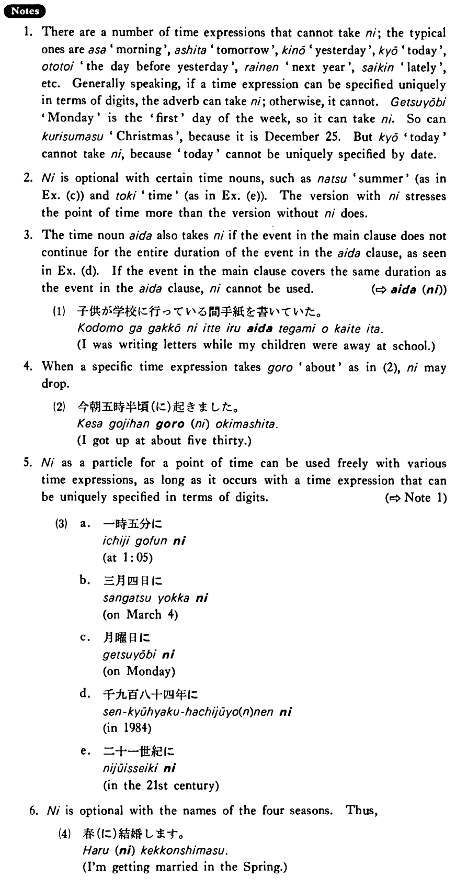

# に (1)

[1. Summary](#summary) 
[2. Example Sentences](#example-sentences) 
[3. Explanation](#explanation) 
 

## Summary

<table><tr>   <td>Summary</td>   <td>A particle that indicates a point of time at which something takes place.</td></tr><tr>   <td>English</td>   <td>At; in; on</td></tr><tr>   <td>Part of speech</td>   <td>Particle</td></tr><tr>   <td>Related expression</td>   <td>で4</td></tr></table>

## Example Sentences

<table><tr>   <td>私は毎朝六時半に起きる・起きます。</td>   <td>I get up at six thirty every morning.</td></tr><tr>   <td>私は四月一日に生まれました。</td>   <td>I was born on April 1st.</td></tr><tr>   <td>今朝は五時半にうちを出ました。</td>   <td>This morning I left home at five thirty.</td></tr><tr>   <td>来年の夏（に）外国旅行をするつもりです。</td>   <td>I intend to make a trip abroad next summer.</td></tr><tr>   <td>子供が学校に行っている間に手紙を書いた。</td>   <td>I wrote a letter while my children were away at school.</td></tr><tr>   <td>田中は大学にいる時（に）今の奥さんと出会った。</td>   <td>Tanaka met his present wife when he was in college.</td></tr></table>

## Explanation

1. There are a number of time expressions that cannot take に; the typical ones are 朝 'morning', 明日 'tomorrow', 昨日 'yesterday', 今日 'today', 一昨日 'the day before yesterday', 来年 'next year', 最近 'lately', etc. Generally speaking, if a time expression can be specified uniquely in terms of digits, the adverb can take に; otherwise, it cannot. 月曜日 'Monday' is the 'first' day of the week, so it can take に. So can クリスマス 'Christmas', because it is December 25. But 今日 'today' cannot take に, because 'today' cannot be uniquely specified by date.
  
2. に is optional with certain time nouns, such as 夏 'summer' (as in Example (c)) and 時 'time' (as in Example (e)). The version with に stresses the point of time more than the version without に does.
  
3. The time noun 間 also takes に if the event in the main clause does not continue for the entire duration of the event in the 間 clause, as seen in Example (d). If the event in the main clause covers the same duration as the event in the 間 clause, に cannot be used.
  
(⇨ <a href="#㊦ 間・あいだ(に)">間(に)</a>)
  <ul>(1) <li>子供が学校に行っている間手紙を書いていた。</li> <li>I was writing letters while my children were away at school.</li> </ul>  
4. When a specific time expression takes ごろ 'about' as in (2), に may drop.
  <ul>(2) <li>今朝五時半頃(に)起きました。</li> <li>I got up at about five thirty.</li> </ul>  
5. に as a particle for a point of time can be used freely with various time expressions, as long as it occurs with a time expression that can be uniquely specified in terms of digits. 
  
(⇨ Note 1)
  <ul>(3) <li>a. —時五分に</li> <li>at 1:05</li> 

 <li>b. 三月四日に</li> on March 4</li> 

 <li>c. 月曜日に</li> <li>on Monday</li> 

 <li>d. 千九百八十四年に</li> <li>in 1984</li> 

 <li>e. 二十一世紀に</li> <li>in the 21st century</li> </ul>  
6. に is optional with the names of the four seasons. Thus,
  <ul>(4) <li>春(に)結婚します。</li> <li>I'm getting married in the Spring.</li> </ul>

## Grammar Book Page

