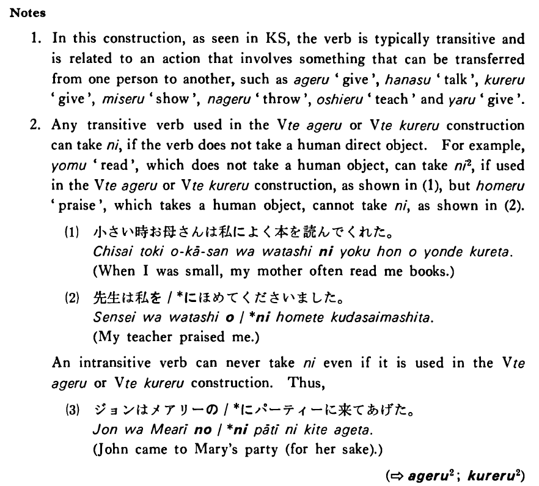

# に (2)

 
 
 
 

## Summary

<table><tr>   <td>Summary</td>   <td>An indirect object marker.</td></tr><tr>   <td>English</td>   <td>To; for</td></tr><tr>   <td>Part of speech</td>   <td>Particle</td></tr></table>

## Example Sentences

<table><tr>   <td>私は母に手紙をよく書く・書きます。</td>   <td>I often write letters to my mother.</td></tr><tr>   <td>父は僕に時計を呉れた。</td>   <td>My father gave me a watch.</td></tr><tr>   <td>加藤先生はアメリカ人の学生に日本文学を教えている。</td>   <td>Professor Kato is teaching Japanese literature to American students.</td></tr><tr>   <td>私は妹にお金を少しやりました。</td>   <td>I gave a little money to my younger sister.</td></tr><tr>   <td>今井さんに電話しましたがいませんでした。</td>   <td>I called Mr. Imai, but he wasn't there.</td></tr><tr>   <td>大川先生は学生に色々な辞書を見せた。</td>   <td>Professor Ookawa showed various dictionaries to his students.</td></tr></table>

## Explanation

1. In this construction, as seen in Key Sentence, the verb is typically transitive and is related to an action that involves something that can be transferred from one person to another, such as あげる 'give', 話す 'talk', くれる 'give', 見せる 'show', 投げる 'throw, 教える 'teach' and やる 'give'.
  
2. Any transitive verb used in the Verbてあげる or Verbてあげる construction can take に, if the verb does not take a human direct object. For example, 読む 'read', which does not take a human object, can take に2, if used in the Verbてあげる or Verbてくれる construction, as shown in (1), but ほめる 'praise', which takes a human object, cannot take に, as shown in (2).
  <ul>(1) <li>小さい時お母さんは私によく本を読んでくれた。</li> <li>When I was small, my mother often read me books.</li> </ul>  <ul>(2) <li>先生は私を/*にほめてくださいました。</li> <li>My teacher praised me.</li> </ul>  
An intransitive verb can never take に even if it is used in the Verbてあげる or Verbてくれる construction. Thus,
  <ul>(3) <li>ジョンはメアリーの/*にパーティーに来てあげた。</li> <li>John came to Mary's party (for her sake).</li> </ul>  
(⇨ <a href="#㊦ あげる (2)">あげる2</a>; <a href="#㊦ 呉れる・くれる (2)">くれる2</a>)

## Grammar Book Page

