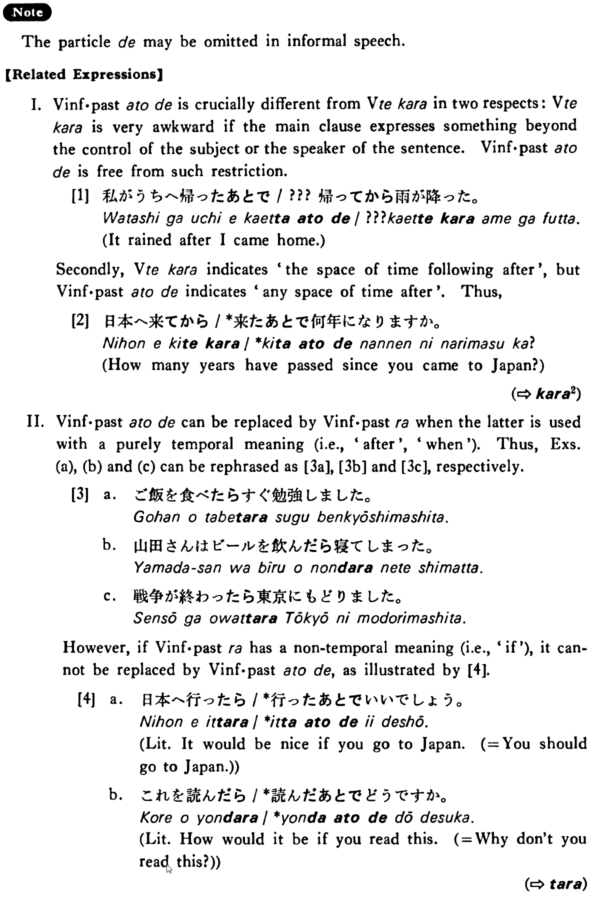

# あとで

[1. Summary](#summary) 
[2. Formation](#formation) 
[3. Example Sentences](#example-sentences) 
[4. Explanation](#explanation) 
[5. Grammar Book Page](#grammar-book-page) 

## Summary

<table><tr>   <td>Summary</td>   <td>Some state or action takes place at a time (not always immediately) after another state or action has taken place.</td></tr><tr>   <td>Equivalent</td>   <td>After</td></tr><tr>   <td>Part of speech</td>   <td>Conjunction</td></tr><tr>   <td>Related expression</td>   <td>たら; てから</td></tr><tr>   <td>Antonym expression</td>   <td>前に</td></tr></table>

## Formation

<table class="table"> <tbody><tr class="tr head"> <td class="td">Vinformal    past</td> <td class="td">あとで </td> <td class="td">&nbsp;</td> </tr> <tr class="tr"> <td class="td">&nbsp;</td> <td class="td">話したあとで </td> <td class="td">After someone has talked/had talked </td> </tr> <tr class="tr"> <td class="td">&nbsp;</td> <td class="td">食べたあとで  </td> <td class="td">After someone has eaten/had eaten </td> </tr> <tr class="tr head"> <td class="td">Noun</td> <td class="td">のあとで </td> <td class="td">&nbsp;</td> </tr> <tr class="tr"> <td class="td">&nbsp;</td> <td class="td">勉強のあとで  </td> <td class="td">After    study</td> </tr> </tbody></table>

## Example Sentences

<table><tr>   <td>メイソンさんは日本へ行ったあとで病気になった・なりました。</td>   <td>Mr. Mason became ill after he went to Japan.</td></tr><tr>   <td>私は授業のあとで図書館に行った・行きました。</td>   <td>After the class I went to the library.</td></tr><tr>   <td>ご飯を食べたあと（で）すぐ勉強しました。</td>   <td>I studied right after I had eaten my meal.</td></tr><tr>   <td>山田さんはビールを飲んだあと（で）寝てしまった。</td>   <td>Mr. Yamada fell asleep after he drank beer.</td></tr><tr>   <td>戦争が終わったあと（で）東京に戻りました。</td>   <td>I went back to tokyo after the war ended.</td></tr><tr>   <td>食事のあとでテニスをした。</td>   <td>I played tennis after my meal.</td></tr></table>

## Explanation

The particle で may be omitted in informal speech.

## Grammar Book Page

