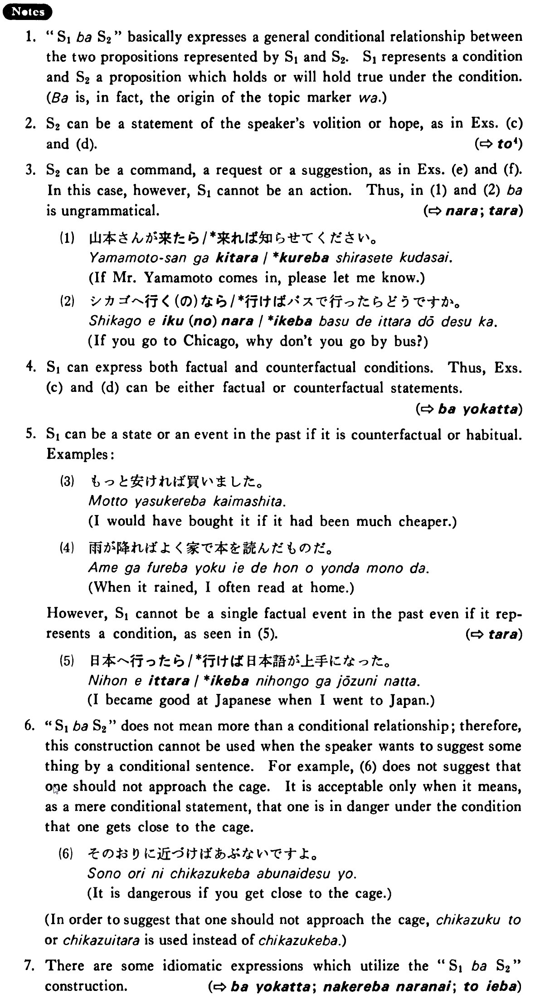

# ば

[1. Summary](#summary) 
[2. Formation](#formation) 
[3. Example Sentences](#example-sentences) 
[4. Explanation](#explanation) 
 

## Summary

<table><tr>   <td>Summary</td>   <td>A conjunction which indicates that the preceding clause expresses a conditional.</td></tr><tr>   <td>English</td>   <td>If</td></tr><tr>   <td>Part of speech</td>   <td>Conjunction</td></tr><tr>   <td>Related expression</td>   <td>たら; (なら,と4)4</td></tr></table>

## Formation

<table class="table"> <tbody><tr class="tr head"> <td class="td">(i)  Group 1 verbs</td> <td class="td">Vconditional ば</td> <td class="td">&nbsp;</td> </tr> <tr class="tr"> <td class="td">&nbsp;</td> <td class="td">話せば </td> <td class="td">If    someone talks</td> </tr> <tr class="tr head"> <td class="td">(ii)  Group 2 verbs</td> <td class="td">Vstem れば</td> <td class="td">&nbsp;</td> </tr> <tr class="tr"> <td class="td">&nbsp;</td> <td class="td">食べれば </td> <td class="td">If    someone eats</td> </tr> <tr class="tr head"> <td class="td">(iii)  Irregular verbs</td> <td class="td">来る→来れば</td> <td class="td">If    someone comes</td> </tr> <tr class="tr"> <td class="td">&nbsp;</td> <td class="td">する→すれば</td> <td class="td">If    someone does</td> </tr> <tr class="tr head"> <td class="td">(iv)  Adjective い</td> <td class="td">Adjective い stem ければ</td> <td class="td">&nbsp;</td> </tr> <tr class="tr"> <td class="td">&nbsp;</td> <td class="td">高ければ </td> <td class="td">If    something is expensive</td> </tr> <tr class="tr head"> <td class="td">(v) Adjective な </td> <td class="td">Adjective な stem {なら (ば)/ であれば}</td> <td class="td">&nbsp;</td> </tr> <tr class="tr"> <td class="td">&nbsp;</td> <td class="td">{静かなら (ば)/ 静かであれば}</td> <td class="td">If    something is quiet</td> </tr> <tr class="tr head"> <td class="td">(vi)  Noun+copula</td> <td class="td">Noun {なら (ば)/ であれば}</td> <td class="td">&nbsp;</td> </tr> <tr class="tr"> <td class="td">&nbsp;</td> <td class="td">{先生なら (ば)/ 先生であれば}</td> <td class="td">If    someone is a teacher</td> </tr> </tbody></table>

## Example Sentences

<table><tr>   <td>この薬を飲めばよくなる・なります。</td>   <td>If you take this medicine, you'll get well.</td></tr><tr>   <td>これは松本先生に聞けば分かります。</td>   <td>You'll understand it if you ask Professor Matsumoto.</td></tr><tr>   <td>その町は車で行けば三十分で行ける。</td>   <td>You can get to that town in thirty minutes if you go by car.</td></tr><tr>   <td>安ければ買います。</td>   <td>I'll buy it if it's cheap./I would buy it if were cheap.</td></tr><tr>   <td>時間があれば京都へも行きたい。</td>   <td>If I have time, I want to go to Kyoto too./If I had time, I would want to go to Kyoto, too.</td></tr><tr>   <td>見たければ見なさい。</td>   <td>If you want to see it, see it.</td></tr><tr>   <td>出来ればこれもやってください。</td>   <td>Please do this, too, if you can.</td></tr></table>

## Explanation

1. "Sentence1ばSentence2" basically expresses a general conditional relationship between the two propositions represented by Sentence1 and Sentence2. Sentence1 represents a condition and Sentence2 a proposition which holds or will hold true under the condition. (ば is, in fact, the origin of the topic marker は.) 
  
2. Sentence2 can be a statement of the speaker's volition or hope, as in Examples (c) and (d).
  
(⇨ <a href="#㊦ と (4)">と4</a>)
  
3. Sentence2 can be a command, a request or a suggestion, as in Examples (e) and (f). In this case, however, Sentence1 cannot be an action.  Thus, in (1) and (2) ば is ungrammatical. 
  
(⇨ <a href="#㊦ なら">なら</a>; <a href="#㊦ たら">たら</a>)
  <ul>(1) <li>山本さんが来たら/*来れば知らせてください。</li> <li>If Mr. Yamamoto comes in, please let me know.</li> </ul>  <ul>(2) <li>シカゴへ行く(の)なら/*行けばバスで行ったらどうですか。</li> <li>If you go to Chicago, why don't you go by bus?</li> </ul>  
4. Sentence1 can express both factual and counterfactual conditions. Thus, Examples (c) and (d) can be either factual or counterfactual statements.
  
(⇨ <a href="#㊦ ばよかった">ばよかった</a>)
  
5. Sentence1 can be a state or an event in the past if it is counterfactual or habitual. Examples:
  <ul>(3) <li>もっと安ければ買いました 。</li> <li>I would have bought it if it had been much cheaper.</li> </ul>  <ul>(4) <li>雨が降ればよく家で本を読んだものだ 。</li> <li>When it rained, I often read at home.</li> </ul>  
However, Sentence1 cannot be a single factual event in the past even if it represents a condition, as seen in (5). 
  
(⇨ <a href="#㊦ たら">たら</a>)  <ul>(5) <li>日本へ行ったら/*行けば日本語が上手になった。</li> <li>I became good at Japanese when I went to Japan.</li> </ul>  
6."Senetnce1ばSentence2" does not mean more than a conditional relationship; therefore, this construction cannot be used when the speaker wants to suggest something by a conditional sentence. For example, (6) does not suggest that one should not approach the cage. It is acceptable only when it means, as a mere conditional statement, which one is in danger under the condition that one gets close to the cage.
  <ul>(6) <li>そのおりに近づけばあぶないですよ。</li> <li>It is dangerous if you get close to the cage.</li> </ul>  
In order to suggest that one should not approach the cage, 近づくと or 近づいたら is used instead of 近づけば.
  
7. There are some idiomatic expressions which utilize the "Sentence1ばSentence2" construction.
  
(⇨ <a href="#㊦ ばよかった">ばよかった</a>; <a href="#㊦ なければならない">なければならない</a>; <a href="#㊦ と言えば">と言えば</a>)

## Grammar Book Page

