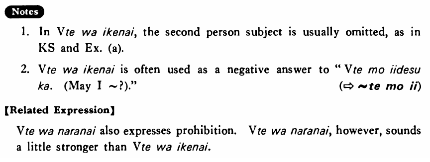

# はいけない

[1. Summary](#summary) 
[2. Formation](#formation) 
[3. Example Sentences](#example-sentences) 
[4. Explanation](#explanation) 
[5. Grammar Book Page](#grammar-book-page) 

## Summary

<table><tr>   <td>Summary</td>   <td>A phrase which indicates prohibition.</td></tr><tr>   <td>English</td>   <td>Cannot do something; must not do something; don’t do something; should not do something</td></tr><tr>   <td>Part of speech</td>   <td>Phrase</td></tr><tr>   <td>Related expression</td>   <td>はならない</td></tr></table>

## Formation

<table class="table"> <tbody><tr class="tr head"> <td class="td">Vて</td> <td class="td">はいけない </td> <td class="td">&nbsp;</td> </tr> <tr class="tr"> <td class="td">&nbsp;</td> <td class="td">話してはいけない </td> <td class="td">Must    not talk</td> </tr> <tr class="tr"> <td class="td">&nbsp;</td> <td class="td">食べてはいけない </td> <td class="td">Must    not eat</td> </tr></tbody></table>

## Example Sentences

<table><tr>   <td>この部屋に入ってはいけない・いけません。</td>   <td>You must not enter this room.</td></tr><tr>   <td>教室でものを食べてはいけません。</td>   <td>You must not eat (food) in the classroom.</td></tr><tr>   <td>花子はまだ酒を飲んではいけない。</td>   <td>Hanako must/can not drink alcohol yet.</td></tr></table>

## Explanation

1. In Verbてはいけない, the second person subject is usually omitted, as in Key Sentence and Example (a).
  
2. Verbてはいけない is often used as a negative answer to "Verbてもいいです (May I ~?)."
   
(⇨ <a href="#㊦ てもいい">てもいい</a>)
  
【Related Expression】
  
Verbてはならない also expresses prohibition. Verbてはならない, however, sounds a little stronger than Verbてはいけない.

## Grammar Book Page

