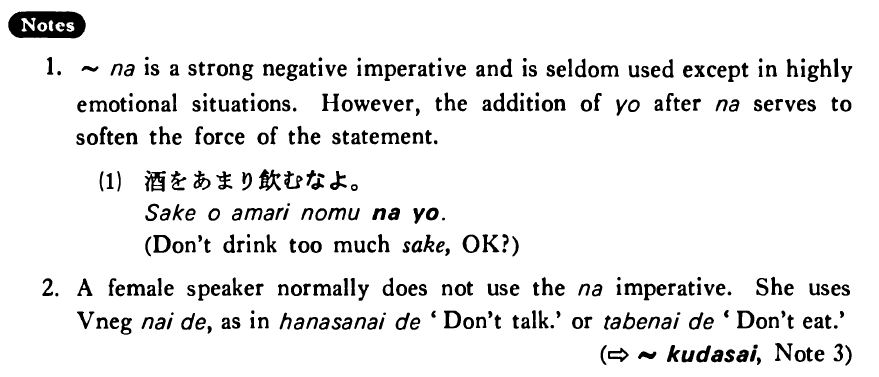

# な

 
 
 
 
 

## Summary

<table><tr>   <td>Summary</td>   <td>A negative imperative marker used by a male speaker in very informal speech</td></tr><tr>   <td>English</td>   <td>Don't do ~</td></tr><tr>   <td>Part of speech</td>   <td>Particle</td></tr></table>

## Formation

<table class="table"> <tbody><tr class="tr head"> <td class="td">Vinformal nonpast</td> <td class="td">な </td> <td class="td">&nbsp;</td> </tr> <tr class="tr"> <td class="td">&nbsp;</td> <td class="td">話すな </td> <td class="td">Don’t    talk!</td> </tr> <tr class="tr"> <td class="td">&nbsp;</td> <td class="td">食べるな </td> <td class="td">Don’t    eat!</td> </tr></tbody></table>

## Example Sentences

<table><tr>   <td>煙草を吸うな！</td>   <td>Don't smoke!</td></tr><tr>   <td>酒をあまり飲むな！</td>   <td>Don't drink too much sake!</td></tr><tr>   <td>そんな所にもう行くな！</td>   <td>Don't go to such a place any more!</td></tr><tr>   <td>あんな男とは結婚するな！</td>   <td>Don't marry that kind of man!</td></tr><tr>   <td>もう帰って来るな！</td>   <td>Don't come home any more!</td></tr></table>

## Explanation

1. な is a strong negative imperative and is seldom used except in highly emotional situations. However, the addition of よ after な serves to soften the force of the statement.
  <ul>(1) <li>酒をあまり飲むなよ。</li> <li>Don't drink too much sake, OK?</li> </ul>  
2. A female speaker normally does not use the な imperative. She uses Verb negative ないで, as in 話さないで 'Don't talk.' or 食べないで 'Don't eat.'
  
(⇨ <a href="#㊦ 下さい・ください">ください</a>, Note 3)

## Grammar Book Page

