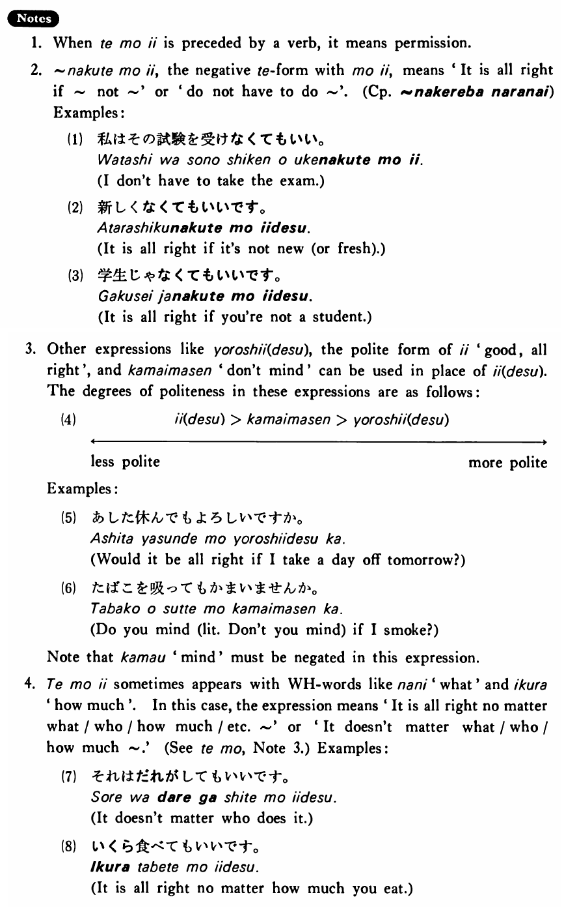

# てもいい

[1. Summary](#summary) 
[2. Formation](#formation) 
[3. Example Sentences](#example-sentences) 
[4. Explanation](#explanation) 
 

## Summary

<table><tr>   <td>Summary</td>   <td>A phrase which expresses persmission or concession.</td></tr><tr>   <td>English</td>   <td>May; It is all right if</td></tr><tr>   <td>Part of speech</td>   <td>Phrase</td></tr><tr>   <td>Related expression</td>   <td>はいけない</td></tr></table>

## Formation

<table class="table"> <tbody><tr class="tr head"> <td class="td">{V/Adjective(い/な)/Noun+copula} て</td> <td class="td">もいい </td> <td class="td">&nbsp;</td> </tr> <tr class="tr"> <td class="td">&nbsp;</td> <td class="td">話してもいい </td> <td class="td">May    talk; it is all right if someone talks</td> </tr> <tr class="tr"> <td class="td">&nbsp;</td> <td class="td">高くてもいい </td> <td class="td">It    is all right if something is expensive</td> </tr> <tr class="tr"> <td class="td">&nbsp;</td> <td class="td">静かでもいい </td> <td class="td">It    is all right if something is quiet</td> </tr> <tr class="tr"> <td class="td">&nbsp;</td> <td class="td">先生でもいい </td> <td class="td">It    is all right is someone is a teacher</td> </tr></tbody></table>

## Example Sentences

<table><tr>   <td>A:ここで煙草を吸ってもいいですか。  B:はい、いいです。</td>   <td>A: May I smoke here?&emsp;&emsp;B: Yes, you may.</td></tr><tr>   <td>高くてもいい・いいです。</td>   <td>It is all right if it's expensive.</td></tr><tr>   <td>学生でもいい・いいです。</td>   <td>It is all right if you are a student.</td></tr><tr>   <td>この椅子を使ってもいいですか。</td>   <td>May I used this chair?</td></tr><tr>   <td>今日の宿題は作文です。短くてもいいですが面白いのを書いて下さい。</td>   <td>Today's homework assignment is a composition. It is all right if it's short, but please write an interesting one.</td></tr><tr>   <td>A:テニスをしませんか。  B:下手でもいいですか。</td>   <td>A: Wouldn't you like to play tennis?  B: Is it alright if I'm poor at it?</td></tr><tr>   <td>A:何か冷たいものを飲みたいんですが。  B:ビールでもいいですか。</td>   <td>A: I want to drink something cold.&emsp;&emsp;B: Will beer do?</td></tr></table>

## Explanation

1. When てもいい is preceded by a verb, it means permission.
  
2. なくてもいい, the negative て form with もいい, means 'It is all right is ~not ~' or 'do not have to do ~'. (Complementiser phrase: <a href="#㊦ なければならない">なければならない</a>)
  
Examples:
  <ul>(1) <li>私はその試験を受けなくてもいい。</li> <li>I don't have to take the exam.</li> </ul>  <ul>(2) <li>新しくなくてもいいです。</li> <li>It is all right if it's not new (or fresh).</li> </ul>  <ul>(3) <li>学生じゃなくてもいいです。</li> <li>It is all right if you're not a student.</li> </ul>  
3. Other expressions like よろしい(です), the polite form of いい 'good, all right', and 構いません 'don't mind' can be used in place of いい(です). The degrees of politeness in these expressions are as follows:
  (4)  <table class="table"> <tbody> <tr class="tr"> <td class="td">いい(です)→</td> <td class="td">構いません→</td> <td class="td">よろしい(です)</td> </tr> <tr class="tr"> <td class="td">
</td> <td class="td">
</td> <td class="td">
</td> </tr> <tr class="tr"> <td class="td">←less polite</td> <td class="td"></td> <td class="td">more polite→</td> </tr> </tbody> </table>  
Examples:
  <ul>(5) <li>明日休んでもよろしいですか。</li> <li>Would it be all right if I take a day off tomorrow?</li> </ul>  <ul>(6) <li>たばこを吸ってもかまいませんか。</li> <li>Do you mind (literally: Don't you mind) if I smoke?</li> </ul>  
Note that 構う 'mind' must be negated in this expression.
  
4. てもいい sometimes appears with interrogative words like 何 'what' and いくら 'how much'. In this case, the expression means 'It is all right no matter what/who/how much/etc. ~' or 'It doesn't matter what/who/how much ~.' (See <a href="#㊦ ても">ても</a>, Note 3.) Examples:
  <ul>(7) <li>それは誰がしてもいいです。</li> <li>It doesn't matter who does it.</li> </ul>  <ul>(8) <li>いくら食べてもいいです。</li> <li>It is all right no matter how much you eat.</li> </ul>

## Grammar Book Page

