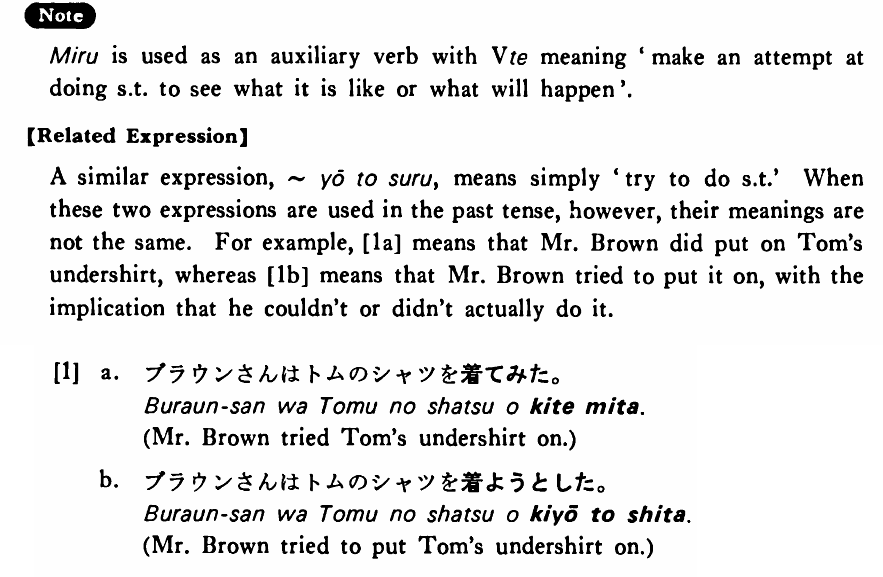

# みる

[1. Summary](#summary) 
[2. Formation](#formation) 
[3. Example Sentences](#example-sentences) 
[4. Explanation](#explanation) 
[5. Grammar Book Page](#grammar-book-page) 

## Summary

<table><tr>   <td>Summary</td>   <td>Do something to see what it’s like or what will happen.</td></tr><tr>   <td>English</td>   <td>Do something and see; try to do something</td></tr><tr>   <td>Part of speech</td>   <td>Auxiliary Verb (Group 2)</td></tr><tr>   <td>Related expression</td>   <td>ようとする</td></tr></table>

## Formation

<table class="table"> <tbody><tr class="tr head"> <td class="td">Vて</td> <td class="td">みる </td> <td class="td">&nbsp;</td> </tr> <tr class="tr"> <td class="td">&nbsp;</td> <td class="td">話してみる </td> <td class="td">Try    to talk</td> </tr> <tr class="tr"> <td class="td">&nbsp;</td> <td class="td">食べてみる </td> <td class="td">Try    to eat</td> </tr></tbody></table>

## Example Sentences

<table><tr>   <td>私は日本の小説を読んでみる・みます。</td>   <td>I will read Japanese novels (to see what they are like).</td></tr><tr>   <td>面白そうなコンサートだったので行ってみました。</td>   <td>Since it seemed interesting, I went to the concert (to see what it was like).</td></tr><tr>   <td>ここの刺身は美味しいですよ。食べてみますか。</td>   <td>Sashimi here is good. Will you try it?</td></tr></table>

## Explanation

みる is used as an auxiliary verb with Verbて meaning 'make an attempt at doing something to see what it is like or what will happen'.
  
【Related Expression】
  
A similar expression, ようとする, means simply 'try to do something'. When these two expressions are used in the past tense, however, their meanings are not the same. For example, [1a] means that Mr. Brown did put on Tom's undershirt, whereas [1b] means that Mr. Brown tried to put it on, with the implication that he couldn't or didn't actually do it.
  
[1]
  <ul> <li>a. ブラウンさんはトムのシャツを蒼てみた。</li> <li>Mr. Brown tried Tom's undershirt on.</li> 

 <li>b. ブラウンさんはトムのシャツを着ようとした。</li> <li>Mr. Brown tried to put Tom's undershirt on.</li> </ul>

## Grammar Book Page

