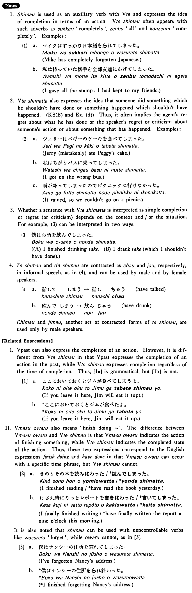

# しまう

[1. Summary](#summary) 
[2. Formation](#formation) 
[3. Example Sentences](#example-sentences) 
[4. Explanation](#explanation) 
[5. Grammar Book Page](#grammar-book-page) 

## Summary

<table><tr>   <td>Summary</td>   <td>An auxiliary verb which indicates the completion of an action.</td></tr><tr>   <td>English</td>   <td>Have dome something; finish doing something; finish something up</td></tr><tr>   <td>Part of speech</td>   <td>Auxiliary Verb (Group 1)</td></tr><tr>   <td>Related expression</td>   <td>~終わる </td></tr></table>

## Formation

<table class="table"> <tbody><tr class="tr head"> <td class="td">Vて</td> <td class="td">しまう </td> <td class="td">&nbsp;</td> </tr> <tr class="tr"> <td class="td">&nbsp;</td> <td class="td">話してしまう </td> <td class="td">Have    talked</td> </tr> <tr class="tr"> <td class="td">&nbsp;</td> <td class="td">食べてしまう </td> <td class="td">Have    eaten</td> </tr></tbody></table>

## Example Sentences

<table><tr>   <td>池田君は三日でその本を読んでしまった・しまいました。</td>   <td>Mr. Ikeda finished reading the book in three days.</td></tr><tr>   <td>私はルームメートのミルクを飲んでしまった・しまいました。</td>   <td>I (mistakenly) drank my roommate's milk.</td></tr><tr>   <td>もう宿題をしてしまいましたか。</td>   <td>Have you done your homework yet?</td></tr><tr>   <td>私は今日中にそのレポートを書いてしまおうと思っている。</td>   <td>I think that I will finish (writing) the report today.</td></tr><tr>   <td>早くご飯を食べてしまいなさい。</td>   <td>Finish (eating) your meal quickly.</td></tr><tr>   <td>シチューを作り過ぎてしまいました。</td>   <td>I made too much stew (to my regret).</td></tr></table>

## Explanation

1. しまう is used as an auxiliary verb with Verbて and expresses the idea of completion in terms of an action. Verbてしまう often appears with such adverbs as すっかり 'completely', 全部 'all' and 完全に 'completely. Examples:
  <ul>(1) <li>a. マイクはすっかり日本語を忘れてしまった。</li> <li>Mike has completely forgotten Japanese.</li> 

 <li>b. 私は持っていた切手を全部友達にあげてしまった。</li> <li>I gave all the stamps I had kept to my friends.</li> </ul>  
2. Verbてしまった also expresses the idea that someone did something which he shouldn't have done or something happened which shouldn't have happened. (Key Sentence (B) and Example (d)) Thus, it often implies the agents regret about what he has done or the speaker's regret or criticism about someone's action or about something that has happened. Examples:
  <ul>(2) <li>a. ジェリーはペギーのケーキを食べてしまった。</li> <li>Jerry (mistakenly) ate Peggy's cake.</li> 

 <li>b. 私はちがうバスに乗ってしまった。</li> <li>I got on the wrong bus.</li> 

 <li>c. 雨が降ってしまったのでピクニックに行けなかった。</li> <li>It rained, so we couldn't go on a picnic.</li> </ul>  
3. Whether a sentence with Verbてしまった is interpreted as simple completion or regret (or criticism) depends on the context and/or the situation. For example, (3) can be interpreted in two ways.
  <ul>(3) <li>僕はお酒を飲んでしまった。</li> <li>(A) I finished drinking sake. </li> <li>(B) I drank sake (which I shouldn't have done).</li> </ul>  
4. てしまう and でしまう are contractea as ちゃう and じゃう respectively, in informal speech, as in (4), and can be used by male and by female speakers.
  <ul>(4) <li>a. 話してしまう&nbsp;&nbsp;→&nbsp;&nbsp;話しちやう&nbsp;&nbsp;have talked</li> 

 <li>b. 飲んでしまう&nbsp;&nbsp;→&nbsp;&nbsp;飲んじやう&nbsp;&nbsp;have drunk</li> </ul>  
ちまう and じまう, another set of contracted forms of てしまう, are used only by male speakers.
  
【Related Expressions】
  
I. Verb past can also express the completion of an action. However, it is different from Verbてしまう in that Verb past expresses the completion of an action in the past, while Verbてしまう expresses completion regardless of the time of completion. Thus, [1a] is grammatical, but [1b] is not.
  
[1]
  <ul> <li>a. ここにおいておくとジムが食べてしまうよ。</li> <li>If you leave it here, Jim will eat it (up).</li> 

 <li>b. ここにおいておくとジムが食べたよ。</li> <li>If you leave it here, Jim will eat it up.</li> </ul>  
II. Verbます終わる also means 'finish doing ~'. The difference between Verbます終わる and Verbてしまう is that Verbます終わる indicates the action of finishing something, while Verbてしまう indicates the completed state of the action. Thus, these two expressions correspond to the English expressions 'finish doing' and 'have done' in that Verbます終わる can occur with a specific time phrase, but Verbてしまう cannot.
  
[2]
  <ul> <li>a. きのうその本を読み終わった/*読んでしまった。</li> <li>I finished reading/*have read the book yesterday.</li> 

 <li>b. けさ九時にやっとレポートを書き終わった/*書いてしまった。</li> <li>I finally finished writing/*have finally written the report at nine o'clock this morning.</li> </ul>  
It is also noted that しまう can be used with noncontrollable verbs like 忘れる 'forget', while 終わる cannot, as in [3].
  
[3]
  <ul> <li>a. 僕はナンシーの住所を忘れてしまった。</li> <li>I've forgotten Nancy's address.</li> 

 <li>b. *僕はナンシーの住所を忘れ終わった。</li> <li>*I finished forgetting Nancy's address.</li> </ul>

## Grammar Book Page

