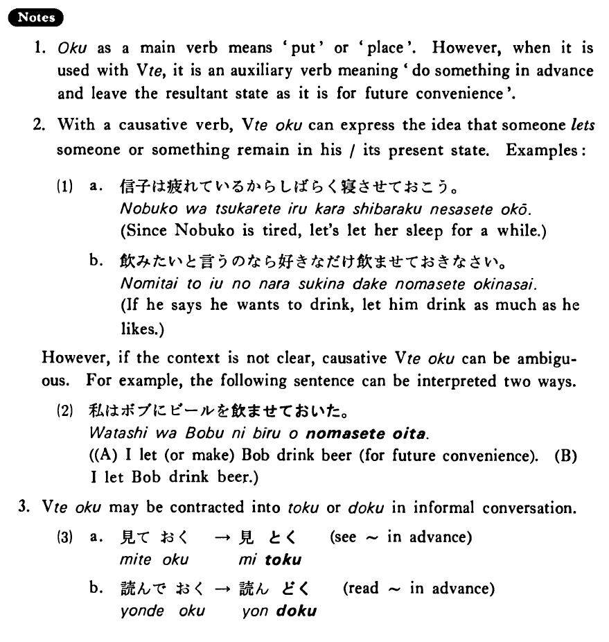

# おく

[1. Summary](#summary) 
[2. Formation](#formation) 
[3. Example Sentences](#example-sentences) 
[4. Explanation](#explanation) 
[5. Grammar Book Page](#grammar-book-page) 

## Summary

<table><tr>   <td>Summary</td>   <td>Do something in advance for future convenience.</td></tr><tr>   <td>English</td>   <td>Do something in advance; go ahead and do something; let someone/something remain as he/it is</td></tr><tr>   <td>Part of speech</td>   <td>Auxiliary Verb (Group 1)</td></tr><tr>   <td>Related expression</td>   <td>ある2</td></tr></table>

## Formation

<table class="table"> <tbody><tr class="tr head"> <td class="td">Vて</td> <td class="td">おく </td> <td class="td">&nbsp;</td> </tr> <tr class="tr"> <td class="td">&nbsp;</td> <td class="td">話しておく </td> <td class="td">Talk    in advance</td> </tr> <tr class="tr"> <td class="td">&nbsp;</td> <td class="td">食べておく </td> <td class="td">Eat    something in advance</td> </tr></tbody></table>

## Example Sentences

<table><tr>   <td>明日パーティーをするのでビールを買っておいた・おきました。</td>   <td>Since we are having a party tomorrow, I bought some beer for it.</td></tr><tr>   <td>今日は昼に客が来るので昼ご飯を早目に食べておいた。</td>   <td>Since I'm having a guest at noon today, I had my lunch earlier.</td></tr><tr>   <td>来年日本へ行くから少し日本語を勉強しておきます。</td>   <td>Since I'm going to Japan next year, I will study a little Japanese ahead of time.</td></tr></table>

## Explanation

1. おく as a main verb means 'put' or 'place'. However, when it is used with Verbて, it is an auxiliary verb meaning 'do something in advance and leave the resultant state as it is for future convenience'.
  
2. With a causative verb, Verbておく can express the idea that someone lets someone or something remain in his/its present state. Examples:
  <ul>(1) <li>a. 信子は疲れているからしばらく寝させておこう。</li> <li>Since Nobuko is tired, let's let her sleep for a while.</li> 

 <li>b.飲みたいと言うのなら好きなだけ飲ませておきなさい。</li> <li>If he says he wants to drink, let him drink as much as he likes.</li> </ul>  
However, if the context is not clear, causative Verbておく can be ambiguous. For example, the following sentence can be interpreted two ways.
  <ul>(2) <li>私はボブにビールを飲ませておいた。</li> 

 <li>(A) I let (or make) Bob drink beer (for future convenience). </li> <li>(B) I let Bob drink beer.</li> </ul>  
3. Verbておく may be contracted into とく or どく in informal conversation.
  <ul>(3) <li>a. 見ておく→見とく</li>  <li>see 〜 in advance</li> 

 <li>b. 読んでおく→読んどく</li> <li>read 〜 in advance</li> </ul>

## Grammar Book Page

