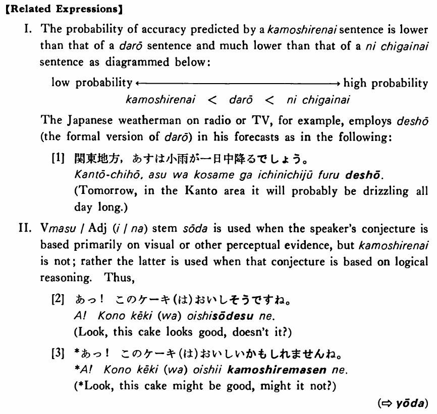

# かもしれない

[1. Summary](#summary) 
[2. Formation](#formation) 
[3. Example Sentences](#example-sentences) 
[4. Explanation](#explanation) 
[5. Grammar Book Page](#grammar-book-page) 

## Summary

<table><tr>   <td>Summary</td>   <td>Can't tell if ~</td></tr><tr>   <td>English</td>   <td>Might</td></tr><tr>   <td>Part of speech</td>   <td>Auxiliary Adjective (い)</td></tr><tr>   <td>Related expression</td>   <td>だろう; に違いない; そうだ2</td></tr></table>

## Formation

<table class="table"> <tbody><tr class="tr head"> <td class="td">(i)  {V/Adjective い}    informal</td> <td class="td">かもしれない </td> <td class="td">&nbsp;</td> </tr> <tr class="tr"> <td class="td">&nbsp;</td> <td class="td">{話す /話した} かもしれない</td> <td class="td">Someone    might talk/might have talked</td> </tr> <tr class="tr"> <td class="td">&nbsp;</td> <td class="td">{高い /高かった} かもしれない</td> <td class="td">Something    might be high/might have been high</td> </tr> <tr class="tr head"> <td class="td">(ii)  {Adjective な stem/   Noun}</td> <td class="td">{Ø/だった} かもしれない </td> <td class="td">&nbsp;</td> </tr> <tr class="tr"> <td class="td">&nbsp;</td> <td class="td">{静か/静かだった} かもしれない </td> <td class="td">Something    might be quiet/might have been quiet</td> </tr> <tr class="tr"> <td class="td">&nbsp;</td> <td class="td">{先生/先生だった} かもしれない </td> <td class="td">Someone    might be a teacher/might have been a teacher</td> </tr></tbody></table>

## Example Sentences

<table><tr>   <td>午後雨が降るかもしれない・かもしれません。</td>   <td>It might rain in the afternoon.</td></tr><tr>   <td>あの先生の授業はつまらないかもしれない・かもしれません。</td>   <td>That teacher's class might be dull.</td></tr><tr>   <td>京都の桜はまだ奇麗かもしれない・かもしれません。</td>   <td>The cherry blossoms in Kyoto might still be beautiful.</td></tr><tr>   <td>今年の冬は大変寒くなるかもしれません。</td>   <td>It might be very cold this winter.</td></tr><tr>   <td>あの人は今日のパーティーのことを忘れたかもしれません。</td>   <td>He might have forgotten about today's party.</td></tr><tr>   <td>この映画はあなたにつまらないかもしれません。</td>   <td>This movie might be uninteresting for you.</td></tr><tr>   <td>中国語の文法は日本語の文法より簡単かもしれない。</td>   <td>Chinese grammar might be simpler than Japanese grammar.</td></tr><tr>   <td>あれは鈴木先生かもしれないよ。</td>   <td>That might be Professor Suzuki.</td></tr></table>

## Explanation

【Related Expressions】
  
I. The probability of accuracy predicted by a かもしれない sentence is lower than that of a だろう sentence and much lower than that of a に違いいない sentence as diagrammed below:
  <table class="table"> <tbody> <tr class="tr"> <td class="td">low probability</td> <td class="td"></td> <td class="td"></td> <td class="td"></td> <td class="td">high probability</td> </tr> <tr class="tr"> <td class="td"></td> <td class="td">かもしれない</td> <td class="td">< だろう</td> <td class="td">< に違いない</td> <td class="td"></td> </tr> </tbody> </table>  
The Japanese weatherman on radio or TV, for example, employs でしょう (the formal version of だろう) in his forecasts as in the following:
  
[1]
  <ul> <li>関東地方、あすは小雨が一日中降るでしょう。</li> <li>Tomorrow, in the Kanto area it will probably be drizzling all day long.</li> </ul>  
II. Verbます/Adjective(い/な) stem そうだ is used when the speaker's conjecture is based primarily on visual or other perceptual evidence, but かもしれない is not; rather the latter is used when that conjecture is based on logical reasoning. Thus,
  
[2]
  <ul> <li>あつ！このケーキ(は)おいしそうですね。</li> <li>Look, this cake looks good, doesn't it?</li> </ul>  <ul> <li>*あつ！このケーキ(は)おいしいかもしれませんね。</li> <li>*Look, this cake might be good, might it not?</li> </ul>  
(⇨ <a href="#㊦ ようだ">ようだ</a>)

## Grammar Book Page

