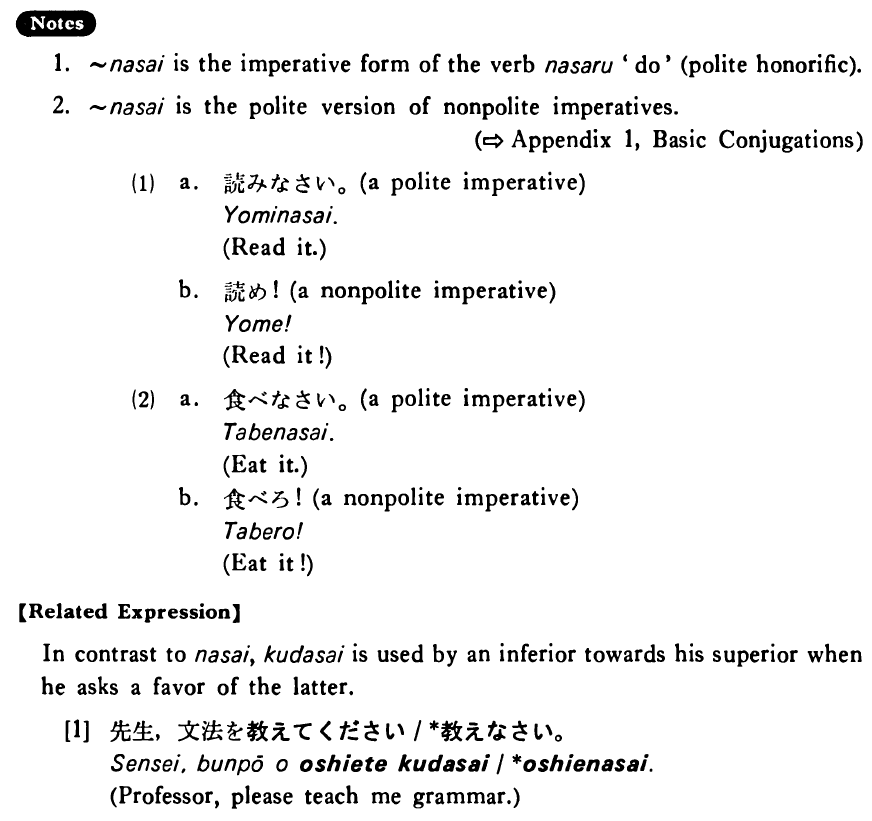

# なさい

[1. Summary](#summary) 
[2. Formation](#formation) 
[3. Example Sentences](#example-sentences) 
[4. Explanation](#explanation) 
[5. Grammar Book Page](#grammar-book-page) 

## Summary

<table><tr>   <td>Summary</td>   <td>A polite imperative used by superiors such as parents or teachers to their inferiors (=people of younger age and lower rank)</td></tr><tr>   <td>Equivalent</td>   <td>Do something</td></tr><tr>   <td>Part of speech</td>   <td>Auxiliary Verb</td></tr><tr>   <td>Related expression</td>   <td>下さい</td></tr></table>

## Formation

<table class="table"> <tbody><tr class="tr head"> <td class="td">Vます</td> <td class="td">なさい </td> <td class="td">&nbsp;</td> </tr> <tr class="tr"> <td class="td">&nbsp;</td> <td class="td">話しなさい </td> <td class="td">Talk</td> </tr> <tr class="tr"> <td class="td">&nbsp;</td> <td class="td">食べなさい </td> <td class="td">Eat</td> </tr></tbody></table>

## Example Sentences

<table><tr>   <td>もっと沢山食べなさい。</td>   <td>Eat more.</td></tr><tr>   <td>遊ばないで勉強しなさい。</td>   <td>Don't play. Study.</td></tr><tr>   <td>早くうちに帰って来なさいよ。</td>   <td>Come home early, OK?</td></tr><tr>   <td>もう遅いから歯を磨いて寝なさい。</td>   <td>It's late now, so brush your teeth and go to bed.</td></tr></table>

## Explanation

1. なさい is the imperative form of the verb なさる 'do' (polite honorific).
  
2. なさい is the polite version of nonpolite imperatives.
  <ul>(1) <li>a. 読みなさい。&nbsp;&nbsp;&nbsp;&nbsp;[a polite imperative]</li> <li>Read it.</li> 

 <li>b. 読め！&nbsp;&nbsp;&nbsp;&nbsp;[a nonpolite imperative]</li> <li>Read it!</li> 

 <li>a. 食べなさい。&nbsp;&nbsp;&nbsp;&nbsp;[a polite imperative]</li> <li>Eat it.</li> 

 <li>b. 食べろ！&nbsp;&nbsp;&nbsp;&nbsp;[a nonpolite imperative]</li> <li>Eat it!</li> </ul>  
【Related Expression】
  
In contrast to なさい/ください is used by an inferior towards his superior when he asks a favor of the latter.
  
[1]
  <ul> <li>先生、文法を教えてください/*教えなさい。</li> <li>Professor, please teach me grammar.</li> </ul>

## Grammar Book Page

