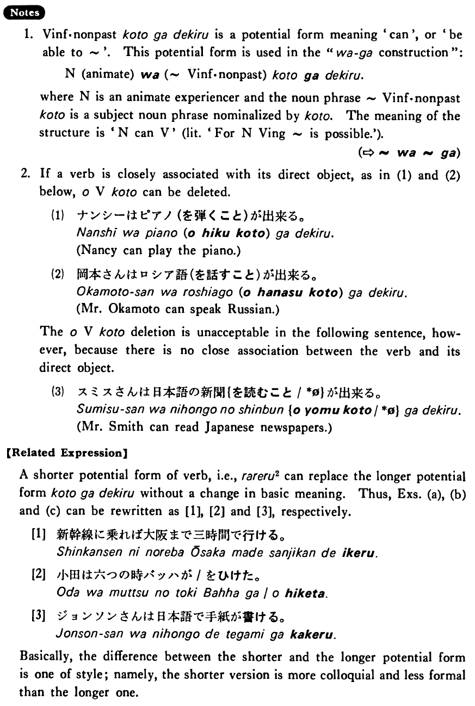

# ことが出来る・できる

[1. Summary](#summary) 
[2. Formation](#formation) 
[3. Example Sentences](#example-sentences) 
[4. Explanation](#explanation) 
[5. Grammar Book Page](#grammar-book-page) 

## Summary

<table><tr>   <td>Summary</td>   <td>Doing something is possible</td></tr><tr>   <td>Equivalent</td>   <td>Can; be able to</td></tr><tr>   <td>Part of speech</td>   <td>Phrase</td></tr><tr>   <td>Related expression</td>   <td>られる2</td></tr></table>

## Formation

<table class="table"> <tbody><tr class="tr head"> <td class="td">Vinformal nonpast</td> <td class="td">ことが出来る </td> <td class="td">&nbsp;</td> </tr> <tr class="tr"> <td class="td">&nbsp;</td> <td class="td">話すことが出来る </td> <td class="td">Someone    can talk</td> </tr> <tr class="tr"> <td class="td">&nbsp;</td> <td class="td">食べることが出来る </td> <td class="td">Someone    can eat</td> </tr></tbody></table>

## Example Sentences

<table><tr>   <td>田口さんは中国語を話すことが出来る・出来ます。</td>   <td>Mr. Taguchi can speak Chinese.</td></tr><tr>   <td>新幹線に乗れば大阪まで三時間で行くことが出来る。</td>   <td>If you take the bullet train, you can get to Osaka in three hours.</td></tr><tr>   <td>小田さんは六つの時バッハを弾くことが出来た。</td>   <td>Oda was able to play Bach at the age of six.</td></tr><tr>   <td>ジョンソンさんは日本語で手紙を書くことが出来る。</td>   <td>Mr. Johnson can write letters in Japanese.</td></tr></table>

## Explanation

1. Verb informal nonpast ことが出来る is a potential form meaning 'can' or 'be able to ~'. This potential form is used in the "は~が construction":
  <ul><li>Noun (animate) は (~Verb informal nonpast) ことが出来る.</li></ul>  
where Noun is an animate experiencer and the noun phrase ~Verb informal nonpast こと is a subject noun phrase nominalized by こと. The meaning of the structure is 'Noun can Verb' (Literally: 'For Noun, Verbing~ is possible.').
  
(⇨ <a href="#㊦ は～が">は~が</a>)
  
2. If a verb is closely associated with its direct object, as in (1) and (2) below, をVerbこと can be deleted.
  <ul>(1) <li>ナンシーはピアノ(を弾くこと)が出来る。</li> <li>Nancy can play the piano.</li> </ul>  <ul>(2) <li>岡本さんはロシア語(を話すこと)が出来る。</li> <li>Mr. Okamoto can speak Russian.</li> </ul>  
The をVerbこと deletion is unacceptable in the following sentence, however, because there is no close association between the verb and its direct object.
  <ul>(3) <li>スミスさんは日本語の新聞{を読むこと/*∅}が出来る。</li> <li>Mr. Smith can read Japanese newspapers.</li> </ul>  
【Related Expression】
  
A shorter potential form of verb, i.e., られる2 can replace the longer potential form ことが出来る without a change in basic meaning. Thus, Examples (a), (b) and (c) can be rewritten as [1], [2] and [3], respectively.
  
[1] 
  <ul> <li>新幹線に乗れば大阪まで三時間で行ける。</li> </ul>  
[2] 
  <ul> <li>小田は六つの時バッハが/を弾けた。</li> </ul>  
[3] 
  <ul> <li>ジョンソンさんは日本語で手紙が書ける。</li> </ul>  
Basically, the difference between the shorter and the longer potential form is one of style; namely, the shorter version is more colloquial and less formal than the longer one.

## Grammar Book Page

