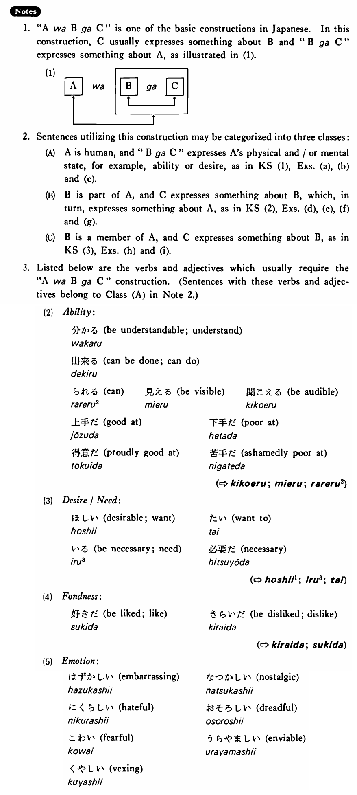

# は～が

[1. Summary](#summary) 
[2. Example Sentences](#example-sentences) 
[3. Explanation](#explanation) 
 

## Summary

<table><tr>   <td>Summary</td>   <td>A construction which relates a non-controllable state of something or someone to a topic</td></tr><tr>   <td>Part of speech</td>   <td>Structure</td></tr></table>

## Example Sentences

<table><tr>   <td>私は英語が分かる・分かります。</td>   <td>To me, English is understandable.</td></tr><tr>   <td>花子は目が奇麗だ・奇麗です。</td>   <td>Speaking of Hanako, her eyes are pretty.</td></tr><tr>   <td>辞書はウェブスターがいい・いいです。</td>   <td>Talking about dictionaries, Webster's is good.</td></tr><tr>   <td>たかしはテニスが上手だ。</td>   <td>Takashi is good at tennis.</td></tr><tr>   <td>私はボーイフレンドが欲しい。</td>   <td>I want a boyfriend.</td></tr><tr>   <td>僕はフットボールが好きだ。</td>   <td>I like football.</td></tr><tr>   <td>象は鼻が長い。</td>   <td>Elephants have long trunks.</td></tr><tr>   <td>私はお腹が空いた。</td>   <td>I am hungry.</td></tr><tr>   <td>ミラーさんは背が高い。</td>   <td>Mr. Miller is tall.</td></tr><tr>   <td>日本はステーキが高い。</td>   <td>Steak is expensive in Japan.</td></tr><tr>   <td>海は日本海が奇麗だ。</td>   <td>Talking about the sea, the Japan Sea is clean.</td></tr><tr>   <td>日本の野球はどこが強いですか。</td>   <td>Talking about baseball in Japan, who is strong?</td></tr></table>

## Explanation

1. "AはBがC" is one of the basic constructions in Japanese. In this construction, C usually expresses something about B and "BがC" expresses something about A, as illustrated in (1).
  <ul>(1)  <table class="table"> <tbody> <tr class="tr"> <td class="td">[A]</td> <td class="td">は&nbsp;&nbsp;&nbsp;&nbsp;</td> <td class="td">&nbsp;&nbsp;[B]</td> <td class="td">&nbsp;が</td> <td class="td">[C]</td> </tr> <tr class="tr"> <td class="td">&nbsp;&nbsp;↑</td> <td class="td"></td> <td class="td">&nbsp;&nbsp;&nbsp;↑_</td> <td class="td">___</td> <td class="td">_↑</td> </tr> <tr class="tr"> <td class="td">&nbsp;&nbsp;⎪_</td> <td class="td">______</td> <td class="td">___</td> <td class="td">_T</td> <td class="td"></td> </tr> </tbody> </table>  </ul>  
2. Sentences utilizing this construction may be categorized into three classes:
  <ul>(A)  <li>A is human, and "BがC" expresses A's physical and/or mental state, for example, ability or desire, as in Key Sentence (1), Examples (a), (b) and (c).</li> </ul>  <ul>(B)  <li>B is part of A, and C expresses something about B, which, in turn, expresses something about A, as in Key Sentence (2), Examples (d), (e), (f) and (g).</li> </ul>  <ul>(C)  <li>B is a member of A, and C expresses something about B, as in Key Sentence (3), Examples (h) and (i).</li> </ul>  
3. Listed below are the verbs and adjectives which usually require the "AはBがC" construction. (Sentences with these verbs and adjectives belong to Class (A) in Note 2.)
  <ul>(2)&nbsp;&nbsp;&nbsp;&nbsp;Ability: 

 <li>分かる&nbsp;&nbsp;be understandable; understand</li> 

 <li>出来る&nbsp;&nbsp;can be done; can do</li> 

 <li>られる2&nbsp;&nbsp;can&nbsp;&nbsp;&nbsp;&nbsp;見える&nbsp;&nbsp;be visisble&nbsp;&nbsp;&nbsp;&nbsp;聞こえる&nbsp;&nbsp;be audible</li> 

 <li>上手だ&nbsp;&nbsp;good at&nbsp;&nbsp;&nbsp;&nbsp;下手だ&nbsp;&nbsp;poor at</li> 

 <li>得意だ&nbsp;&nbsp;proudly good at&nbsp;&nbsp;&nbsp;&nbsp;苦手だ&nbsp;&nbsp;ashamedly poor at</li> </ul>  
(⇨ <a href="#㊦ 聞こえる・きこえる">聞こえる</a>; <a href="#㊦ 見える・みえる">見える</a>; <a href="#㊦ られる (2)">られる2</a>)
  <ul>(3)&nbsp;&nbsp;&nbsp;&nbsp;Desire/Need: 

 <li>欲しい&nbsp;&nbsp;desireable; want&nbsp;&nbsp;&nbsp;&nbsp;たい&nbsp;&nbsp;want to</li> 

 <li>要る&nbsp;&nbsp;be necessary; need&nbsp;&nbsp;&nbsp;&nbsp;必要だ&nbsp;&nbsp;necessary</li> </ul>  
(⇨ <a href="#㊦ 欲しい・ほしい (1)">欲しい1</a>; <a href="#㊦ 要る・いる (3)">要る3</a>; <a href="#㊦ たい">たい</a>)
  <ul>(4)&nbsp;&nbsp;&nbsp;&nbsp;Fondness: 

 <li>好きだ&nbsp;&nbsp;be liked; like&nbsp;&nbsp;&nbsp;&nbsp;嫌いだ&nbsp;&nbsp;be disliked; dislike</li> </ul>  
(⇨ <a href="#㊦ 嫌いだ・きらいだ">嫌いだ</a>; <a href="#㊦ 好きだ・すきだ">好きだ</a>)
  <ul>(5)&nbsp;&nbsp;&nbsp;&nbsp;Emotion: 

 <li>恥ずかしい&nbsp;&nbsp;embarrassing&nbsp;&nbsp;&nbsp;&nbsp;懐かしい&nbsp;&nbsp;nostalgic</li> 

 <li>憎らしい&nbsp;&nbsp;hateful&nbsp;&nbsp;&nbsp;&nbsp;恐ろしい&nbsp;&nbsp;dreadful</li> 

 <li>怖い&nbsp;&nbsp;fearful&nbsp;&nbsp;&nbsp;&nbsp;羨ましい&nbsp;&nbsp;enviable</li> 

 <li>悔しい&nbsp;&nbsp;vexing</li> </ul>

## Grammar Book Page

