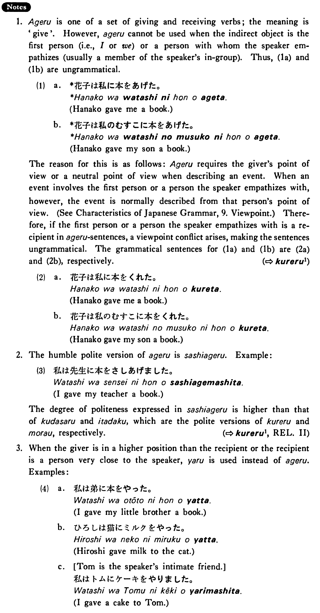

# あげる (1)

 
 
 
 

## Summary

<table><tr>   <td>Summary</td>   <td>Someone gives something to a person who is not a member of the giver’s in group but whose status is about equal to that of the giver.</td></tr><tr>   <td>English</td>   <td>Give</td></tr><tr>   <td>Part of speech</td>   <td>Verb (Group 2)</td></tr><tr>   <td>Related expression</td>   <td>くれる1; (もらう1)</td></tr></table>

## Example Sentences

<table><tr>   <td>私は良子に花をあげた・あげました。</td>   <td>I gave Yoshiko flowers.</td></tr><tr>   <td>大野さんは山本さんに本をあげた。</td>   <td>Ms. Ono gave Mr. Yamamoto a book.</td></tr><tr>   <td>君はアンに何をあげましたか。</td>   <td>What did you give to Ann?</td></tr></table>

## Explanation

1. あげる is one of a set of giving and receiving verbs; the meaning is 'give'. However, あげる cannot be used when the indirect object is the first person (i.e., I or we) or a person with whom the speaker empathizes (usually a member of the speaker's in-group). Thus, (1a) and (1b) are ungrammatical.
  <ul>(1) <li>a. *花子は私に本をあげた。</li> <li>Hanako gave me a book.</li> 

 <li>b. ＊花子は私のむすこ に本をあげた。</li> <li>Hanako gave my son a book.</li> </ul>  
The reason for this is as follows: あげる requires the giver's point of view or a neutral point of view when describing an event. When an event involves the first person or a person the speaker empathizes with, however, the event is normally described from that person's point of view. Therefore, if the first person or a person the speaker empathizes with is a recipient in a あげる sentences, a viewpoint conflict arises, making the sentences ungrammatical. The grammatical sentences for (1a) and (1b) are (2a) and (2b), respectively. 
  
(⇨ <a href="#㊦ 呉れる・くれる (1)">くれる1</a>)
  <ul>(2) <li>a. 花子は私に本をくれた。</li> <li>Hanako gave me a book.</li> 

 <li>b. 花子は私のむすこに本をくれた。</li> <li>Hanako gave my son a book.</li> </ul>  
2. The humble polite version of あげる is 差し上げる. Example:
  <ul>(3) <li>私は先生に本をさしあげました。</li> <li>I gave my teacher a book.</li> </ul>  
The degree of politeness expressed in 差し上げる is higher than that of 下さる and it いただく, which are the polite versions of くれる and もらう, respectively. 
  
(⇨ <a href="#㊦ 呉れる・くれる (1)">くれる1</a>, Related expression II)
  
3. When the giver is in a higher position than the recipient or the recipient is a person very close to the speaker, やる is used instead of あげる. Examples:
  <ul>(4) <li>a . 私は弟に本をやった。</li> <li>I gave my little brother a book.</li> 

 <li>b. ひろしは猫にミルクをやった。</li> <li>Hiroshi gave milk to the cat.</li> 

 <li>c. Tom is the speaker's intimate friend.</li> <li>私はトムにケーキをやりました。</li> <li>I gave a cake to Tom.</li> </ul>

## Grammar Book Page

