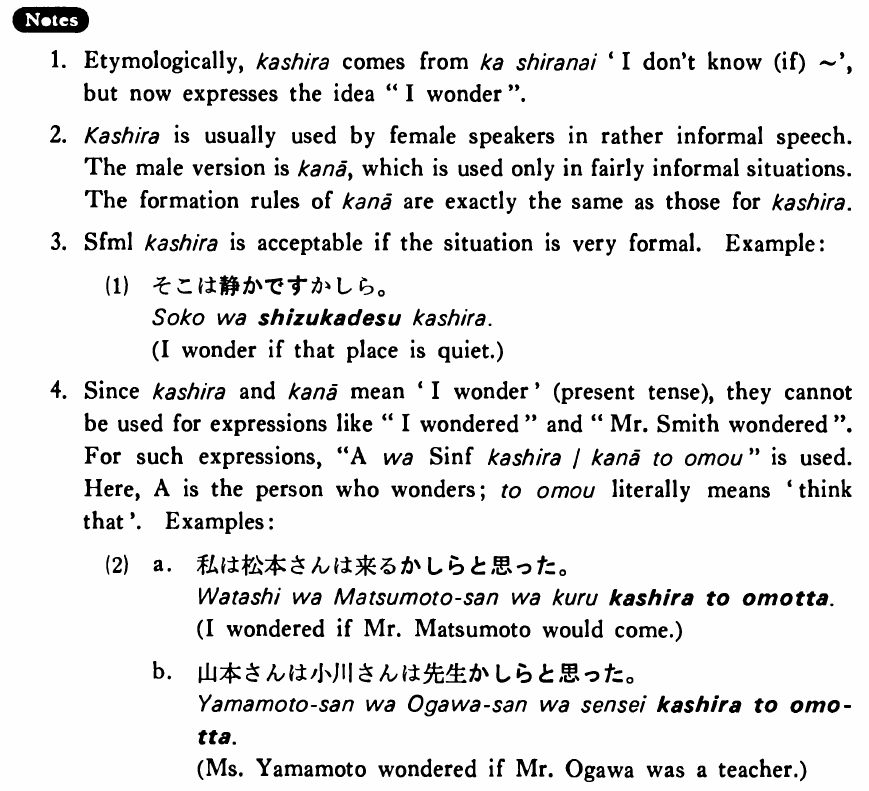

# かしら

[1. Summary](#summary) 
[2. Formation](#formation) 
[3. Example Sentences](#example-sentences) 
[4. Explanation](#explanation) 
 

## Summary

<table><tr>   <td>Summary</td>   <td>A sentence final particle which expresses the idea that the female speaker wonders about something.</td></tr><tr>   <td>English</td>   <td>I wonder</td></tr><tr>   <td>Part of speech</td>   <td>Particle</td></tr></table>

## Formation

<table class="table"><tbody><tr class="tr head"><td class="td">(i)  {V/Adjective い}    informal</td><td class="td">かしら </td><td class="td">&nbsp;</td></tr><tr class="tr"><td class="td">&nbsp;</td><td class="td">{話す /話した} かしら</td><td class="td">I    wonder someone (will) talk/talked</td></tr><tr class="tr"><td class="td">&nbsp;</td><td class="td">{高い /高かった} かしら</td><td class="td">I    wonder something is/was expensive</td></tr><tr class="tr head"><td class="td">(ii)  {Adjective な stem/   N}</td><td class="td">{Ø/だった} かしら</td><td class="td">&nbsp;</td></tr><tr class="tr"><td class="td">&nbsp;</td><td class="td">{静か /静かだった} かしら</td><td class="td">I    wonder something is/was quiet</td></tr><tr class="tr"><td class="td">&nbsp;</td><td class="td">{先生/    先生だった} かしら</td><td class="td">I    wonder someone is/was a teacher</td></tr></tbody></table>

## Example Sentences

<table><tr>   <td>松本さんは来るかしら。</td>   <td>I wonder if Mr. Matsumoto will come.</td></tr><tr>   <td>あの先生の授業は面白いかしら。</td>   <td>I wonder if that teacher's class is interesting.</td></tr><tr>   <td>幸子さんは何が好きかしら。</td>   <td>I wonder what Sachiko likes.</td></tr><tr>   <td>あの人は誰かしら。</td>   <td>I wonder who that person is.</td></tr></table>

## Explanation

1. Etymologically, かしら comes from か知らない 'I don't know (if) ~', but now expresses the idea "I wonder".
  
2. かしら is usually used by female speakers in rather informal speech. The male version is かなあ which is used only in fairly informal situations. The formation rules of かなあ are exactly the same as those for かしら.
  
3. Sentence formal かしら is acceptable if the situation is very formal. Example:
  <ul>(1) <li>そこは静かですかしら。</li> <li>I wonder if that place is quiet.</li> </ul>  
4. Since かしら and かなあ mean 'I wonder' (present tense), they cannot be used for expressions like "I wondered" and "Mr. Smith wondered". For such expressions, "Aは Sentence Informal かしら/かなあと思う" is used. Here, A is the person who wonders; と思う literally means 'think that'. Examples:
  <ul>(2)  <li>a. 私は松本さんは来るかしらと思った。</li> <li>I wondered if Mr. Matsumoto would come.</li> 

 <li>b. 山本さんは小川さんは先生かしらと思った。</li> <li>Ms. Yamamoto wondered if Mr. Ogawa was a teacher.</li> </ul>

## Grammar Book Page

