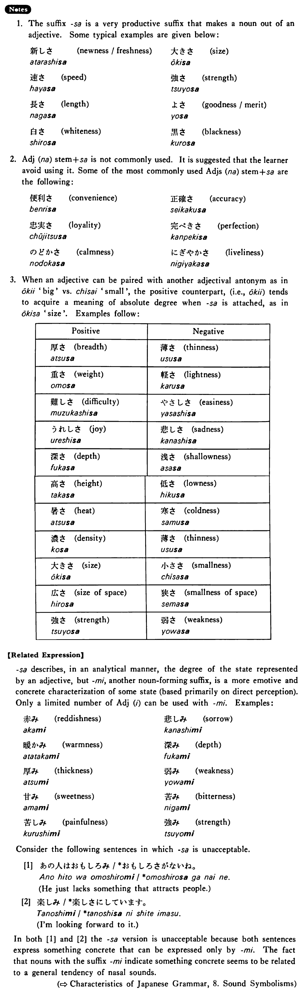

# さ

[1. Summary](#summary) 
[2. Formation](#formation) 
[3. Example Sentences](#example-sentences) 
[4. Explanation](#explanation) 
[5. Grammar Book Page](#grammar-book-page) 

## Summary

<table><tr>   <td>Summary</td>   <td>A suffix that makes a noun out of an adjective by attaching it to the stem of an Adj (い) or much less frequently to the stem of an Adj (な)</td></tr><tr>   <td>English</td>   <td>-ness; -ly</td></tr><tr>   <td>Part of speech</td>   <td>Suffix</td></tr><tr>   <td>Related expression</td>   <td>み</td></tr></table>

## Formation

<table class="table"> <tbody><tr class="tr head"> <td class="td">Adjective (い/な) stem</td> <td class="td">さ </td> <td class="td">&nbsp;</td> </tr> <tr class="tr"> <td class="td">&nbsp;</td> <td class="td">高さ </td> <td class="td">Height</td> </tr> <tr class="tr"> <td class="td">&nbsp;</td> <td class="td">静かさ </td> <td class="td">quietness</td> </tr></tbody></table>

## Example Sentences

<table><tr>   <td>このうちの広さはちょうどいい・いいです。</td>   <td>This size of this house is just right.</td></tr><tr>   <td>富士山の高さはどのぐらいですか。</td>   <td>What is the approximate height of Mt. Fuji?</td></tr><tr>   <td>日本語の難しさがよく分かりました。</td>   <td>I'm now well aware of the difficulty of Japanese.</td></tr><tr>   <td>アメリカのよさはパイオニア・スピリットでしょう。</td>   <td>One of America's good qualities is perhaps its pioneering spirit.</td></tr></table>

## Explanation

1. The suffix さ is a very productive suffix that makes a noun out of an adjective. Some typical examples are given below:
  <ul> <li>新しさ&nbsp;&nbsp;newness/freshness</li>  

 <li>大きさ&nbsp;&nbsp;size</li> 

 <li>速さ&nbsp;&nbsp;speed</li> 

 <li>強さ&nbsp;&nbsp;strength</li> 

 <li>長さ&nbsp;&nbsp;length</li> 

 <li>よさ&nbsp;&nbsp;goodness/merit</li> 

 <li>白さ&nbsp;&nbsp;whiteness</li>  

 <li>黒さ&nbsp;&nbsp;blackness</li> </ul>  
2. Adjective な stem+さ is not commonly used. It is suggested that the learner avoid using it. Some of the most commonly used Adjective な stem+さ are the following:
  <ul> <li>便利さ&nbsp;&nbsp;convenience</li> 

  <li>正確さ&nbsp;&nbsp;accuracy</li> 

 <li>忠実さ&nbsp;&nbsp;loyalty</li> 

 <li>完璧さ&nbsp;&nbsp;perfection</li> 

 <li>のどかさ&nbsp;&nbsp;calmness</li> 

  <li>にぎやかさ&nbsp;&nbsp;liveliness</li> </ul>  
3. When an adjective can be paired with another adjectival antonym as in 大きい 'big' vs. 小さい 'small', the positive counterparty (i.e., 大きい) tends to acquire a meaning of absolute degree when さ is attached, as in 大きさ 'size'. Examples follow:
  <table class="table"> <tbody> <tr class="tr"> <td class="td">Positive</td> <td class="td"></td> <td class="td">Negative</td> <td class="td"></td> </tr> <tr class="tr"> <td class="td">厚さ</td> <td class="td">breadth</td> <td class="td">薄さ</td> <td class="td">thinness</td> </tr> <tr class="tr"> <td class="td">重さ</td> <td class="td">weight</td> <td class="td">軽さ</td> <td class="td">lightness</td> </tr> <tr class="tr"> <td class="td">難しさ</td> <td class="td">difficulty</td> <td class="td">やさしさ</td> <td class="td">easiness</td> </tr> <tr class="tr"> <td class="td">うれしさ</td> <td class="td">joy</td> <td class="td">悲しさ</td> <td class="td">sadness</td> </tr> <tr class="tr"> <td class="td">深さ</td> <td class="td">depth</td> <td class="td">浅さ</td> <td class="td">shallowness</td> </tr> <tr class="tr"> <td class="td">高さ</td> <td class="td">height</td> <td class="td">低さ</td> <td class="td">lowness</td> </tr> <tr class="tr"> <td class="td">暑さ</td> <td class="td">heat</td> <td class="td">寒さ</td> <td class="td">coldness</td> </tr> <tr class="tr"> <td class="td">濃さ</td> <td class="td">density</td> <td class="td">薄さ</td> <td class="td">thinness</td> </tr> <tr class="tr"> <td class="td">大きさ</td> <td class="td">size</td> <td class="td">小ささ</td> <td class="td">smallness</td> </tr> <tr class="tr"> <td class="td">広さ</td> <td class="td">size of space</td> <td class="td">狭さ</td> <td class="td">smallness of space</td> </tr> <tr class="tr"> <td class="td">強さ</td> <td class="td">strength</td> <td class="td">弱さ</td> <td class="td">weakness</td> </tr> </tbody> </table>  
【Related Expression】
  
さ describes, in an analytical manner, the degree of the state represented by an adjective, but み, another noun-forming suffix, is a more emotive and concrete characterization of some state (based primarily on direct perception). Only a limited number of Adjective い can be used with み. Examples:
  <ul> <li>赤み&nbsp;&nbsp;reddishness</li> 

 <li>悲しみ&nbsp;&nbsp;sorrow</li> 

 <li>暖かみ&nbsp;&nbsp;warmness</li>  

 <li>深み&nbsp;&nbsp;depth</li> 

 <li>厚み&nbsp;&nbsp;thickness</li> 

 <li>弱み&nbsp;&nbsp;weakness</li> 

 <li>甘み&nbsp;&nbsp;sweetness</li>  

 <li>苦み&nbsp;&nbsp;bitterness</li> 

 <li>苦しみ&nbsp;&nbsp;painfulness</li> 

  <li>強み&nbsp;&nbsp;strength</li> </ul>  
Consider the following sentences in which さ is unacceptable.
  
[1]
  <ul> <li>あの人はおもしろみ/*おもしろさがないね。</li> <li>He just lacks something that attracts people.</li> </ul>  
[2]
  <ul> <li>楽しみ/*楽しさにしています。</li> <li>I'm looking forward to it.</li> </ul>  
In both [1] and [2] the さ version is unacceptable because both sentences express something concrete that can be expressed only by み. The fact that nouns with the suffix み indicate something concrete seems to be related to a general tendency of nasal sounds.

## Grammar Book Page

